# Архитектура StonerHand Soundlinks Bot

Карта системы для тех, кто поддерживает или форкает бота. Актуальна для версии со Студией 3.0 (Mini App), отложенным постингом, конструктором подборок (хранится на стороне клиента), пакетной вставкой ссылок, брендированной рамкой обложки, health-мониторингом и алертами.

## Общая схема

```mermaid
flowchart LR
    U["Пользователь / группа / канал / inline"] --> T["Telegram"]
    MA["Mini App «Студия»"] -->|"initData + action"| WA["/api/webapp"]
    T -->|"Webhook (Vercel) или Polling"| H["/api/telegram"]
    H --> R["Router: track_lookup / inline / menu / editor"]
    WA --> R2["Studio actions: resolve / update / deliver / crate / queue"]
    R -->|"текст без ссылки"| SRCH["iTunes Search"]
    SRCH -->|"URL релиза"| S
    R -->|"музыкальные ссылки"| S["Song.link / Odesli"]
    R -->|"Spotify playlist / artist"| O1["Spotify oEmbed"]
    R -->|"YouTube"| O2["YouTube oEmbed"]
    R -->|"SoundCloud fallback"| O3["SoundCloud oEmbed"]
    R -->|"NTS Radio"| O4["NTS Open Graph"]
    S --> KV[("Redis / Upstash:\nкеш, черновики, очередь,\nистория, антидубль")]
    S --> N["Нормализованный релиз\n(TrackMatch + обложка)"]
    N --> F["Formatter + i18n"]
    F --> K["Inline Keyboard\n+ редактор / Студия"]
    K --> T
    HL["/api/health + UptimeRobot"] -->|"алерты в личку"| ADM["Владелец"]
```



## Поток обновления

### Webhook (Vercel, основной режим)

1. Telegram шлёт update на `POST /api/telegram` (`api/telegram.py`).
2. Проверяется размер payload, форма JSON и подпись `X-Telegram-Bot-Api-Secret-Token`. Секрет берётся из `TELEGRAM_WEBHOOK_SECRET`, а если он не задан — **выводится из токена бота** (SHA-256), так что подделать update нельзя даже без настройки.
3. **Тёплый reuse**: приложение PTB, HTTP-пулы и кеши создаются один раз на инстанс (`_ensure_application`). Постоянный asyncio-loop работает в отдельном потоке, поэтому независимые webhook/API-запросы ждут сеть конкурентно, а лок защищает только инициализацию. Каждый вызов ограничен по времени; приложение утилизируется только после нескольких сбоев подряд.
4. **Дедуп по `update_id`** (Redis с TTL, фолбэк в память): повторная доставка того же update после медленного ответа не даёт двойной ответ/публикацию; упавший update освобождает claim, чтобы ретрай отработал.
5. После каждого update выполняется тик очереди отложенных публикаций.

### Polling (Railway / локально)

`python -m music_links_bot` запускает `run_polling` с теми же `allowed_updates`: `message`, `channel_post`, `callback_query`, `inline_query`.

### Самовосстановление и мониторинг

- `GET /api/set_webhook` (секрет в query или `Authorization: Bearer $CRON_SECRET`) заново регистрирует webhook (включая производный секрет), синхронизирует команды, описания профиля (RU+EN) и кнопку меню «Студия». Vercel Cron дёргает его ежедневно (`0 3 * * *`).
- `GET /api/health` — пульс: `getMe`, `getWebhookInfo` (свежие ошибки доставки = red), пинг Redis, а также **состояние очереди** (размер + число просроченных заданий). Ответ 503 при проблеме — вешается на бесплатный UptimeRobot. Каждый пинг заодно тикает очередь отложки через `/api/webapp`.
- **Алерты** (`alerts.py`): при падении health-проверки, краше webhook, незаливающейся очереди или потерянном отложенном посте владелец получает DM. Дедупликация через Redis `SET NX` — не чаще раза в час на проблему.
- **CI** (`.github/workflows/ci.yml`): два джоба — `test` (pyflakes + 270+ тестов + `node --check` JS Студии) и `e2e` (хедлесс-смоук Студии на Playwright: boot → поиск → карточка → подборка → ярлыки → пакетная вставка) на каждый пуш и PR.

## Маршрутизация входящих сообщений

`track_lookup_message` (`bot.py`) — главный обработчик текста:

1. Сообщения, вставленные через собственный inline-режим (`via_bot == сам бот`), игнорируются.
2. Из текста извлекаются поддерживаемые URL (`url_utils.extract_supported_urls`), максимум 12.
3. **Нет URL** (только в личке): текст очищается от упоминания бота и уходит в поиск (`SearchClient` → iTunes Search API → Apple Music URL → обычный конвейер).
4. URL сортируются по типам (`_split_source_urls`) и резолвятся **параллельно** через `asyncio.gather`.
5. Один релиз → карточка с редактором (в личке), несколько → нумерованная подборка, смесь типов → mixed-подборка.

В личке мгновенно отправляется плейсхолдер «⏳ Собираю пост…», который редактируется в готовый пост (ContextVar, task-локальный).

## Клиенты метаданных (`src/music_links_bot/`)

| Модуль | Источник | Роль |
| --- | --- | --- |
| `songlink.py` | Song.link / Odesli API | Кроссплатформенные ссылки, тип релиза, год, обложка. Сначала запрашивает основной регион и обращается к дополнительным только для неполного результата; одинаковые параллельные запросы объединяет single-flight. Кеш: локальный TTL + Redis (7 дней) |
| `search.py` | iTunes Search API (без ключа) | Текст → до 3 кандидатов (URL, артист, название, обложка, 30-сек `previewUrl`); жанры для хэштегов; аудио-превью для Студии |
| `youtube.py` | YouTube oEmbed | Название и канал видео |
| `soundcloud.py` | SoundCloud oEmbed | Fallback, когда Song.link не знает трек |
| `playlist.py` / `artist.py` | Spotify oEmbed | Названия плейлистов и артистов |
| `nts.py` | NTS Open Graph | Название эфира и станция |
| `kvstore.py` | Upstash Redis REST | GET/SET(+NX)/MGET/DEL, JSON-обёртки. Полностью опционален, ошибки глотаются |
| `branding.py` | Pillow (композитинг) | Опц. брендированная рамка обложки в фото-режиме: нижний градиент с подписью канала + лого в углу. Включается `BRAND_PHOTO_FRAME=1`; любой сбой → мягкий фолбэк на обычную обложку |

Гарантия Spotify: если Song.link не вернул прямую ссылку, подставляется deep-link на поиск Spotify; такие ссылки исключены из выбора превью. Fallback-карточки оборачивают исходный URL в `song.link/<url>`, чтобы hub-кнопка всегда открывала все площадки.

## Inline-режим

- URL в запросе → одна карточка-результат.
- Текст → до 3 кандидатов, каждый резолвится через Song.link параллельно; выбор из списка с обложками.
- Пустой/неудачный запрос → кнопка-подсказка, открывающая бота.
- Ответы кешируются Telegram (`cache_time=1800`).

## Редактор постов в чате (личка)

Одиночный релиз отправляется как **черновик**: словарь в памяти (до 300) + Redis (`draft:<id>`, TTL 48 ч). Панель сжата до глифов, чтобы занимать два коротких ряда:

- ряд тумблеров: `#️⃣ ✓` (хэштеги), `💬 ✓` (цитата, если была подводка), `🖼 ⊞/⊟` (превью)
- ряд действий: `🎛 Студия` · `✅` (финализировать) · `🗑` (удалить) · `📤 В канал` (только владелец)

Новые кнопки используют версионированный контракт `v2|<scope>|<action>|<payload>`; старые `ed|<action>|<draft_id>` продолжают читаться. Единый dispatcher разводит menu/search/editor/crate/retry. Callback-id фиксируется на 15 минут, а долгие send/publish/add-to-crate получают отдельный lease: двойной тап не создаёт повторную публикацию. Во время действия клавиатура переходит в busy-state, после публикации — в success-state.

Первый `/start` ведёт по трёхшаговому онбордингу; следующий показывает короткий рабочий экран. Свободный запрос сначала показывает до шести кандидатов, а не молча выбирает первый. Progress редактирует одно сообщение (поиск → площадки → карточка), типизированная ошибка объясняет следующий шаг и хранит retry-action в пользовательской сессии. Несколько ссылок автоматически собираются в bot-crate; `/crate` показывает порядок, удаление и перестановку, состояние хранится в Redis с memory fallback.

`bot_runtime.py` держит пользовательские сессии, идемпотентность callback, action leases, отмену устаревшего запроса и диагностику провайдеров. `bot_crate.py` изолирует хранение чат-подборки. Отправка себе, публикация в канал и очередь используют общий delivery pipeline `_deliver_draft`. Lookup разных типов параллелен; быстрое обогащение жанром попадает в первый ответ, медленное продолжает работу в фоне. Поиск имеет positive cache на 6 часов и negative cache на 10 минут.

## Mini App «Студия» (`webapp/` + `api/webapp.py`)

Визуальный редактор без сборки: семантический `index.html`, отдельные `styles.css`, UI-модуль `app.js`, транспорт `api-client.js` и адаптер Telegram CloudStorage `cloud-storage.js`. Статика — `/app`, API — `POST /api/webapp` с `{init_data, action, payload, request_id}`. Подпись `initData` проверяется официальным HMAC-алгоритмом (`webapp_auth.py`), свежесть 24 ч. Мутации идемпотентны по `request_id` (результат хранится в Redis 24 ч; без Redis — память инстанса).

| Action | Кто | Что делает |
| --- | --- | --- |
| `resolve` | все | Ссылка/текст → черновик; несколько совпадений → список кандидатов (обложка + превью), выбор возвращается с `pick`. Троттлится пер-юзер |
| `resolve_batch` | все | Пакетная вставка: 2+ ссылки разом → параллельный резолв, дедуп → готовые для подборки айтемы. Троттлится пер-юзер |
| `preview` | владелец | Ленивая догрузка 30-сек аудио-превью по требованию (карточка уже на экране — поиск не ждёт лишний вызов iTunes) |
| `draft` | владелец | Открыть черновик из чат-редактора |
| `update` | владелец | Патч: флаги (`hashtags/quote/large_preview/as_photo`), свой CTA, свои теги, набор и порядок платформ |
| `send` / `publish` | все / админ | Отправить себе / в канал (антидубль с `force`); publish возвращает `message_id` для undo |
| `unpublish` | админ | Undo: удаляет пост из канала и сбрасывает антидубль-отметку |
| `schedule` / `queue` / `unschedule` / `reschedule` | админ | Отложенная публикация (очередь `queue:v1`); `reschedule` переносит задание на новое время |
| `history` | все | Последние 10 релизов (`hist:<id>`, TTL 90 дней) с отметкой «уже в канале» |
| `stats` | админ | Счётчики + топы для дашборда |
| `crate*` | все / публикация — админ | Конструктор подборок: `crate/add/remove/order/clear/send/publish`. **Авторитетный список — на клиенте** (в CloudStorage) и едет с каждым запросом, поэтому подборка работает и без Redis; сервер зеркалит в `crate:<id>` (до 10 треков, TTL 14 дней) как удобство |

Дизайн: digital music zine — крупная обложка, редакционная сетка, Unbounded (акцентные заголовки), Golos Text (интерфейс), JetBrains Mono (метаданные), жжёный оранжевый, бумага и плёночное зерно. Светлая и тёмная темы работают через CSS-переменные; ручной выбор хранится в CloudStorage. Внизу три рабочих раздела (Главная / Подборка / Очередь) и центральное действие «Создать»; статистика вынесена в admin-инструменты. Компоновка фиксируется в `100dvh`, проверены 320–390 px, цели касания не меньше 44 px, поддержаны keyboard focus, семантические dialog/navigation/status и `prefers-reduced-motion`.

UI: контентная главная с hero и визуальной историей; экран релиза с большой обложкой, цветным акцентом, плеером и фирменными знаками площадок; визуальный конструктор с липким live-preview; подборка как стопка пластинок; swipe-жесты и drag-and-drop; пакетная вставка ссылок; мини-плеер кандидатов. Главное действие открывает финальный bottom sheet (канал / личный чат / очередь / поделиться), успешная отправка — отдельный экран со следующим действием и доступным undo. Есть иллюстрированные пустые состояния, структурный skeleton, живые ошибки, typeahead с обложками, clipboard banner, хэптика, системная «Назад», четырёхшаговый онбординг и fullscreen (Bot API 8.0). Удаление подтверждается нативным диалогом Telegram; оптимистичные изменения подборки откатываются, если сервер не сохранил их. **Устойчивость клиента:** каждый запрос ограничен таймаутом и отменяется при уходе с экрана, гонки отсекаются seq-гвардами, битая обложка падает в эмодзи-плитку, протухший `initData` показывает «сессия истекла». Все внешние URL проходят проверку схемы и экранирование (анти-XSS).

## Очередь публикаций (`publish_queue.py`)

Задания `{id, publish_at, attempts, status, lease_until, draft}` в Redis (`queue:v1`; без Redis — память инстанса). Доставка **оппортунистическая**: тик после каждого telegram-update, на `GET /api/webapp` и на каждый пинг `/api/health` — монитор раз в 5 минут даёт точность до минут. Кросс-инстансовый лок `queue:lock` исключает одновременную запись, а локальный `asyncio.Lock` сериализует memory-fallback. Созревшее задание не удаляется до доставки: оно атомарно получает статус `processing` и lease. После краша просроченный lease подхватит следующий worker; результат может зафиксировать только владелец lease. Ошибка возвращает задание в `pending` с растущим backoff (до 3 попыток), затем следует алерт.

## Локализация (`i18n.py`)

Интерфейс (меню, подсказки, редактор, описания профиля, Студия) — RU/EN по `language_code` (ru/uk/be/kk → RU). Тексты постов остаются на русском — голос канала.

## Статистика (`stats.py`)

Счётчики постов/типов и топы пользователей/чатов. Локальный JSON + асинхронный мерж в Redis-блоб `stats:v1` (максимум по счётчикам, объединение map-ов). `/stats` в чате и дашборд Студии показывают объединённый вид.

## Безопасность

- Подпись входящих updates обязательна: явный `TELEGRAM_WEBHOOK_SECRET` или производный от токена.
- `initData` Mini App: HMAC + `compare_digest` + свежесть; черновики/подборки видит только владелец; publish/schedule/stats/unpublish — только `ADMIN_CHAT_ID`.
- `/api/set_webhook` — секрет обязателен (query или cron-Bearer), сравнение timing-safe.
- Всё, что уходит в HTML постов (включая пользовательский текст), экранируется; все URL в Студии — scheme-check + escape (в т.ч. клиентские `page_url` подборки — только `http(s)`).
- **Троттлинг** `resolve`/`resolve_batch` пер-юзер выполняется атомарным Redis-счётчиком с локальным fallback и защищает внешние API от спама.
- Логи санитайзятся: клиентская строка `action` чистится от управляющих символов и обрезается (анти-лог-инъекция); в логах — request-id и update-id с таймингами.
- Лимиты тела: 64 КБ (Студия), 1 МБ (webhook). Зависимости запиннены в `requirements.txt`. Секретов в репозитории нет.

## Конфигурация (env)

| Переменная | Роль |
| --- | --- |
| `BOT_TOKEN` | токен Telegram (обязательно) |
| `SET_WEBHOOK_SECRET` | защита `/api/set_webhook` |
| `CRON_SECRET` | авторизация Vercel Cron |
| `TELEGRAM_WEBHOOK_SECRET` | подпись updates (опционально — есть производный) |
| `ADMIN_CHAT_ID` | права 📤/отложки/дашборда + получатель алертов |
| `PUBLISH_CHAT_ID` | куда публикует 📤 (по умолчанию `@stonerhand`) |
| `UPSTASH_REDIS_REST_URL/TOKEN` (или `KV_REST_API_*`) | Redis для всего перечисленного выше |
| `PRIMARY_PLATFORM`, `SONGLINK_USER_COUNTRIES`, `BOT_UI_MODE` | поведение постов |
| `BRAND_PHOTO_FRAME`, `BRAND_LOGO_URL`, `BRAND_LABEL` | брендированная рамка обложки в фото-режиме (опц., по умолчанию выкл) |
| `EPHEMERAL_GROUP_REPLIES` | невидимые ответы в группах (опц.) |
| `WEBAPP_URL`, `WEBHOOK_BASE_URL`, `STATS_PATH`, `LOG_LEVEL`, `SONGLINK_API_KEY` | тонкая настройка |

## Карта кода

```text
.github/workflows/ci.yml   CI: джобы test (линт + тесты + JS) и e2e (смоук Студии)
api/
├── telegram.py       webhook: валидация, тёплый reuse, тик очереди, алерт при краше
├── webapp.py         API Студии: resolve/draft/update/deliver/unpublish/schedule/history/stats/crate
├── health.py         пульс: Telegram/webhook/Redis, алерты, тик очереди
└── set_webhook.py    регистрация webhook + синк команд, описаний и кнопки меню

webapp/
├── index.html        семантическая разметка Mini App
├── styles.css        дизайн-система, адаптивность и светлая/тёмная темы
├── app.js            состояние, навигация, редактор и аудио
├── api-client.js     timeout/cancel, request_id и нормализация ошибок
└── cloud-storage.js  адаптер Telegram CloudStorage + local fallback

src/music_links_bot/
├── bot.py            хендлеры, роутинг, редактор, inline, черновики
├── bot_runtime.py    сессии, callback v2, идемпотентность, leases, cancel, диагностика
├── bot_crate.py      чат-подборка: Redis/memory, дедуп, порядок и удаление
├── bot_ui.py         start/onboarding/editor/crate Telegram-клавиатуры
├── bot_lookup.py     резолв источников, fallback и сборка результатов
├── loop_runner.py    постоянный concurrent asyncio-loop для serverless
├── request_guard.py  Redis rate limit + идемпотентность мутаций
├── keyboards.py      Telegram-клавиатуры, кнопки и порядок платформ
├── bot_stats.py      сбор статистики по типам сообщений
├── publication_state.py антидубли и отметки опубликованных релизов
├── studio_models.py  чистые модели/валидация Mini App
├── studio_storage.py история и серверное зеркало подборки
├── text_utils.py     нормализация пользовательского текста
├── publish_queue.py  очередь отложенных публикаций (Redis + память, NX-лок)
├── alerts.py         DM владельцу о проблемах (дедуп 1 ч через Redis)
├── branding.py       брендированная рамка обложки в фото-режиме (Pillow, опц.)
├── ephemeral.py      невидимые ответы в группах (raw Bot API, graceful, опц.)
├── webhook_secret.py производный секрет webhook из токена
├── webapp_auth.py    проверка подписи initData Mini App
├── songlink.py       Song.link client, регионы, обложки, Redis-кеш
├── search.py         iTunes Search: кандидаты, жанры, аудио-превью
├── kvstore.py        Upstash/Vercel KV REST-клиент (graceful degradation)
├── i18n.py           RU/EN каталог интерфейсных строк
├── formatter.py      макет постов, хэштеги, CTA (+ оверрайды из Студии)
├── telegram_text.py  безопасный перенос rich-text подводок
├── playlist.py / artist.py / youtube.py / soundcloud.py / nts.py   метаданные
├── url_utils.py      детект URL, чистка трекинг-параметров, cache-key
├── cache.py          in-memory TTL-кеш
├── stats.py          счётчики + merge для Redis
├── phrases.py        фразы CTA и ошибок (голос канала)
└── config.py         Settings из env

tests/                295+ тестов: unittest, стабы клиентов, без сети
└── e2e/smoke.py       хедлесс-смоук Студии на Playwright (гоняется в CI-джобе e2e)
```

## Принципы

- **Никакой деградации без Redis/ключей**: всё опциональное отключается молча, бот остаётся рабочим на голом `BOT_TOKEN`.
- **Ничего не падает молча**: проблема → DM владельцу (health, очередь, краши webhook).
- **Пост публикуется до удаления исходника** в группах/каналах — контент не теряется.
- **Ошибки не тупиковые**: в личке любая ошибка приходит с клавиатурой подсказок.
- **Внешние вызовы**: явные таймауты, параллелизм, кеширование, фоллбеки.
