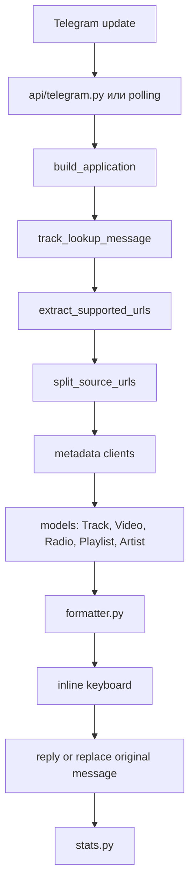

# Архитектура StonerHand Soundlinks Bot

Этот документ - карта проекта. Его задача простая: быстро вспомнить, как устроен бот, где что менять и почему некоторые решения сделаны именно так.

## Коротко

StonerHand Soundlinks Bot принимает ссылку из Telegram, определяет тип контента, подтягивает легкие метаданные, собирает аккуратный HTML-пост и отправляет его обратно с inline-кнопками.

Бот не скачивает музыку, видео или медиафайлы. Он работает со ссылками, preview и метаданными.

## Главный Поток



## Режимы Запуска

| Режим | Файл | Как работает | Когда нужен |
| --- | --- | --- | --- |
| Vercel webhook | `api/telegram.py` | Telegram отправляет POST updates на `/api/telegram`; payload валидируется до запуска бота | Основной бесплатный serverless-деплой |
| Local / Railway polling | `src/music_links_bot/__main__.py` | Бот сам опрашивает Telegram через long polling | Локальная разработка или worker-хостинг |
| Webhook setup | `api/set_webhook.py` | Регистрирует `/api/telegram` в Telegram и синхронизирует команды | Один раз после деплоя или смены домена |

В проде должен быть активен только один режим: либо webhook, либо polling. Если включить оба, будут дубли сообщений.

## Карта Модулей

| Файл | Роль |
| --- | --- |
| `src/music_links_bot/bot.py` | Главный роутер Telegram updates, команды, клавиатуры, удаление/замена сообщений |
| `src/music_links_bot/url_utils.py` | Поиск URL в тексте, нормализация, дедупликация, определение типа ссылок |
| `src/music_links_bot/telegram_text.py` | Перенос Telegram entities после удаления URL, безопасный rich-text HTML |
| `src/music_links_bot/songlink.py` | Основной клиент Song.link / Odesli для треков, альбомов, подкастов и платформ |
| `src/music_links_bot/soundcloud.py` | Fallback для прямых SoundCloud-ссылок через oEmbed |
| `src/music_links_bot/youtube.py` | Метаданные YouTube-видео через oEmbed |
| `src/music_links_bot/nts.py` | Метаданные NTS Radio через Open Graph / HTML parsing |
| `src/music_links_bot/playlist.py` | Spotify playlist metadata через oEmbed |
| `src/music_links_bot/artist.py` | Spotify artist metadata через oEmbed |
| `src/music_links_bot/formatter.py` | Внешний вид постов: заголовки, цитаты, подписи, хэштеги |
| `src/music_links_bot/phrases.py` | Человеческие фразы для CTA и ошибок |
| `src/music_links_bot/constants.py` | Поддерживаемые хосты, labels кнопок, алиасы платформ |
| `src/music_links_bot/models.py` | Dataclass-модели результата поиска |
| `src/music_links_bot/cache.py` | Маленький in-memory TTL cache для внешних metadata-запросов |
| `src/music_links_bot/stats.py` | Privacy-safe статистика по пользователям, чатам и типам постов |
| `src/music_links_bot/config.py` | Настройки из env variables и `.env` |

## Модели Данных

| Модель | Для чего |
| --- | --- |
| `TrackMatch` | Трек, альбом, EP, single, podcast episode/show |
| `VideoMatch` | YouTube-видео |
| `RadioMatch` | NTS Radio page |
| `PlaylistMatch` | Spotify playlist |
| `ArtistMatch` | Spotify artist profile |

Главная модель - `TrackMatch`. В ней есть:

| Поле | Значение |
| --- | --- |
| `title` | Название релиза |
| `artist` | Исполнитель, шоу или владелец |
| `links` | Словарь платформ: `spotify`, `appleMusic`, `tidal` и т.д. |
| `page_url` | Song.link page или исходная fallback-ссылка |
| `kind` | `song`, `album`, `podcast` |
| `release_format` | `single`, `ep`, `album`, `show` |

## Роутинг Ссылок

Главный обработчик - `track_lookup_message` в `bot.py`.

1. Берет `message.text` или `message.caption`
2. Достает поддерживаемые URL через `extract_supported_urls`
3. Ограничивает пачку до `MAX_LINKS_PER_MESSAGE`
4. Убирает URL из пользовательского текста и превращает остаток в цитату, сохраняя абзацы и Telegram entities
5. Делит ссылки через `_split_source_urls`
6. Единым параллельным pipeline отправляет непустые группы ссылок в нужные клиенты
7. Выбирает одиночную карточку, однотипную подборку или mixed collection
8. Форматирует и сначала публикует ответ
9. В группах/каналах удаляет исходное сообщение только после успешной публикации
10. Записывает счетчики в stats

### Как Выбирается Клиент

| Ссылка | Клиент |
| --- | --- |
| Spotify artist | `ArtistClient` |
| Spotify playlist | `PlaylistClient` |
| YouTube video | `YouTubeClient` |
| NTS Radio | `NTSClient` |
| Spotify/Apple/Deezer/Tidal/Yandex/YouTube Music | `SonglinkClient` |
| SoundCloud | Сначала `SonglinkClient`, потом fallback через `SoundCloudClient` |
| Spotify/Apple podcast | `SonglinkClient`, потом podcast fallback |

Если в одном сообщении несколько типов ссылок, бот запускает lookup параллельно через `asyncio.gather` и собирает mixed collection.

## Metadata Clients

### Song.link

`SonglinkClient` - основной источник платформ.

Особенности:

- делает запросы в `https://api.song.link/v1-alpha.1/links`
- поддерживает `SONGLINK_USER_COUNTRIES`
- может ходить по нескольким регионам и объединять найденные платформы
- использует `TTLCache`
- чистит tracking-параметры для cache key
- возвращает `TrackMatch`

### SoundCloud

`SoundCloudClient` нужен потому, что Song.link не всегда связывает SoundCloud с другими платформами.

Если Song.link не нашел матч, бот все равно делает чистую карточку с кнопкой SoundCloud.

### YouTube

`YouTubeClient` работает через YouTube oEmbed. Поддерживаются:

- `youtube.com/watch`
- `youtu.be`
- `youtube.com/shorts`
- `youtube.com/live`
- `youtube.com/embed`
- `m.youtube.com`

YouTube Music не идет в YouTube card. Он идет в Song.link как музыкальная ссылка.

### NTS Radio

`NTSClient` парсит Open Graph metadata из HTML страницы. Это отдельный путь, потому что Song.link для NTS не подходит.

## Меню И Навигация

Команды `/start`, `/help`, `/platforms` и `/guide` используют одно inline-меню. Кнопки меню работают через `callback_query`, поэтому production webhook должен быть зарегистрирован с `message`, `channel_post` и `callback_query`.

| Кнопка | Что открывает |
| --- | --- |
| `Быстрый старт` | Короткое описание возможностей |
| `Как пользоваться` | Мини-инструкция на 3 шага |
| `Сервисы` | Поддерживаемые платформы и типы ссылок |
| `Для каналов` | Права админа и автозамена сообщений |
| `Открыть канал` | `@stonerhand` |
| `Поделиться ботом` | Telegram share-ссылка на бота |

## Форматирование Постов

Весь внешний вид поста живет в `formatter.py`.

| Функция | Что делает |
| --- | --- |
| `format_track_message` | Трек / альбом / подкаст |
| `format_video_message` | YouTube card |
| `format_radio_message` | NTS Radio card |
| `format_playlist_message` | Spotify playlist card |
| `format_artist_message` | Spotify artist card |
| `format_collection_message` | Подборка из релизов |
| `format_mixed_collection_message` | Подборка из разных типов ссылок |
| `format_user_note_html` | Переносит bold/italic/underline/strike/spoiler/code/text-link entities на текст без URL |
| `prepend_user_html` | Помещает безопасно собранный rich text в цитату с автором на отдельной строке |

Посты отправляются в `ParseMode.HTML`, поэтому в formatter обязательно используется `html.escape`.

## UI Правила

| Элемент | Правило |
| --- | --- |
| Заголовок | Иконка + жирный artist/title |
| Пользовательский текст | `<blockquote>` перед музыкальным блоком |
| CTA | Курсивная фраза из `phrases.py` |
| Хэштеги | Автоматически по типу релиза |
| Кнопки платформ | По 2 в строку, прямые платформы выше Song.link hub |
| Стили кнопок | `success` для Spotify, `danger` для YouTube и Song.link hub, `primary` для остальных ссылок |
| Кнопка канала | Скрывается в самом канале `@stonerhand`, остается в других местах |
| Preview | Большой preview над текстом, если Telegram смог подтянуть |
| UI mode | `BOT_UI_MODE=stonerhand|minimal|editorial` меняет плотность и тон кнопок без переписывания форматтера |
| Меню | HTML-заголовки, активный раздел `success`, остальные действия `primary` |
| Внешние metadata | Переносы нормализуются, аномально длинные названия безопасно сокращаются |

Важно: Telegram сам решает, как именно покажет preview. Код может попросить `prefer_large_media`, но не может заставить Telegram всегда показать большую картинку идеально.
То же касается цветов кнопок: бот передает Telegram Bot API поле `style`, а финальный вид зависит от версии клиента.

## Клавиатуры

Клавиатуры собираются в `bot.py`.

| Функция | Кнопки |
| --- | --- |
| `_build_link_keyboard` | Платформы для одного релиза + Song.link hub ниже прямых платформ |
| `_build_collection_keyboard` | По одной кнопке на релиз |
| `_build_youtube_keyboard` | YouTube + канал |
| `_build_nts_keyboard` | NTS + канал |
| `_build_playlist_keyboard` | Spotify playlist + канал |
| `_build_artist_keyboard` | Spotify artist + канал |
| `_build_mixed_collection_keyboard` | Разные типы контента в одном списке |
| `_keyboard_with_optional_channel` | Единая сборка клавиатуры с опциональной кнопкой канала |
| `_build_error_keyboard` | Кнопка `Что поддерживается` + действия, чтобы ошибка не была тупиком |

Порядок платформ зависит от `PRIMARY_PLATFORM`. Текст платформенных кнопок и Song.link hub зависит от `BOT_UI_MODE`.

URL-кнопки создаются через `_url_button`, который прокидывает Telegram Bot API `style` через `api_kwargs`. Это нужно, потому что текущая версия `python-telegram-bot` может еще не иметь отдельного named-параметра для нового поля.

Поддерживаемые значения:

```text
spotify
appleMusic
applePodcasts
youtubeMusic
soundcloud
deezer
tidal
yandexMusic
```

Также работают человеческие alias:

```text
Spotify
apple
yt music
yandex
soundcloud
```

## Ошибки И Тишина

Главный принцип: бот не должен спамить.

| Сценарий | Поведение |
| --- | --- |
| Личный чат без ссылки | Отвечает короткой подсказкой |
| Группа/канал без ссылки | Молчит |
| Канал с нерелевантной ссылкой | Молчит |
| Song.link временно недоступен | В личке отвечает, в канале молчит и может уведомить админа |
| Ничего не найдено | В личке отвечает понятной фразой, в канале молчит |
| Нет прав удалить сообщение | Не падает, просто отвечает реплаем |

Админ-уведомления идут только если задан `ADMIN_CHAT_ID`.

## Статистика

`stats.py` хранит счетчики:

- посты
- треки
- альбомы
- подкасты
- видео
- радио
- плейлисты
- артисты
- подборки
- пользователи
- чаты

Что не хранится:

- текст сообщений
- исходные ссылки
- приватная переписка

На Vercel stats по умолчанию пишутся в `/tmp/stonerhand_stats.json`, поэтому они временные. Для серьезной аналитики нужна база данных.

## Конфигурация

| Env variable | Зачем |
| --- | --- |
| `BOT_TOKEN` | Telegram Bot API token |
| `SONGLINK_API_KEY` | Опциональный Song.link API key |
| `SONGLINK_USER_COUNTRIES` | Регионы поиска, например `US` или `US,GB` |
| `LOG_LEVEL` | Уровень логов |
| `ADMIN_CHAT_ID` | Приватная статистика и уведомления |
| `PRIMARY_PLATFORM` | Приоритет preview и кнопок |
| `BOT_UI_MODE` | Режим `stonerhand`, `minimal` или `editorial` |
| `SET_WEBHOOK_SECRET` | Защита `/api/set_webhook` |
| `TELEGRAM_WEBHOOK_SECRET` | Подпись Telegram updates через request header |
| `WEBHOOK_BASE_URL` | Явный production URL для регистрации webhook |
| `STATS_PATH` | Путь к файлу stats |

## Деплой

### Vercel

Главные файлы:

| Файл | Роль |
| --- | --- |
| `vercel.json` | Маршруты `/api/telegram` и `/api/set_webhook` |
| `api/telegram.py` | Webhook receiver |
| `api/set_webhook.py` | Регистрация webhook |

`SET_WEBHOOK_SECRET` обязателен для setup endpoint. После деплоя нужно открыть:

```text
https://your-domain.vercel.app/api/set_webhook?secret=your-secret
```

Если задан `TELEGRAM_WEBHOOK_SECRET`, setup передает его Telegram через `setWebhook`, а `api/telegram.py` сверяет заголовок `X-Telegram-Bot-Api-Secret-Token` constant-time сравнением. Без этой переменной receiver остается обратно совместимым.

Production URL выбирается в порядке `WEBHOOK_BASE_URL` → `VERCEL_PROJECT_PRODUCTION_URL` → `VERCEL_URL` → безопасный request host.

Корневая страница Vercel может показывать `404`. Это нормально: бот живет на API routes.

### Railway / Local

Главные файлы:

| Файл | Роль |
| --- | --- |
| `railway.toml` | Worker config |
| `Procfile` | Альтернативный worker start |
| `src/music_links_bot/__main__.py` | Long polling startup |

Команда:

```bash
PYTHONPATH=src python -m music_links_bot
```

## Производительность

Что уже сделано:

- внешние запросы идут через `httpx.AsyncClient`
- у клиентов есть connection pooling
- у клиентов есть короткие timeout
- несколько ссылок обрабатываются параллельно через `asyncio.gather`
- все типы ссылок проходят через один lookup/dispatch pipeline без дублирующих веток
- повторные metadata-запросы кешируются через `TTLCache`
- перед lookup-запросами бот отправляет `typing`, чтобы пользователь сразу видел реакцию
- tracking query params не ломают cache key
- Telegram payload на Vercel ограничен `MAX_UPDATE_BYTES`
- слишком длинные пользовательские подводки режутся через `MAX_USER_NOTE_LENGTH`
- слишком много ссылок режется через `MAX_LINKS_PER_MESSAGE`
- исходный пост удаляется только после успешной отправки готовой карточки
- HTTP-клиенты закрываются параллельно и независимо друг от друга
- внешние metadata ограничены по длине до сборки Telegram HTML

## Как Добавлять Новую Платформу

Если платформа поддерживается Song.link:

1. Добавить host в `SUPPORTED_INPUT_HOSTS`
2. Добавить label в `PLATFORM_LABELS`
3. Добавить alias в `PLATFORM_ALIASES`
4. Добавить тесты в `tests/test_url_utils.py` и `tests/test_songlink.py`
5. Обновить README и этот документ

Если платформа не поддерживается Song.link:

1. Создать отдельный client по аналогии с `youtube.py`, `nts.py`, `soundcloud.py`
2. Добавить detector в `url_utils.py`
3. Расширить `_split_source_urls`
4. Добавить send-функцию и keyboard builder в `bot.py`
5. Добавить formatter в `formatter.py`
6. Добавить stats counters при необходимости
7. Покрыть тестами

## Как Менять Внешний Вид

| Что поменять | Где |
| --- | --- |
| Подписи кнопок платформ | `constants.py` |
| Текст `/start`, `/help`, `/platforms` | `bot.py` |
| Фразы под постом | `phrases.py` |
| Заголовки карточек | `formatter.py` |
| Хэштеги | `formatter.py` |
| Кнопки и порядок строк | `bot.py` |
| Канал бренда | `CHANNEL_USERNAME`, `CHANNEL_URL` в `bot.py` |

## Тесты

Основная команда:

```bash
PYTHONPATH=src python -m unittest discover -s tests -v
```

Compile check:

```bash
python -m compileall -q src tests api
```

Полезная проверка перед публичным пушем:

```bash
git diff --check
```

## Где Что Смотреть

| Вопрос | Файл |
| --- | --- |
| Почему ссылка распозналась или нет | `url_utils.py` |
| Почему платформа не появилась | `songlink.py`, `constants.py` |
| Почему кнопки в таком порядке | `bot.py`, `_build_platform_order` |
| Почему пост выглядит так | `formatter.py`, `phrases.py` |
| Почему бот молчит в канале | `bot.py`, `track_lookup_message` |
| Почему нет статистики | `stats.py`, `STATS_PATH`, Vercel `/tmp` |
| Как настроить webhook | `api/set_webhook.py` |
| Почему локально работает, а в Vercel нет | `api/telegram.py`, env variables, `/api/set_webhook` |

## Важные Ловушки

| Ловушка | Почему важно |
| --- | --- |
| Не запускать webhook и polling одновременно | Будут дубли |
| Не коммитить `.env` | Там токены |
| Не хранить stats на Vercel как постоянные | `/tmp` временный |
| Не удалять `html.escape` в formatter | Можно сломать HTML или получить injection |
| Не перегружать пост текстом | Telegram mobile быстро превращает карточку в простыню |
| Не ожидать идеального preview всегда | Telegram сам решает, как рендерить карточку |
| Не делать downloader без отдельного анализа | Это другая юридическая и техническая зона |

## Мини-Чеклист Перед Релизом

```bash
git status --short
```

```bash
PYTHONPATH=src python -m unittest discover -s tests -v
```

```bash
python -m compileall -q src tests api
```

```bash
git diff --check
```

```bash
rg -n "ghp_|x-rapidapi-key|X-RapidAPI-Key|[0-9]{6,}:[A-Za-z0-9_-]{20,}" .
```

Если все чисто - можно пушить.
