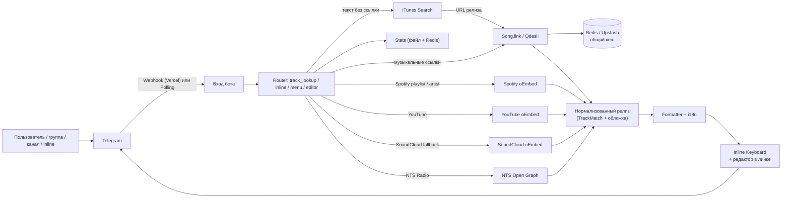

# Архитектура StonerHand Soundlinks Bot

Карта системы для тех, кто поддерживает или форкает бота. Актуальна для версии с inline-режимом, поиском по названию, редактором постов, Redis-кешем и двуязычным интерфейсом.

## Общая схема



## Поток обновления

### Webhook (Vercel, основной режим)

1. Telegram шлёт update на `POST /api/telegram` (`api/telegram.py`).
2. Проверяется размер payload, форма JSON и опциональная подпись `X-Telegram-Bot-Api-Secret-Token` (`TELEGRAM_WEBHOOK_SECRET`).
3. **Тёплый reuse**: приложение PTB, его HTTP-пулы и кеши создаются один раз на инстанс и переиспользуются между вызовами (`_ensure_application`). Никакого `getMe` и пересборки на каждое сообщение. Упавший update утилизирует кешированное приложение, чтобы следующий стартовал чисто.
4. Update обрабатывается хендлерами из `build_application`.

### Polling (Railway / локально)

`python -m music_links_bot` запускает `run_polling` с теми же `allowed_updates`: `message`, `channel_post`, `callback_query`, `inline_query`.

### Самовосстановление webhook

`GET /api/set_webhook` (защищён `SET_WEBHOOK_SECRET`, либо `Authorization: Bearer $CRON_SECRET` от Vercel Cron) заново регистрирует webhook с актуальными `allowed_updates`, синхронизирует меню команд и описания профиля бота (`setMyDescription` / `setMyShortDescription`, RU + EN). Cron из `vercel.json` дергает его ежедневно (`0 3 * * *`), поэтому подписка не «протухает» после изменений кода.

## Маршрутизация входящих сообщений

`track_lookup_message` (`bot.py`) — главный обработчик текста:

1. Сообщения, вставленные через собственный inline-режим (`via_bot == сам бот`), игнорируются.
2. Из текста извлекаются поддерживаемые URL (`url_utils.extract_supported_urls`), максимум 12.
3. **Нет URL** (только в личке): текст очищается от упоминания бота и уходит в поиск (`SearchClient` → iTunes Search API → Apple Music URL → обычный конвейер). Слишком короткий текст → подсказка.
4. URL сортируются по типам: Spotify artist / Spotify playlist / YouTube / NTS / остальная музыка (`_split_source_urls`), все типы резолвятся **параллельно** через `asyncio.gather`.
5. Один релиз → карточка (в личке — с редактором), несколько → нумерованная подборка, смесь типов → mixed-подборка.

В личке вместо typing-индикатора мгновенно отправляется плейсхолдер «⏳ Собираю пост…», который затем редактируется в готовый пост (ContextVar `_PLACEHOLDER_MESSAGE`, task-локальный).

## Клиенты метаданных (`src/music_links_bot/`)

| Модуль | Источник | Роль |
| --- | --- | --- |
| `songlink.py` | Song.link / Odesli API | Кроссплатформенные ссылки, тип релиза, год, обложка (`thumbnailUrl`). Параллельный опрос регионов из `SONGLINK_USER_COUNTRIES`, мерж ссылок. Кеш: локальный TTL + Redis (7 дней) |
| `search.py` | iTunes Search API (без ключа) | Текстовый запрос → до 3 кандидатов (URL, артист, название, обложка). Топ-1 для лички, весь список для inline |
| `youtube.py` | YouTube oEmbed | Название и канал видео |
| `soundcloud.py` | SoundCloud oEmbed | Fallback, когда Song.link не знает трек |
| `playlist.py` / `artist.py` | Spotify oEmbed | Названия плейлистов и артистов |
| `nts.py` | NTS Open Graph | Название эфира и станция |
| `kvstore.py` | Upstash Redis REST | Общий кеш, черновики, статистика. Полностью опционален |

Гарантия Spotify: если Song.link не вернул прямую ссылку, в `links["spotify"]` подставляется deep-link на поиск `open.spotify.com/search/<артист> <название>`; такие ссылки исключены из выбора превью. Fallback-карточки оборачивают исходный URL в `song.link/<url>`, чтобы hub-кнопка всегда открывала полный список площадок.

## Inline-режим

`inline_query_handler`:

- В запросе есть URL → одна карточка-результат.
- Текст без URL → до 3 кандидатов из поиска, каждый резолвится через Song.link параллельно; пользователь выбирает из списка (заголовок, исполнитель, обложка).
- Пустой/неудачный запрос → кнопка-подсказка, открывающая бота (`InlineQueryResultsButton`).
- Ответы кешируются Telegram (общий кеш, `cache_time=1800`), поэтому популярные запросы не бьют по API.

Вставленный результат — полный пост с клавиатурой площадок и подписью «via @bot».

## Редактор постов (только личка)

Одиночный релиз в личке отправляется как **черновик** (`_send_track_draft`):

- Состояние: `{type, item (TrackMatch), prefix, hashtags, quote, large_preview, can_publish, lang}`.
- Хранение: словарь в памяти (до 300) + Redis (`draft:<id>`, TTL 48 ч) — черновики переживают перезапуски инстансов.
- Кнопки (`callback_data = "ed|<action>|<draft_id>"`):
  - `h` — хэштеги вкл/выкл
  - `q` — цитата вкл/выкл (если была подводка)
  - `v` — превью большое/компакт
  - `f` — финализировать (убрать панель редактора)
  - `d` — удалить пост
  - `p` — 📤 опубликовать в канал: только для владельца (`from_user.id == ADMIN_CHAT_ID`), цель — `PUBLISH_CHAT_ID` (по умолчанию `@stonerhand`), хэштеги при публикации всегда включаются

## Mini App «Студия» (`webapp/` + `api/webapp.py`)

Одностраничный визуальный редактор внутри Telegram (кнопка меню и кнопка 🎛 под постом). Статика — `webapp/index.html` (`/app`), API — `POST /api/webapp` с телом `{init_data, action, payload}`. Подпись `initData` проверяется по официальному HMAC-алгоритму (`webapp_auth.py`), свежесть — 24 часа.

Действия API:

| Action | Кто | Что делает |
| --- | --- | --- |
| `resolve` | все | Ссылка или текст → черновик; текстовый запрос с несколькими совпадениями возвращает список кандидатов (обложка + 30-сек `previewUrl` из iTunes), выбор возвращается как `resolve` c `pick` |
| `draft` | владелец | Открыть существующий черновик (из чат-редактора), лениво догружает аудио-превью |
| `update` | владелец | Патч черновика: флаги, свой CTA-текст, свои хэштеги (`custom_tags`), набор и порядок платформ (`platforms`) |
| `send` / `publish` | все / админ | Отправить себе / опубликовать в канал (антидубль с `force`) |
| `schedule` / `queue` / `unschedule` | админ | Отложенная публикация: очередь в Redis `queue:v1` |
| `history` | все | Последние 10 релизов пользователя (`hist:<id>`, TTL 90 дней) с отметкой «уже в канале» (MGET по фингерпринтам) |
| `stats` | админ | Счётчики + топы для дашборда |
| `crate*` | все / публикация — админ | Конструктор подборок: `crate` / `crate_add` / `crate_remove` / `crate_order` / `crate_clear` / `crate_send` / `crate_publish` (`crate:<id>`, до 10 треков, TTL 14 дней) |

Флаг черновика `as_photo` отправляет пост фотографией с подписью (обложка всегда сверху). Клиентские фишки: хэптика, системная кнопка «Назад», вставка из буфера, подсказки из истории при вводе, живой акцент из доминирующего цвета обложки, ↗️ шаринг через `switchInlineQuery`, дефолты в `CloudStorage`, онбординг-подсказки, полноэкранный режим и ярлык на домашний экран (Bot API 8.0).

## Очередь публикаций (`publish_queue.py`)

Задания `{id, publish_at, draft}` лежат в Redis (`queue:v1`, без Redis — память инстанса). Доставка **оппортунистическая**: тик очереди выполняется после каждого telegram-апдейта и на каждый `GET /api/webapp` — внешний пинг (UptimeRobot) даёт точность до минут. Кросс-инстансовый лок `queue:lock` (SET NX, TTL 30 с) исключает двойную публикацию.

## Локализация (`i18n.py`)

Интерфейс (меню, вкладки, подсказки, ошибки, тексты загрузки, кнопки редактора, описания профиля) — RU/EN, язык выбирается по `language_code` пользователя (ru/uk/be/kk → RU, остальные → EN). Тексты постов (CTA-фразы из `phrases.py`, подписи форматтера) остаются на русском — это голос канала.

## Статистика (`stats.py`)

Счётчики постов/треков/альбомов/видео и топы пользователей/чатов. Локально — JSON-файл (на Vercel `/tmp`, эфемерный). С настроенным Redis каждый апдейт асинхронно мержится в блоб `stats:v1` (максимум по счётчикам, объединение map-ов), а `/stats` показывает объединённый вид — цифры переживают холодные старты и общие для всех инстансов.

## Конфигурация (env)

| Переменная | Роль |
| --- | --- |
| `BOT_TOKEN` | токен Telegram (обязательно) |
| `SONGLINK_USER_COUNTRIES` | регионы для Song.link, опрашиваются параллельно |
| `PRIMARY_PLATFORM` | какая площадка первая в кнопках и превью |
| `BOT_UI_MODE` | `stonerhand` / `minimal` / `editorial` |
| `ADMIN_CHAT_ID` | приватная статистика, уведомления, право кнопки 📤 |
| `PUBLISH_CHAT_ID` | куда публикует 📤 (по умолчанию `@stonerhand`) |
| `SET_WEBHOOK_SECRET` | защита `/api/set_webhook` |
| `TELEGRAM_WEBHOOK_SECRET` | подпись входящих updates |
| `CRON_SECRET` | авторизация Vercel Cron для ежедневного самовосстановления |
| `UPSTASH_REDIS_REST_URL/TOKEN` (или `KV_REST_API_*`) | Redis: общий кеш, черновики, статистика, история и очередь Студии |
| `WEBAPP_URL` | адрес Mini App (по умолчанию `https://<прод-домен>/app`) |
| `WEBHOOK_BASE_URL`, `STATS_PATH`, `LOG_LEVEL`, `SONGLINK_API_KEY` | тонкая настройка |

## Карта кода

```text
api/
├── telegram.py       webhook: валидация, тёплый reuse приложения, тик очереди
├── webapp.py         API Студии: resolve/draft/update/deliver/schedule/history/stats
└── set_webhook.py    регистрация webhook + синк команд, описаний и кнопки меню

webapp/
└── index.html        Mini App «Студия»: один файл, vanilla JS, дизайн Vintage Amplifier

src/music_links_bot/
├── bot.py            хендлеры, роутинг, клавиатуры, редактор, inline, черновики
├── songlink.py       Song.link client, регионы, обложки, Redis-кеш
├── search.py         iTunes Search: текст → кандидаты релизов, жанры, аудио-превью
├── publish_queue.py  очередь отложенных публикаций (Redis + память)
├── webapp_auth.py    проверка подписи initData Mini App
├── kvstore.py        Upstash/Vercel KV REST-клиент (graceful degradation)
├── i18n.py           RU/EN каталог интерфейсных строк
├── formatter.py      макет постов, хэштеги, выбор превью
├── telegram_text.py  безопасный перенос rich-text подводок
├── playlist.py / artist.py / youtube.py / soundcloud.py / nts.py   метаданные
├── url_utils.py      детект URL, чистка трекинг-параметров, cache-key
├── cache.py          in-memory TTL-кеш
├── stats.py          счётчики + merge для Redis
├── phrases.py        фразы CTA и ошибок (голос канала)
└── config.py         Settings из env

tests/                228 тестов: unittest, стабы клиентов, без сети
```

## Принципы

- **Никакой деградации без Redis/ключей**: всё опциональное отключается молча, бот остаётся рабочим на голом `BOT_TOKEN`.
- **Пост публикуется до удаления исходника** в группах/каналах — контент не теряется.
- **Ошибки не тупиковые**: в личке любая ошибка приходит с клавиатурой подсказок.
- **Внешние вызовы**: явные таймауты, параллелизм, кеширование, фоллбеки.
