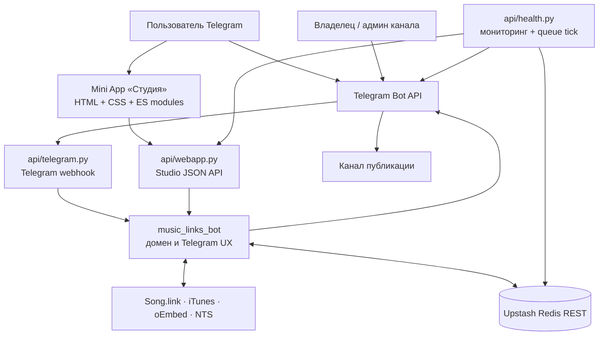
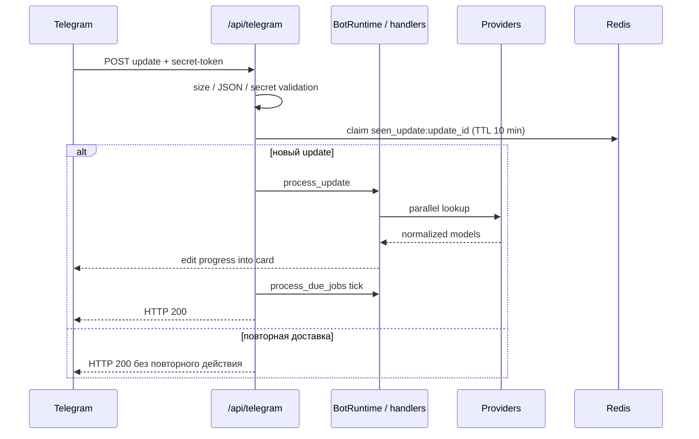
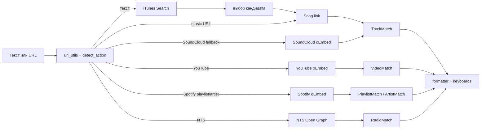
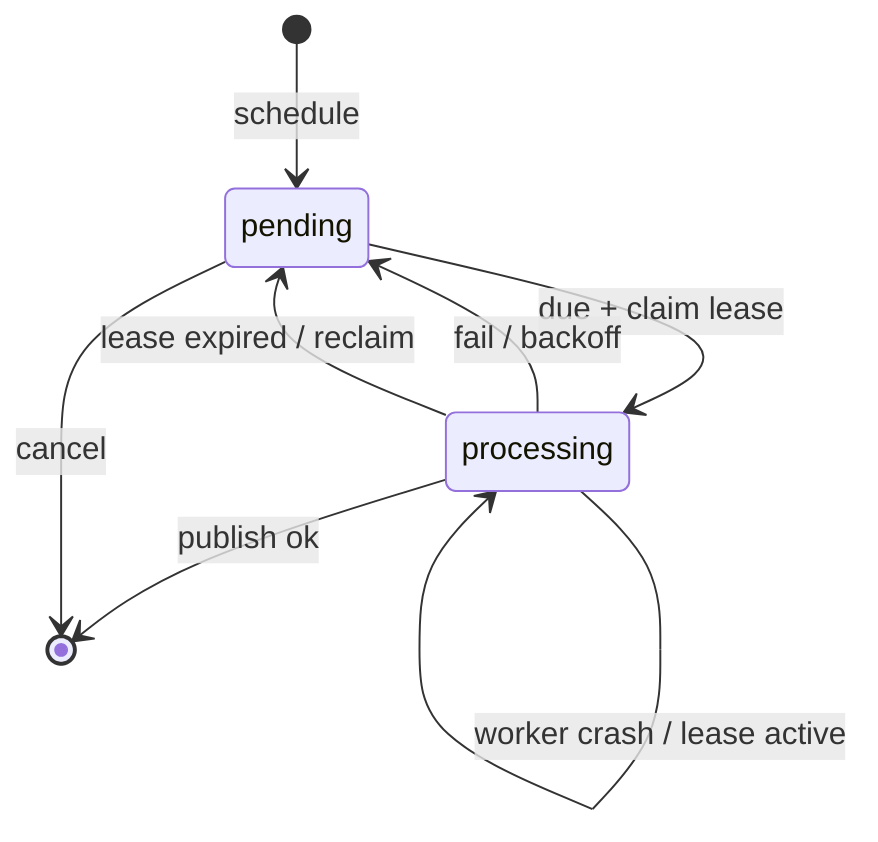

# Архитектура StonerHand Soundlinks Bot

Документ описывает текущую production-архитектуру Telegram-бота и Mini App «Студия»: границы модулей, потоки данных, хранение, безопасность и эксплуатацию.

## 1. Контекст системы



Production работает на Vercel Functions. Telegram присылает updates через webhook, а Studio обращается к отдельному JSON API. Оба транспорта собирают одно и то же PTB-приложение через `build_application()` и переиспользуют доменные сервисы.

## 2. Структура репозитория

```text
api/
  telegram.py          HTTP webhook Telegram, dedup updates, warm runtime
  webapp.py            авторизованный JSON API Студии
  health.py            Telegram/webhook/Redis health + состояние очереди
  set_webhook.py       регистрация webhook, команд, профиля и menu button

src/music_links_bot/
  bot.py               composition root, handlers, chat editor, delivery
  bot_lookup.py        параллельный lookup и fallback разных типов URL
  bot_runtime.py       сессии, callback v2, action leases, диагностика
  bot_crate.py         подборка внутри Telegram-чата
  bot_ui.py            экраны и клавиатуры conversational UX
  songlink.py          Song.link/Odesli, кеш и single-flight
  search.py            iTunes Search, кандидаты, жанры, audio preview
  youtube.py           YouTube oEmbed
  soundcloud.py        SoundCloud oEmbed fallback
  playlist.py          Spotify playlist oEmbed
  artist.py            Spotify artist oEmbed
  nts.py               Open Graph страниц NTS
  models.py            нормализованные модели контента
  formatter.py         HTML-текст постов, CTA и хэштеги
  keyboards.py         кнопки платформ и Telegram actions
  i18n.py              RU/EN интерфейсные строки
  telegram_text.py     безопасное сохранение rich-text подводок
  studio_models.py     валидация draft patch и crate payload
  studio_storage.py    история и серверное зеркало crate
  publish_queue.py     durable-очередь отложенных публикаций
  publication_state.py антидубль опубликованных релизов
  request_guard.py     rate limit и idempotency Studio mutations
  kvstore.py           Upstash/Vercel KV REST adapter
  cache.py             локальный TTL cache
  stats.py             локальные счётчики и merge
  bot_stats.py         запись статистики из Telegram handlers
  alerts.py            дедуплицированные DM владельцу
  branding.py          опциональная Pillow-рамка фото-поста
  webhook_secret.py    явный или производный webhook secret
  url_utils.py         распознавание, нормализация и очистка URL
  config.py            Settings из environment
  loop_runner.py       постоянный asyncio loop для serverless runtime

webapp/
  index.html           семантическая разметка экранов и dialog sheets
  styles.css           responsive темы и визуальная система
  app.js               state machine, UI, Telegram WebApp integration
  api-client.js        JSON transport, timeout/cancel, request_id
  cloud-storage.js     Promise/callback adapter Telegram CloudStorage

tests/
  test_*.py            unit и integration tests без внешней сети
  e2e/smoke.py         headless пользовательский сценарий Studio
```

## 3. Composition root и жизненный цикл

`build_application(settings)` в `bot.py` создаёт:

- `python-telegram-bot` Application;
- HTTP-клиенты Song.link, Search, YouTube, SoundCloud, Spotify oEmbed и NTS;
- опциональный `KVStore`;
- `BotRuntime`;
- memory fallback для drafts, search selections и другого transient state;
- Telegram handlers и общий error handler.

Один набор handlers используется в двух режимах:

| Режим | Точка входа | Получение updates |
| --- | --- | --- |
| Production | `api/telegram.py` | Telegram webhook |
| Local / Railway | `python -m music_links_bot` | `run_polling()` |

В serverless-функциях PTB Application и сетевые клиенты сохраняются в module-level state тёплого инстанса. `loop_runner.py` держит постоянный asyncio event loop в отдельном потоке. Инициализация сериализована lock, но обработка независимых запросов не удерживает этот lock во время сети.

## 4. Telegram update pipeline



### Защита transport-слоя

- максимальный update — 1 MiB;
- JSON должен быть объектом;
- `X-Telegram-Bot-Api-Secret-Token` сравнивается constant-time;
- секрет берётся из `TELEGRAM_WEBHOOK_SECRET`, либо стабильно выводится из `BOT_TOKEN`;
- update claim хранится 10 минут в Redis, при его отсутствии — в памяти;
- если обработка упала, claim освобождается, чтобы Telegram retry мог повторить update;
- каждый запрос выполняется с timeout, после серии ошибок warm Application пересоздаётся;
- падение webhook отправляет дедуплицированный alert владельцу.

### Маршрутизация

Порядок handlers:

1. команды `/start`, `/help`, `/guide`, `/platforms`, `/channel`, `/id`, `/stats`, `/crate`;
2. callback v2 (`v2|scope|action|payload`);
3. legacy callback (`menu:*`, `ed|*`) для уже отправленных сообщений;
4. inline query;
5. обычный текст или caption.

`detect_action()` классифицирует вход до дорогих вызовов: `help`, `search`, `resolve`, `crate` или `ignore`. До 12 URL из одного сообщения нормализуются и распределяются по типам.

## 5. Lookup pipeline



`bot_lookup.resolve_sources()` запускает независимые provider lookup параллельно. Результат — `LookupBundle` с треками, видео, радио, плейлистами, артистами и ошибками.

Ключевые свойства:

- Song.link использует локальный TTL cache и Redis cache на 7 дней;
- одинаковые одновременные запросы объединяются single-flight;
- основной регион запрашивается первым, дополнительные — только если результат неполный;
- Search имеет positive cache на 6 часов и negative cache на 10 минут;
- жанр подгружается быстро для первой карточки, медленное enrichment может продолжиться в фоне;
- Spotify получает безопасный search deep-link, если прямой URL не вернулся;
- неизвестный SoundCloud URL деградирует к oEmbed-карточке;
- fallback сохраняет исходный источник и универсальный переход через Song.link;
- ошибки провайдера типизированы и превращаются в сообщение с дальнейшим действием.

## 6. Telegram UX и состояние

### Поиск и progress

В личке текстовый запрос сохраняется в пользовательской сессии. Бот показывает до шести кандидатов. После выбора или прямой ссылки одно сообщение обновляется по этапам, поэтому чат не засоряется временными статусами.

### Черновик

Одиночный TrackMatch превращается в draft:

```text
draft:<id> → {
  chat_id,
  item,
  source_url,
  flags,
  custom_cta,
  custom_hashtags,
  platform_order,
  preview,
  preview_pending
}
```

Draft живёт 48 часов в Redis и в bounded memory cache до 300 элементов. Владение проверяется по `chat_id`.

### Callback и повторные действия

- новый формат callback: `v2|<scope>|<action>|<payload>`;
- Telegram limit 64 bytes проверяется при кодировании;
- callback ID claim живёт 15 минут;
- publish/send/crate actions используют lease на 45 секунд;
- повторный тап не создаёт второй пост;
- активный поиск пользователя можно отменить новым поиском;
- последняя retryable action хранится в сессии 30 дней.

### Delivery pipeline

`_deliver_draft()` — единая точка отправки себе и публикации в канал. Она формирует HTML/keyboard, применяет link preview или photo mode и возвращает результат доставки. Антидубль строится по fingerprint исполнителя и названия. Удаление исходной ссылки в группе/канале выполняется только после успешного нового поста.

## 7. Studio Mini App

### Клиентская архитектура

Studio не требует Node build:

- `index.html` содержит экраны Home, Candidates, Loading, Result, Format, Crate, Queue, Stats и bottom sheets;
- `styles.css` задаёт editorial design system, CSS variables, light/dark theme, safe areas, touch targets и reduced motion;
- `app.js` управляет state/view transitions, Telegram WebApp API, player, formatting, presets, crate, queue и stats;
- `api-client.js` создаёт `request_id`, ставит timeout, поддерживает abort и нормализует ошибки;
- `cloud-storage.js` хранит тему, onboarding, presets и client-authoritative crate.

Сервер не доверяет отображаемому клиентом admin-state. Каждое privileged действие снова проверяет `user.id == ADMIN_CHAT_ID`.

### API contract

`POST /api/webapp`:

```json
{
  "init_data": "<Telegram WebApp initData>",
  "action": "resolve",
  "payload": {},
  "request_id": "client-generated-id"
}
```

`initData` валидируется официальным HMAC-SHA256 алгоритмом Telegram. Данные старше 24 часов не принимаются. Максимальный body — 64 KiB, action timeout — 25 секунд.

| Action | Доступ | Назначение |
| --- | --- | --- |
| `resolve` | пользователь | текст/URL → кандидаты или draft |
| `resolve_batch` | пользователь | 2+ URL → дедуплицированные элементы crate |
| `draft` | владелец draft | открыть draft из Telegram |
| `preview` | владелец draft | лениво получить audio preview |
| `update` | владелец draft | применить flags, CTA, tags и platform order |
| `history` | пользователь | последние 10 релизов и published state |
| `send` | пользователь | отправить пост себе |
| `publish` / `unpublish` | админ | публикация в канал / undo |
| `schedule` | админ | поставить draft в очередь |
| `queue` / `unschedule` / `reschedule` | админ | управление очередью |
| `stats` | админ | агрегированная статистика |
| `crate*` | пользователь; publish — админ | добавить, удалить, упорядочить, очистить, отправить или опубликовать подборку |

`resolve` и `resolve_batch` ограничены 20 запросами в минуту на пользователя. Mutating actions принимают `request_id`; результат успешной операции кешируется 24 часа. Параллельный повтор получает `request_in_progress`, а временная ошибка не фиксируется как окончательный результат.

### State ownership

| Состояние | Авторитетный источник | Fallback / зеркало |
| --- | --- | --- |
| текущий экран и release editor | память страницы | нет |
| тема, onboarding, presets | Telegram CloudStorage | localStorage вне Telegram |
| crate | CloudStorage клиента | `crate:<user>` в Redis на 14 дней |
| draft | Redis на 48 часов | bounded memory текущего инстанса |
| history | Redis на 90 дней | memory текущего инстанса |
| published fingerprints | Redis | ограниченный memory state |
| stats | Redis merge | локальный JSON/memory |
| queue | Redis `queue:v1` | memory текущего инстанса |

Client-authoritative crate позволяет собирать подборку без Redis и отправляет полный список с mutation. Сервер валидирует каждую запись, ограничивает crate десятью треками и сохраняет зеркало.

## 8. Очередь публикаций

Job shape:

```text
{
  id,
  publish_at,
  attempts,
  status: pending | processing,
  lease_owner?,
  lease_until?,
  draft
}
```

Ограничения: до 50 jobs, планирование максимум на 90 дней, processing lease 90 секунд.



Очередь защищена:

- локальным `asyncio.Lock`;
- Redis lock `queue:lock` на 30 секунд для нескольких инстансов;
- compare-and-delete при снятии lock;
- per-job lease, поэтому crash не теряет задание;
- тремя попытками с backoff 2, 10 и 30 минут;
- alert владельцу после исчерпания попыток.

Queue tick запускается после Telegram update, при `GET /api/webapp` и из `/api/health`. Vercel Cron не является поминутным scheduler: для точности около пяти минут нужен внешний uptime monitor.

## 9. Redis keyspace

| Ключ / префикс | Назначение | TTL |
| --- | --- | --- |
| Song.link cache keys | нормализованные provider responses | 7 дней |
| `draft:<id>` | Telegram/Studio draft | 48 часов |
| `session:v1:<user>` | onboarding, язык, last/retry action | 30 дней |
| `callback:v2:<id>` | дедуп callback query | 15 минут |
| `action:v1:<key>` | lease долгого Telegram action | 45 секунд |
| `seen_update:<id>` | дедуп webhook update | 10 минут |
| `idem:result:*` | результат Studio mutation | 24 часа |
| `idem:lock:*` | выполняющаяся Studio mutation | 30 секунд |
| `hist:<user>` | история релизов | 90 дней |
| `crate:<user>` | серверное зеркало подборки | 14 дней |
| `queue:v1` | durable очередь | без TTL |
| `queue:lock` | межинстансовая запись очереди | 30 секунд |
| `stats:v1` | объединённая статистика | без TTL |
| release fingerprint | антидубль публикаций | зависит от publication state |
| alert dedup keys | ограничение повторных DM | 1 час |

Если Redis не настроен или временно недоступен, `KVStore` мягко возвращает fallback. Это сохраняет основной lookup и отправку, но memory state не разделяется между serverless-инстансами и может исчезнуть после cold start.

## 10. Health, self-healing и наблюдаемость

### `/api/health`

Проверяет:

1. `getMe` — токен и доступность Telegram;
2. `getWebhookInfo` — webhook зарегистрирован на `/api/telegram` и нет свежей ошибки доставки;
3. Redis ping, если Redis настроен;
4. размер и число просроченных queue jobs;
5. запускает queue tick через `/api/webapp`.

Telegram и webhook критичны всегда; Redis критичен только когда настроен. HTTP 503 позволяет внешнему монитору заметить отказ. Health и queue-stuck alerts дедуплицируются примерно на час.

### `/api/set_webhook`

Endpoint:

- определяет production base URL;
- регистрирует webhook и allowed updates;
- передаёт webhook secret;
- синхронизирует команды;
- синхронизирует полные и короткие RU/EN-описания;
- устанавливает menu button Студии, если известен `WEBAPP_URL`;
- вызывается Vercel Cron ежедневно в `03:00 UTC`.

Ручной запрос защищён `SET_WEBHOOK_SECRET`. Cron может авторизоваться `Authorization: Bearer $CRON_SECRET`.

## 11. Безопасность

### Server side

- Telegram update: secret token, constant-time comparison, size limit;
- Studio: HMAC-подпись, age check, user ownership и server-side admin check;
- idempotency key хешируется и ограничен по длине;
- rate limit имеет Redis и memory implementation;
- внешние значения экранируются перед Telegram HTML;
- логируемый action очищается от control characters и обрезается;
- secrets читаются только из environment и не возвращаются клиенту;
- Redis locks снимаются только владельцем.

### Browser side

- CSP разрешает собственные scripts, Telegram bridge, шрифты и HTTPS media;
- `camera`, `microphone`, `geolocation` запрещены Permissions-Policy;
- `frame-ancestors` ограничен Telegram;
- `base-uri` и `object-src` запрещены;
- динамический текст экранируется;
- внешние URL проходят scheme validation;
- запросы отменяются при уходе с экрана, stale responses отбрасываются sequence guard;
- reduced-motion и keyboard focus поддерживаются.

## 12. Конфигурация и права

`Settings.from_env()` требует только `BOT_TOKEN`. Остальные интеграции включаются по наличию environment variables.

| Роль | Возможности |
| --- | --- |
| Любой пользователь | search/resolve, редактирование своего draft, история, crate, отправка себе, inline |
| `ADMIN_CHAT_ID` | всё выше + публикация, undo, очередь, stats, alerts |
| Бот-админ канала | отправка постов и, для автозамены, удаление исходных сообщений |

`PUBLISH_CHAT_ID` задаёт destination независимо от `ADMIN_CHAT_ID`. Владелец определяется Telegram user ID, а destination может быть username канала или числовой chat ID.

## 13. CI/CD

`.github/workflows/ci.yml` запускается на pull request и push в `main`:

- Python 3.12;
- `pyflakes` для `src`, `api`, `tests`;
- полный `unittest` suite;
- `node --check` для трёх ES modules;
- отдельный Playwright/Chromium smoke: boot → search → candidate/result → crate и batch flow.

Vercel Git Integration создаёт Preview для feature branch и Production deployment после merge в `main`. `vercel.json` отдельно объявляет четыре Python functions, пять static assets, routes, security headers и daily cron.

## 14. Правила изменения системы

При добавлении нового источника:

1. расширить `url_utils.py`;
2. добавить маленький provider adapter;
3. включить его в `bot_lookup.resolve_sources()`;
4. нормализовать результат в существующую модель или добавить отдельную;
5. обновить formatter/keyboard и Studio response при необходимости;
6. добавить offline tests с HTTP stubs;
7. обновить README и эту карту.

При добавлении Studio action:

1. определить access level и payload limit;
2. добавить handler в `_handle_action()`;
3. для mutation включить `request_id` idempotency;
4. валидировать ownership/admin на сервере;
5. добавить client timeout/cancel UX;
6. покрыть API tests и E2E critical path.

При изменении callback:

1. сохранить limit 64 bytes;
2. использовать `v2|scope|action|payload`;
3. не ломать legacy callback уже отправленных сообщений;
4. определить, нужен ли callback claim или action lease;
5. проверить двойной тап и retry после временной ошибки.

## 15. Известные архитектурные ограничения

- Vercel Functions не дают постоянного процесса: очередь тикает оппортунистически, а не отдельным worker;
- без Redis состояние является best-effort и привязано к тёплому инстансу;
- `bot.py` и `api/webapp.py` остаются крупнейшими orchestration-модулями; новые provider/storage/UI обязанности нужно выносить в отдельные файлы;
- Studio — vanilla JS state machine без статической типизации, поэтому API contract защищают runtime validation и E2E;
- Telegram удаляет inline keyboard при пересылке сообщения; универсальная Song.link-ссылка остаётся в тексте как fallback;
- публичный iTunes Search не гарантирует одинаковый каталог во всех регионах;
- точность отложенной публикации зависит от частоты внешних health pings.

## 16. Инварианты

- исходный пост не удаляется до успешной публикации замены;
- временная ошибка не кешируется как окончательный idempotent result;
- draft нельзя открыть или изменить другому пользователю;
- privileged действие всегда повторно проверяет admin на сервере;
- queue job не удаляется до подтверждённой доставки;
- stale lease можно безопасно подобрать после crash;
- необязательный провайдер или Redis не должен ломать базовый сценарий «ссылка → пост»;
- пользовательская ошибка должна давать понятный следующий шаг, а не тупиковый экран.
