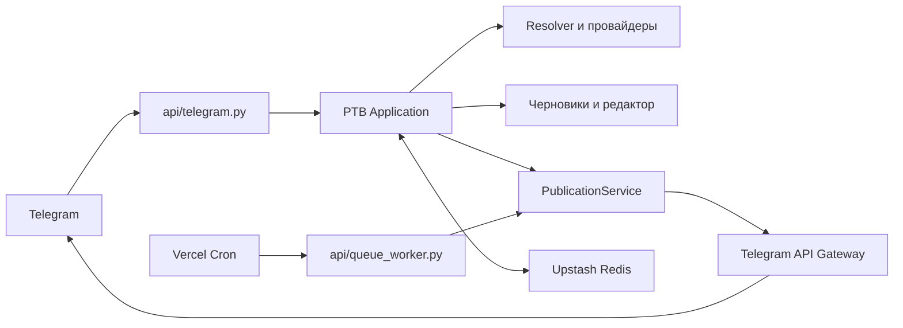

# Архитектура StonerHand Soundlinks Bot

Документ описывает текущую production-архитектуру Telegram-бота.

## Контур системы

```mermaid
flowchart LR
    TG["Telegram"] --> WH["api/telegram.py"]
    WH --> BOT["PTB Application"]
    BOT --> RESOLVE["Resolver и провайдеры"]
    BOT --> EDIT["Черновики и редактор"]
    BOT --> PUB["PublicationService"]
    PUB --> GW["Telegram API Gateway"]
    GW --> TG
    CRON["Vercel Cron"] --> WORKER["api/queue_worker.py"]
    WORKER --> PUB
    BOT <--> REDIS["Upstash Redis"]
```

Production работает на Vercel Functions. Telegram передаёт updates только через
webhook `/api/telegram`. Polling используется исключительно при локальном запуске.

## HTTP-маршруты

- `/api/telegram` — Telegram webhook;
- `/api/set_webhook` — защищённая регистрация webhook, команд, описаний и меню;
- `/api/health` — Telegram, webhook, Redis, очередь и runtime-метрики;
- `/api/queue_worker` — защищённый cron-tick очереди.

## Основные модули

- `bot.py` — orchestration поиска, карточки и публикации;
- `bot_menu.py` — команды, стартовый экран, onboarding и навигация;
- `bot_crate_handlers.py` — действия и undo пользовательской подборки;
- `bot_actions.py` — единый контракт всех callback-действий;
- `bot_pipeline.py` — типизированный запрос и выбор единственного delivery-сценария;
- `bot_ui.py` — Telegram-тексты и inline-клавиатуры;
- `bot_queue.py` — постраничный нативный экран управления отложенными публикациями;
- `editor_view.py` — единый рендер карточки и экранов конструктора;
- `bot_builder.py` — чистая state machine конструктора, ввод и Telegram-лимиты;
- `bot_lookup.py` — классификация и объединение источников;
- `lookup_models.py` — типизированный bundle, статусы источников и cache-сериализация;
- `provider_runtime.py` — параллельные провайдеры, timeout, short negative cache и partial result;
- `track_merge.py` — безопасное объединение одного релиза с разных площадок;
- `publication_service.py` — отправка себе и публикация в канал;
- `publication_preflight.py` — блокирующая проверка карточки перед delivery;
- `publication_presets.py` — именованные пользовательские шаблоны оформления;
- `publication_model.py` — независимая от Telegram модель готовой публикации;
- `rich_publications.py` — безопасный Rich HTML, карточки, медиагруппы и fallback;
- `release_hubs.py` — канонические Songlink/Odesli URL для треков, альбомов и
  подкастов независимо от источника метаданных;
- `telegram_gateway.py` — изолированный контракт новых методов Bot API 10.3;
- `telegram_media_cache.py` — повторное использование Telegram `file_id` обложек;
- `publication_view.py` — единый HTML и клавиатура карточки для preview и delivery;
- `publication_budget.py` — динамический лимит подводки для сообщения и photo caption;
- `draft_model.py` — типизированный черновик, очистка внешних данных и миграция схемы;
- `telegram_buttons.py` — семантический реестр кнопок и цветов;
- `bot_crate.py` — пользовательская подборка до 10 материалов;
- `bot_history.py` — недавние релизы;
- `bot_runtime.py` — сессии, дедупликация, диагностика и метрики;
- `bot_storage.py` — черновики и retry state;
- `publish_queue.py` — долговечная очередь с lease и повторами;
- `kvstore.py` — Upstash Redis с безопасным fallback;
- `formatter.py` и `keyboards.py` — единое представление постов.

## Поиск и карточка

Вход классифицируется как текстовый запрос, музыкальная ссылка, YouTube, NTS,
плейлист или артист. Независимые источники обрабатываются параллельно. Успешные
частичные результаты сохраняются даже при ошибке отдельного провайдера.

Одиночный релиз превращается в редактируемую карточку. State machine разделяет
стиль, подводку, хэштеги, площадки, формат Telegram, чистое превью, действия и
планирование. Аудиофайл превращается в тот же черновик с нативной отправкой
`sendAudio`, а пользовательская фотография может заменить обложку релиза.
Свободный текст принимается через нативный Force Reply и сохраняется в сессии,
поэтому cold start не теряет ожидаемый ввод. Перед внешней публикацией бот
показывает короткую сводку с единственной кнопкой подтверждения.
Telegram-entities подводки преобразуются в безопасный HTML без потери жирного,
курсива и ссылок. Доступный лимит вычисляется из готового тела публикации и
отдельно учитывает UTF-16-лимиты обычного сообщения и подписи к фото, поэтому
эмодзи считаются так же, как на стороне Telegram.
Любой ожидаемый ввод отменяется командой `/cancel`. До пяти последних изменений
настроек можно последовательно вернуть в течение пяти минут.

Пользовательский интерфейс не показывает внутренний термин «черновик».
Стартовый экран объясняет допустимые входы, поиск остаётся главным действием,
а живая незавершённая карточка доступна отдельной вторичной кнопкой. Перед
показом этой кнопки запись проверяется; устаревший указатель удаляется из
сессии. Для владельца канала публикация видна прямо на карточке, остальные
настройки сгруппированы в конструкторе и обновляют preview в одном сообщении.

Несколько ссылок создают одну подборку. Исходные ссылки и цитата в итоговом
посте не повторяются. Подборку можно назвать и открыть в чистом preview;
дубли не добавляются. Порядок и удаление управляются callback-кнопками,
очистка подтверждается, последнее удаление можно отменить.

Входные URL извлекаются как из видимого текста, так и из Telegram
`text_link`-entities, затем канонизируются и дедуплицируются с сохранением
порядка. Resolver формирует ровно один `SourceStatus` на каждый уникальный
источник. Полный результат валиден только при совпадении порядка статусов,
числа материалов и числа входов; повреждённый или старый partial-cache
автоматически отбрасывается и пересобирается.
Ссылки разных площадок с совпадающим релизом схлопываются только в presentation
слое: кнопки объединяются, а исходные статусы и возможность точечного retry не
теряются. Публичный плейлист остаётся самостоятельной карточкой, но при наличии
доступных track URL предлагает собрать до десяти позиций в обычную подборку.

## Состояние

| Данные | Redis key | TTL / fallback |
| --- | --- | --- |
| lookup cache | типизированные cache keys | TTL по провайдеру / bounded memory |
| пользовательская сессия | `session:v2:<id>` | 30 дней / bounded memory |
| черновик schema v5 | `draft:<id>` | 48 часов / bounded memory |
| подборка | `bot-crate:v2:<id>` | 14 дней / bounded memory |
| название подборки | `bot-crate-title:v1:<id>` | 14 дней / bounded memory |
| настройки оформления | `channel:template:v2:<hash>` | 180 дней / bounded memory |
| именованные шаблоны | `publication:presets:v1:<hash>` | 365 дней / bounded memory |
| история | `hist:<id>` | 90 дней / bounded memory |
| очередь | `queue:v1` | постоянная / memory fallback |
| антидубли публикаций | `posted:<hash>` | постоянная |
| Telegram media cache | `telegram-media:v1:<hash>` | 30 дней / bounded memory |

Владение черновиком проверяется по положительному `chat_id`. Callback и update
имеют дедупликацию, а publish/send используют lease, поэтому повторный тап или
повтор Telegram update не создаёт второй пост.

Чтение сессий, подборок и настроек поддерживает предыдущую `v1`: при первом
обращении запись безопасно переносится в актуальную схему без остановки бота.
Пустой окончательный результат кэшируется отдельно только на 3 минуты;
временные ошибки провайдеров в отрицательный кэш не попадают.
Полный результат Song.link хранится 7 дней, а резервная Spotify-карточка —
15 минут: после восстановления агрегатора она быстро заменяется полным набором
площадок. Для Spotify региональный `not found` проверяется в ограниченном наборе
вторичных регионов, затем — по публичным метаданным страницы релиза; ложный
промах повторяется один раз. Неполный результат имеет явный заголовок `N из M`,
не получает кнопку отправки и не попадает в aggregate-cache. Повторная проверка
заново обрабатывает весь исходный набор, поэтому восстановленный материал не
нужно вручную объединять с предыдущей частью. Tracking-параметры не создают
отдельные записи cache/share. Отдельная проблемная позиция может быть заменена
по номеру: retry state хранит исходный порядок, а новый URL подставляется только
в выбранный слот.

## Публикация и очередь

`PublicationService` проверяет права и отправляет подготовленное представление.
`publication_view` одинаково формирует HTML и клавиатуру для редактора, отправки
себе, канала и очереди, поэтому preview не расходится с итоговым постом. Сервис
сначала выполняет локальную preflight-проверку. Загруженное аудио уходит через
`sendAudio`, пользовательская обложка — напрямую по Telegram `file_id` без
повторной загрузки и брендирования. Для обычной карточки пользователь выбирает
Auto с Rich fallback или принудительный Classic. Затем сервис собирает Rich
Message с обложкой, структурированным текстом и кнопками
площадок внутри публикации. Песня и клип используют collage, а подборка —
collage или slideshow. Если новый метод, клиент или конкретное медиа недоступны,
тот же вызов без потери данных переходит на проверенную HTML/photo-карточку.
Capability cooldown не повторяет заведомо неподдерживаемый запрос на каждом
update, но успешная проба сразу восстанавливает Rich-режим. Сервис записывает
отдельные метрики Rich delivery/error/fallback. Для канала сохраняется компактный
шаблон оформления. Очередь использует статусы `pending` и `processing`, lease,
ограниченные повторы и уведомление владельца при окончательной ошибке.

Worker не зависит от пользовательского интерфейса: он создаёт то же приложение
бота, загружает готовый draft и вызывает общий publication pipeline.
Webhook worker не запускает: пользовательский update не ждёт очередь и не
рискует получить повтор от Telegram из-за чужой долгой публикации. Фиксированные
и пользовательские даты рассчитываются в `BOT_TIMEZONE`; горизонт очереди —
90 дней. При заполнении 50 слотов добавление отклоняется явно, без вытеснения
старой публикации. Экран администратора показывает все слоты постранично и
сохраняет текущую страницу после обновления или отмены элемента.

## Надёжность

- один runtime получает updates: webhook в production, polling локально;
- webhook создаёт приложение лениво и переиспользует соединения на тёплом instance;
- update ID резервируется в Redis до обработки;
- локальная дедупликация защищена от параллельных serverless-вызовов;
- внешние запросы имеют timeout, cache и single-flight;
- музыкальные источники получают собственный timeout после входа в ограниченную
  очередь; запуски сглаживаются, а пяти слотов хватает, чтобы все 10 ссылок
  получили полный шанс в пределах webhook-бюджета;
- ошибки одного провайдера не отменяют найденные материалы, а общий resolver
  проверяет точное соответствие входов, статусов и результатов;
- повтор partial-result атомарно пересобирает весь исходный набор;
- этапы прогресса монотонны и не откатываются при повторных callback;
- Telegram-клавиатуры строятся общей семантической фабрикой и проверяются
  контрактными, golden- и snapshot-тестами;
- прогресс использует нативную disabled-кнопку Bot API 10.3 и повторяет отправку
  без неё, если Telegram ещё не поддерживает новый объект;
- ephemeral replies используют вложенный `ephemeral_message_parameters` и
  никогда не мешают публичному fallback;
- повторная photo-публикация использует сохранённый Telegram `file_id`, не
  скачивая неизменившуюся обложку заново;
- runtime агрегирует по каждому провайдеру success rate, среднюю задержку,
  fallback, timeout и rate limit;
- webhook удаляет claim после ошибки, чтобы Telegram мог повторить update;
- профиль, локализованные команды и меню синхронизируются независимо: ошибка
  одного Telegram-вызова не блокирует остальные поля;
- durable draft удаляет неизвестные поля, ограничивает размеры и принимает
  только HTTP(S)-ссылки до создания строгой модели релиза;
- health endpoint параллельно проверяет Telegram, webhook и queue worker,
  считает недоступный worker ошибкой, одним Redis-снимком читает
  очередь/метрики и возвращает version/commit;
- внутренний health-to-worker вызов использует отдельный производный ключ,
  если `CRON_SECRET` сохранён пустым; явный секрет всегда имеет приоритет;
- production canary проверяет реальные API, commit deploy и просроченную очередь;
- CI выполняет lint, compile, security-аудит зависимостей, проверку
  `vercel.json` и полный набор тестов.
