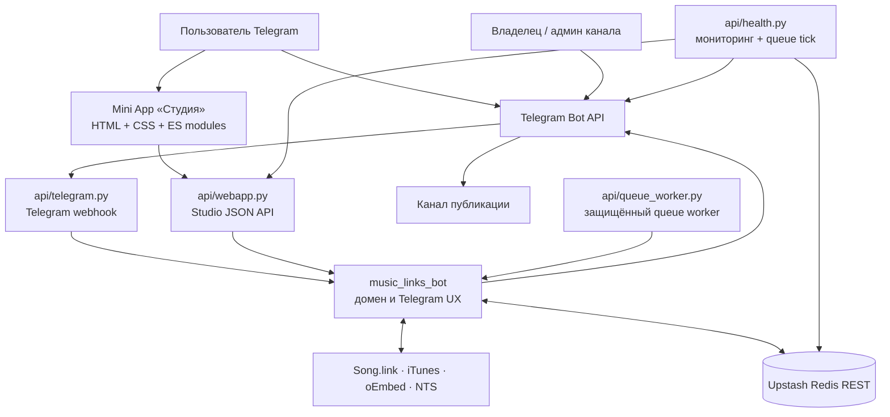
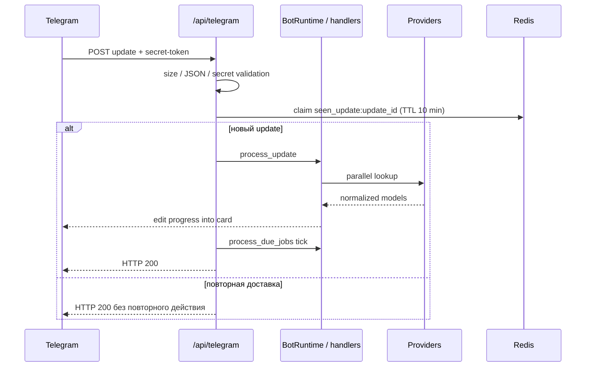
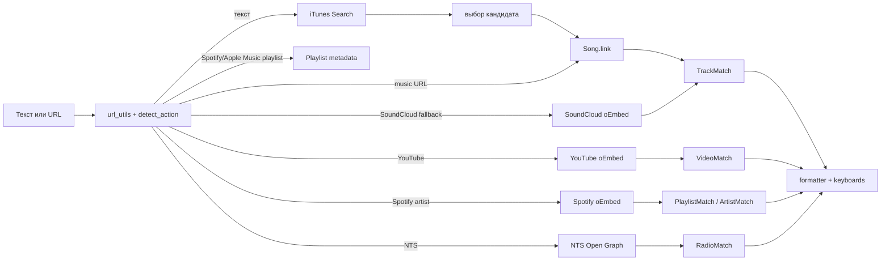
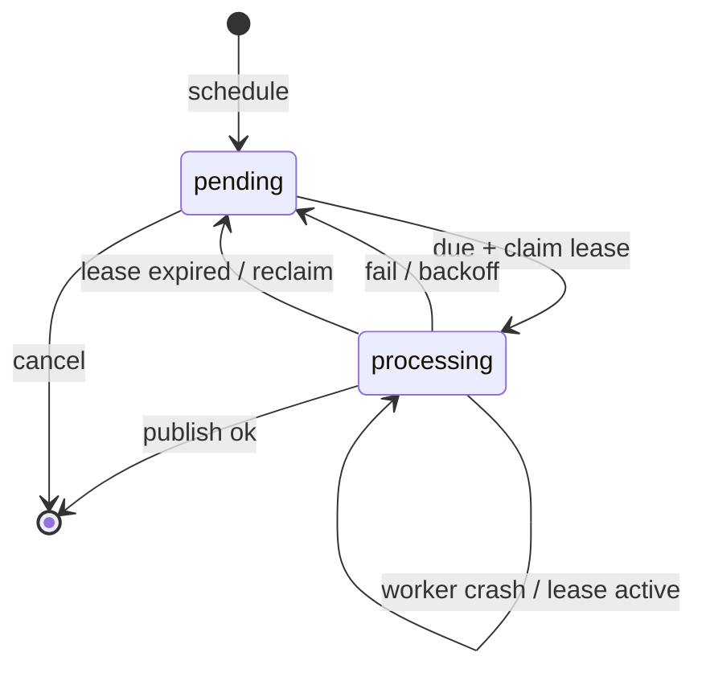

# Архитектура StonerHand Soundlinks Bot

Документ описывает текущую production-архитектуру Telegram-бота и Mini App «Студия»: границы модулей, потоки данных, хранение, безопасность и эксплуатацию.

## 1. Контекст системы


```mermaid
flowchart TB
    USER["Пользователь Telegram"]
    ADMIN["Владелец / админ канала"]
    TELEGRAM["Telegram Bot API"]
    STUDIO["Mini App «Студия»\nHTML + CSS + ES modules"]
    WEBHOOK["api/telegram.py\nTelegram webhook"]
    WEBAPP["api/webapp.py\nStudio JSON API"]
    CORE["music_links_bot\nдомен и Telegram UX"]
    PROVIDERS["Song.link · iTunes · oEmbed · NTS"]
    REDIS[("Upstash Redis REST")]
    CHANNEL["Канал публикации"]
    HEALTH["api/health.py\nмониторинг + queue tick"]
    WORKER["api/queue_worker.py\nзащищённый queue worker"]

    USER --> TELEGRAM
    ADMIN --> TELEGRAM
    TELEGRAM --> WEBHOOK
    USER --> STUDIO
    STUDIO --> WEBAPP
    WEBHOOK --> CORE
    WEBAPP --> CORE
    CORE <--> PROVIDERS
    CORE <--> REDIS
    CORE --> TELEGRAM
    TELEGRAM --> CHANNEL
    HEALTH --> TELEGRAM
    HEALTH --> REDIS
    HEALTH --> WEBAPP
    WORKER --> CORE
```

Production работает на Vercel Functions. Telegram присылает updates через webhook, а Studio обращается к отдельному JSON API. Оба транспорта собирают одно и то же PTB-приложение через `build_application()` и переиспользуют доменные сервисы.

## 2. Структура репозитория

```text
api/
  telegram.py          HTTP webhook Telegram, dedup updates, warm runtime
  webapp.py            авторизованный JSON API Студии
  health.py            Telegram/webhook/Redis health + состояние очереди
  queue_worker.py      CRON_SECRET endpoint обработки очереди
  set_webhook.py       регистрация webhook, команд, профиля и menu button

src/music_links_bot/
  bot.py               совместимый facade и Telegram handlers
  bot_app.py           composition root, lazy clients и lifecycle
  bot_admin.py         owner-only status и runtime-диагностика
  bot_batch.py         статусы нескольких ссылок и retry failed-only
  bot_inline.py        inline query, карточки и коллекции для любого чата
  bot_lookup.py        параллельный lookup и fallback разных типов URL
  bot_runtime.py       сессии, callback v2, action leases, диагностика
  bot_storage.py       durable drafts/selections/retry и bounded memory
  bot_progress.py      одно редактируемое progress-сообщение
  errors.py            единые коды ошибок бота и Studio API
  bot_crate.py         подборка внутри Telegram-чата
  bot_ui.py            экраны и клавиатуры conversational UX
  songlink.py          Song.link/Odesli, кеш и single-flight
  search.py            iTunes Search, кандидаты, жанры, audio preview
  youtube.py           YouTube oEmbed
  soundcloud.py        SoundCloud oEmbed fallback
  playlist.py          плейлисты Spotify (oEmbed) и Apple Music (Open Graph)
  artist.py            Spotify artist oEmbed
  nts.py               Open Graph страниц NTS
  models.py            нормализованные модели контента
  formatter.py         компактный HTML постов, чистые заголовки и хэштеги
  mixed_post.py        пара песня+клип, media preview и Studio-нормализация
  rich_publications.py валидация блоков, Rich HTML, fallback и raw Bot API transport
  keyboards.py         кнопки платформ и Telegram actions
  i18n.py              RU/EN интерфейсные строки
  telegram_text.py     безопасное сохранение rich-text подводок
  studio_models.py     валидация draft patch и crate payload
  studio_presenters.py стабильный публичный Studio response для draft
  studio_storage.py    история и серверное зеркало crate
  publish_queue.py     durable-очередь отложенных публикаций
  publication_service.py единый delivery для бота, Studio и очереди
  publication_state.py антидубль с ID и ссылкой старого поста
  chat_access.py       кешируемая проверка прав канала
  request_guard.py     rate limit и idempotency Studio mutations
  kvstore.py           Upstash/Vercel KV REST adapter
  cache.py             локальный TTL cache
  provider_registry.py декларативная маршрутизация URL по адаптерам
  provider_runtime.py  общий deadline, circuit breaker, partial results и cache
  inline_storage.py    кеш inline-поиска и персональная история
  lazy_client.py       отложенная инициализация HTTP-клиентов провайдеров
  stats.py             локальные счётчики и merge
  bot_stats.py         запись статистики из Telegram handlers
  alerts.py            дедуплицированные DM владельцу
  branding.py          опциональная Pillow-рамка фото-поста
  webhook_secret.py    явный или производный webhook secret
  url_utils.py         распознавание, нормализация и очистка URL
  config.py            Settings из environment
  loop_runner.py       постоянный asyncio loop для serverless runtime

webapp/
  index.html           семантическая разметка экранов и dialog sheets
  styles.css           responsive темы и визуальная система
  studio-shell.css     адаптивный Telegram workspace и component polish
  app.js               state machine, UI, Telegram WebApp integration
  api-client.js        JSON transport, timeout/cancel, request_id
  cloud-storage.js     Promise/callback adapter Telegram CloudStorage
  error-ui.js          перевод error_code в понятное восстановление
  studio-core.js       query mode, preflight, нормализация лонгрида и Markdown import

tests/
  test_*.py            unit и integration tests без внешней сети
  e2e/smoke.py         headless пользовательский сценарий Studio
```

## 3. Composition root и жизненный цикл

`build_application(settings)` делегирует сборку в `bot_app.py`, который создаёт:

- `python-telegram-bot` Application;
- HTTP-клиенты Song.link, Search, YouTube, SoundCloud, Spotify oEmbed и NTS;
- опциональный `KVStore`;
- `BotRuntime`;
- memory fallback для drafts, search selections, failed retries и inline state;
- Telegram handlers и общий error handler.

Один набор handlers используется в двух режимах:

| Режим | Точка входа | Получение updates |
| --- | --- | --- |
| Production | `api/telegram.py` | Telegram webhook |
| Local / Railway | `python -m music_links_bot` | `run_polling()` |

В serverless-функциях PTB Application и сетевые клиенты сохраняются в module-level state тёплого инстанса. `loop_runner.py` держит постоянный asyncio event loop в отдельном потоке. Инициализация сериализована lock, но обработка независимых запросов не удерживает этот lock во время сети.

## 4. Telegram update pipeline


```mermaid
sequenceDiagram
    participant T as Telegram
    participant H as /api/telegram
    participant R as BotRuntime / handlers
    participant P as Providers
    participant K as Redis

    T->>H: POST update + secret-token
    H->>H: size / JSON / secret validation
    H->>K: claim seen_update:update_id (TTL 10 min)
    alt новый update
        H->>R: process_update
        R->>P: parallel lookup
        P-->>R: normalized models
        R-->>T: edit progress into card
        H->>R: process_due_jobs tick
        H-->>T: HTTP 200
    else повторная доставка
        H-->>T: HTTP 200 без повторного действия
    end
```

### Защита transport-слоя

- максимальный update — 1 MiB;
- JSON должен быть объектом;
- `X-Telegram-Bot-Api-Secret-Token` сравнивается constant-time;
- секрет берётся из `TELEGRAM_WEBHOOK_SECRET`, либо стабильно выводится из `BOT_TOKEN`;
- update claim хранится 10 минут в Redis; при отсутствии или временной недоступности Redis запрос переходит на bounded memory fallback, чтобы update не был молча потерян;
- если обработка упала, claim освобождается, чтобы Telegram retry мог повторить update;
- каждый запрос выполняется с timeout, после серии ошибок warm Application пересоздаётся;
- падение webhook отправляет дедуплицированный alert владельцу.

### Маршрутизация

Порядок handlers:

1. команды `/start`, `/help`, `/guide`, `/platforms`, `/channel`, `/id`, `/stats`, `/crate`;
2. callback v2 (`v2|scope|action|payload`);
3. legacy callback (`menu:*`, `ed|*`) для уже отправленных сообщений;
4. inline query, делегированный в `bot_inline.py`;
5. обычный текст или caption.

`detect_action()` классифицирует вход до дорогих вызовов: `help`, `search`, `resolve`, `crate` или `ignore`. До 12 URL из одного сообщения нормализуются и распределяются по типам.
Главный message handler остаётся координатором: текстовый поиск, пустой provider
result и отправка одного/нескольких треков изолированы в отдельных этапах. Это
сохраняет единый pipeline, но не смешивает выбор кандидата, Redis-state и delivery
в одной функции.

## 5. Lookup pipeline


```mermaid
flowchart LR
    INPUT["Текст или URL"] --> CLASSIFY["url_utils + detect_action"]
    CLASSIFY -->|"текст"| SEARCH["iTunes Search"]
    SEARCH --> PICK["выбор кандидата"]
    PICK --> SONG
    CLASSIFY -->|"music URL"| SONG["Song.link"]
    CLASSIFY -->|"YouTube"| YT["YouTube oEmbed"]
    CLASSIFY -->|"SoundCloud fallback"| SC["SoundCloud oEmbed"]
    CLASSIFY -->|"Spotify/Apple Music playlist"| PL["Playlist metadata"]
    CLASSIFY -->|"Spotify artist"| SP["Spotify oEmbed"]
    CLASSIFY -->|"NTS"| NTS["NTS Open Graph"]
    SONG --> MODEL["TrackMatch"]
    YT --> MODEL2["VideoMatch"]
    SC --> MODEL
    SP --> MODEL3["PlaylistMatch / ArtistMatch"]
    NTS --> MODEL4["RadioMatch"]
    MODEL --> VIEW["formatter + keyboards"]
    MODEL2 --> VIEW
    MODEL3 --> VIEW
    MODEL4 --> VIEW
```

`bot_lookup.resolve_sources()` передаёт независимые операции в
`provider_runtime.run_provider_tasks()`. У каждого провайдера есть собственный
timeout и безопасный fallback, поэтому недоступное видео не отменяет уже
найденную песню. Результат — `LookupBundle` с треками, видео, радио,
плейлистами, артистами и ошибками.

Ключевые свойства:

- Song.link использует локальный TTL cache и Redis cache на 7 дней;
- готовый межпровайдерный `LookupBundle` кешируется на 15 минут в bounded memory
  и Redis; временные и пустые результаты не фиксируются;
- успешные partial results отправляются пользователю, а состояние каждого
  провайдера попадает в runtime diagnostics;
- одинаковые одновременные запросы объединяются single-flight; завершившаяся задача удаляется даже после timeout/cancel вызывающего запроса;
- основной регион запрашивается первым, дополнительные — только если результат неполный;
- Search имеет positive cache на 6 часов и negative cache на 10 минут;
- жанр подгружается быстро для первой карточки, медленное enrichment может продолжиться в фоне;
- Spotify получает безопасный search deep-link, если прямой URL не вернулся;
- неизвестный SoundCloud URL деградирует к oEmbed-карточке;
- fallback сохраняет исходный источник и универсальный переход через Song.link;
- ошибки провайдера типизированы и превращаются в сообщение с дальнейшим действием.
- одна песня и один YouTube-клип переходят в отдельный компактный сценарий:
  Telegram показывает обложку и oEmbed-thumbnail двумя плитками, а под ними
  оставляет одну строку переходов к Song.link и оригинальному видео;
- видео не скачивается и не перезаливается; если один из thumbnail недоступен,
  отправка автоматически возвращается к обычному безопасному link-preview.

## 6. Telegram UX и состояние

### Поиск и progress

В личке текстовый запрос сохраняется в пользовательской сессии. Бот показывает до шести кандидатов. После выбора или прямой ссылки одно сообщение обновляется по этапам, поэтому чат не засоряется временными статусами.

`/start` рендерит короткий home-state из размера bot-crate и роли пользователя.
В первом уровне явно показаны два режима — «Быстро» и «Студия», рядом остаются
подборка и помощь. Очередь, публикация, аналитика и расширенное оформление
перенесены в Студию. Web App-кнопка
исключается в группах, где Telegram её не поддерживает.

Готовая карточка не содержит сгенерированных рекламных подписей или скрытой
ссылки в заголовке. Навигация остаётся в явных кнопках: две приоритетные
площадки и «Все платформы». Для пересылки с кнопками Студия создаёт prepared
message вместо обычного Telegram forward.

### Черновик

Одиночный TrackMatch превращается в draft:

```text
draft:<id> → {
  chat_id,
  item,
  source_url,
  flags,
  custom_hashtags,
  platform_order,
  publication_mode: card | longread,
  longread: { title, lead, blocks[] },
  preview,
  preview_pending
}
```

Draft живёт 48 часов в Redis и в bounded memory cache до 300 элементов. Владение проверяется по `chat_id`.
Запись в Redis завершается до ответа webhook/API: черновик не зависит от того,
успеет ли Vercel сохранить фоновую задачу перед заморозкой инстанса. Обновление
существующего элемента не вытесняет другой активный draft, а чтение из Redis
подчиняется тому же лимиту memory cache.

### Callback и повторные действия

- новый формат callback: `v2|<scope>|<action>|<payload>`;
- Telegram limit 64 bytes проверяется при кодировании;
- callback ID claim живёт 15 минут;
- publish/send/crate actions используют lease на 45 секунд;
- повторный тап не создаёт второй пост;
- активный поиск пользователя можно отменить новым поиском;
- указатель на активную задачу снимается в `finally` при успехе, ошибке и отмене;
- последняя retryable action хранится в сессии 30 дней.

### Delivery pipeline

`_deliver_draft()` — единая точка отправки себе и публикации в канал. Для `card` она формирует обычный HTML/keyboard и применяет link preview или photo mode. Для `longread` собирает безопасный Rich HTML (`h1/h2`, paragraph, blockquote, list, details, figure, footer) и вызывает `sendRichMessage` с той же inline-клавиатурой. Если Telegram сообщает, что Rich API недоступен или не поддержан, доставка автоматически повторяется как ограниченный HTML без разрыва тегов. Антидубль строится по fingerprint исполнителя и названия. Удаление исходной ссылки в группе/канале выполняется только после успешного нового поста.

## 7. Studio Mini App

### Клиентская архитектура

Studio не требует Node build:

- `index.html` содержит экраны Home, Candidates, Loading, Result, Format, Longread Editor, Crate, Queue, Stats и bottom sheets;
- `styles.css` задаёт editorial design system, CSS variables, light/dark theme, safe areas, touch targets и reduced motion;
- `app.js` управляет state/view transitions, Telegram WebApp API, player, Card/Longread, блочным редактором, preview, crate, queue и stats;
- `api-client.js` создаёт `request_id`, ставит timeout, поддерживает abort и нормализует ошибки;
- `cloud-storage.js` хранит тему, onboarding, presets, active draft и client-authoritative crate;
- `error-ui.js` переводит стабильный `error_code` API в единообразное сообщение и следующий шаг;
- `studio-core.js` независимо от транспорта распознаёт single/batch query, оценивает готовность поста/подборки, нормализует лонгрид, импортирует Markdown и сериализует active draft snapshot. Batch resolve разделяет музыкальные и YouTube-ссылки: видео хранится в crate как типизированный материал с оригинальным URL и thumbnail. Пара песня+клип получает отдельное двухплиточное превью, но остаётся совместима с общей сортировкой, оформлением и отправкой crate.

Home загружается одним action `dashboard`: history, зеркало crate и очередь читаются
параллельно на сервере. Это убирает прежний waterfall из трёх запросов. Последний
открытый draft сохраняется в CloudStorage и показывается отдельной карточкой
«Продолжить». Перед отправкой единый preflight показывает состояние площадок,
подводки, обложки и хэштегов; блокирующим условием остаётся только отсутствие
доступной площадки. Повторный вызов загрузки Home объединяется с уже выполняющимся,
а новый lookup отменяет предыдущий abortable-запрос. Две и более ссылки до отправки
переключают поиск в явный batch-режим; API возвращает число распознанных и
нераспознанных позиций. Ошибка изображения заменяет его спокойным fallback и не
засчитывается как стопроцентная готовность. Режим лонгрида хранится в том же
draft, поэтому одинаково работает для отправки себе, канала, очереди и нативного
`shareMessage`. Markdown-файл разбирается локально в разрешённые блоки, а сервер
повторно проверяет типы, длины, URL и общий бюджет текста.

Сервер не доверяет отображаемому клиентом admin-state. Каждое privileged действие снова проверяет `user.id == ADMIN_CHAT_ID`.

### API contract

`POST /api/webapp`:

```json
{
  "init_data": "<Telegram WebApp initData>",
  "action": "resolve",
  "payload": {},
  "request_id": "client-generated-id"
}
```

`initData` валидируется официальным HMAC-SHA256 алгоритмом Telegram. Данные старше 24 часов не принимаются. Максимальный body — 128 KiB (с запасом для Unicode-лонгрида), action timeout — 25 секунд.

| Action | Доступ | Назначение |
| --- | --- | --- |
| `resolve` | пользователь | текст/URL → кандидаты или draft |
| `resolve_batch` | пользователь | 2+ URL → дедуплицированные элементы crate |
| `draft` | владелец draft | открыть draft из Telegram |
| `preview` | владелец draft | лениво получить audio preview |
| `update` | владелец draft | применить flags, tags, platform order и Card/Longread blocks |
| `dashboard` | пользователь | history + crate + краткое состояние очереди одним запросом |
| `history` | пользователь | последние 10 релизов и published state |
| `send` | пользователь | отправить карточку или Rich Message себе |
| `prepare_share` | владелец draft | подготовить карточку/Rich Message с кнопками для `shareMessage` |
| `publish` / `unpublish` | админ | публикация в канал / undo |
| `schedule` | админ | поставить draft в очередь |
| `queue` / `unschedule` / `reschedule` | админ | управление очередью |
| `stats` | админ | агрегированная статистика |
| `crate*` | пользователь; publish — админ | добавить, удалить, упорядочить, очистить, отправить или опубликовать подборку |

`resolve` и `resolve_batch` ограничены 20 запросами в минуту на пользователя. Mutating actions принимают `request_id`; результат успешной операции кешируется 24 часа. Параллельный повтор получает `request_in_progress`, а временная ошибка не фиксируется как окончательный результат.

### State ownership

| Состояние | Авторитетный источник | Fallback / зеркало |
| --- | --- | --- |
| текущий экран и release editor | память страницы | нет |
| тема, onboarding, presets, active draft | Telegram CloudStorage | localStorage вне Telegram |
| crate | CloudStorage клиента | `crate:<user>` в Redis на 14 дней |
| draft | Redis на 48 часов | bounded memory текущего инстанса |
| history | Redis на 90 дней | memory текущего инстанса |
| published fingerprints | Redis | ограниченный memory state |
| stats | Redis merge | локальный JSON/memory |
| queue | Redis `queue:v1` | memory текущего инстанса |

Client-authoritative crate позволяет собирать подборку без Redis и отправляет полный список с mutation. Сервер валидирует каждую запись, ограничивает crate десятью материалами и сохраняет зеркало. Дедупликация учитывает и тип материала, поэтому песня и одноимённый клип не схлопываются. Telegram-бот при импорте нескольких ссылок сначала дедуплицирует все релизы, затем сохраняет bot-crate одной записью вместо последовательного цикла load/modify/save.

## 8. Очередь публикаций

Job shape:

```text
{
  id,
  publish_at,
  attempts,
  status: pending | processing,
  lease_owner?,
  lease_until?,
  draft
}
```

Ограничения: до 50 jobs, планирование максимум на 90 дней, processing lease 90 секунд.


```mermaid
stateDiagram-v2
    [*] --> pending: schedule
    pending --> processing: due + claim lease
    processing --> [*]: publish ok
    processing --> pending: fail / backoff
    processing --> processing: worker crash / lease active
    processing --> pending: lease expired / reclaim
    pending --> [*]: cancel
```

Очередь защищена:

- локальным `asyncio.Lock`;
- Redis lock `queue:lock` на 30 секунд для нескольких инстансов;
- compare-and-delete при снятии lock;
- per-job lease, поэтому crash не теряет задание;
- тремя попытками с backoff 2, 10 и 30 минут;
- alert владельцу после исчерпания попыток.

Queue tick запускается после Telegram update, при `GET /api/webapp` и из `/api/health`. Vercel Cron не является поминутным scheduler: для точности около пяти минут нужен внешний uptime monitor.

В production независимый GitHub canary вызывает health каждые 10 минут.
Поэтому без пользовательского трафика бесплатный контур даёт точность примерно
до 10 минут; при обычном трафике webhook запускает queue tick чаще.

## 9. Redis keyspace

| Ключ / префикс | Назначение | TTL |
| --- | --- | --- |
| Song.link cache keys | нормализованные provider responses | 7 дней |
| `draft:<id>` | Telegram/Studio draft | 48 часов |
| `session:v1:<user>` | onboarding, язык, last/retry action, указатель на живое меню | 30 дней |
| `retry:v1:<id>` | только временно не обработанные URL batch-запроса | 30 минут |
| `inline:search:v1:<hash>` | кандидаты inline-поиска | 30 минут |
| `inline:history:v1:<user>` | персональная история inline | 30 дней |
| `lookup:v2:<hash>` | полный успешный LookupBundle | 15 минут |
| `callback:v2:<id>` | дедуп callback query | 15 минут |
| `action:v1:<key>` | lease долгого Telegram action | 45 секунд |
| `seen_update:<id>` | дедуп webhook update | 10 минут |
| `idem:result:*` | результат Studio mutation | 24 часа |
| `idem:lock:*` | выполняющаяся Studio mutation | 30 секунд |
| `hist:<user>` | история релизов | 90 дней |
| `crate:<user>` | серверное зеркало подборки | 14 дней |
| `queue:v1` | durable очередь | без TTL |
| `queue:lock` | межинстансовая запись очереди | 30 секунд |
| `stats:v1` | объединённая статистика | без TTL |
| `runtime:metrics:v1` | latency, cache hits и delivery counters тёплого процесса | 7 дней |
| release fingerprint | дата, target, message ID и URL прежнего поста | без TTL |
| alert dedup keys | ограничение повторных DM | 1 час |

Если Redis не настроен или временно недоступен, `KVStore` мягко возвращает fallback. Это сохраняет основной lookup и отправку, но memory state не разделяется между serverless-инстансами и может исчезнуть после cold start.

## 10. Health, self-healing и наблюдаемость

### `/api/health`

Проверяет:

1. `getMe` — токен и доступность Telegram;
2. `getWebhookInfo` — webhook зарегистрирован на `/api/telegram` и нет свежей ошибки доставки;
3. Redis ping, если Redis настроен;
4. размер и число просроченных queue jobs;
5. последний runtime metrics snapshot;
6. запускает queue tick через `/api/webapp`.

Telegram и webhook критичны всегда; Redis критичен только когда настроен. HTTP 503 позволяет внешнему монитору заметить отказ. Health и queue-stuck alerts дедуплицируются примерно на час.

### `/api/set_webhook`

Endpoint:

- определяет production base URL;
- регистрирует webhook и allowed updates;
- передаёт webhook secret;
- синхронизирует команды;
- синхронизирует полные и короткие RU/EN-описания;
- устанавливает menu button Студии, если известен `WEBAPP_URL`;
- вызывается Vercel Cron ежедневно в `03:00 UTC`.

Ручной запрос защищён `SET_WEBHOOK_SECRET`. Cron может авторизоваться `Authorization: Bearer $CRON_SECRET`.

## 11. Безопасность

### Server side

- Telegram update: secret token, constant-time comparison, size limit;
- Studio: HMAC-подпись, age check, user ownership и server-side admin check;
- idempotency key хешируется и ограничен по длине;
- rate limit имеет Redis и memory implementation;
- внешние значения экранируются перед Telegram HTML;
- логируемый action очищается от control characters и обрезается;
- secrets читаются только из environment и не возвращаются клиенту;
- Redis locks снимаются только владельцем.

### Browser side

- CSP разрешает собственные scripts, Telegram bridge, шрифты и HTTPS media;
- `camera`, `microphone`, `geolocation` запрещены Permissions-Policy;
- `frame-ancestors` ограничен Telegram;
- `base-uri` и `object-src` запрещены;
- динамический текст экранируется;
- внешние URL проходят scheme validation;
- новый lookup отменяет предыдущий запрос, а stale responses отбрасываются sequence guard;
- reduced-motion и keyboard focus поддерживаются.

## 12. Конфигурация и права

`Settings.from_env()` требует только `BOT_TOKEN`. Остальные интеграции включаются по наличию environment variables.

| Роль | Возможности |
| --- | --- |
| Любой пользователь | search/resolve, редактирование своего draft, история, crate, отправка себе, inline |
| `ADMIN_CHAT_ID` | всё выше + публикация, undo, очередь, stats, alerts |
| Бот-админ канала | отправка постов и, для автозамены, удаление исходных сообщений |

`PUBLISH_CHAT_ID` задаёт destination независимо от `ADMIN_CHAT_ID`. Владелец определяется Telegram user ID, а destination может быть username канала или числовой chat ID.

## 13. CI/CD

`.github/workflows/ci.yml` запускается на pull request и push в `main`:

- Python 3.12;
- `pyflakes` для `src`, `api`, `tests`;
- полный `unittest` suite;
- `node --check` для всех ES modules;
- отдельный Playwright/Chromium smoke: boot → search → candidate/result → crate и batch flow.

Vercel Git Integration создаёт Preview для feature branch и Production deployment после merge в `main`. `vercel.json` отдельно объявляет Python functions, Web App assets, routes, security headers и два допустимых для Hobby daily cron: синхронизацию webhook и аварийный queue worker. GitHub production canary каждые 10 минут и после успешного CI проверяет Telegram, webhook, Redis и оболочку Mini App; вызов health также безопасно запускает lease-защищённый queue tick.

## 14. Правила изменения системы

При добавлении нового источника:

1. расширить `url_utils.py`;
2. добавить маленький provider adapter;
3. включить его в `bot_lookup.resolve_sources()`;
4. нормализовать результат в существующую модель или добавить отдельную;
5. обновить formatter/keyboard и Studio response при необходимости;
6. добавить offline tests с HTTP stubs;
7. обновить README и эту карту.

При добавлении Studio action:

1. определить access level и payload limit;
2. добавить handler в `_handle_action()`;
3. для mutation включить `request_id` idempotency;
4. валидировать ownership/admin на сервере;
5. добавить client timeout/cancel UX;
6. покрыть API tests и E2E critical path.

При изменении callback:

1. сохранить limit 64 bytes;
2. использовать `v2|scope|action|payload`;
3. не ломать legacy callback уже отправленных сообщений;
4. определить, нужен ли callback claim или action lease;
5. проверить двойной тап и retry после временной ошибки.

## 15. Известные архитектурные ограничения

- Vercel Hobby не даёт минутный Cron: очередь тикает из webhook/health, а защищённый worker выполняет ежедневное восстановление; lease не позволяет двум тикам опубликовать один job дважды;
- без Redis состояние является best-effort и привязано к тёплому инстансу;
- `bot.py` и `api/webapp.py` остаются совместимыми orchestration-фасадами; lifecycle, публикация, owner status, batch recovery, inline storage и provider registry вынесены в отдельные модули;
- HTTP-клиенты провайдеров создаются лениво при первом обращении; неиспользованный
  провайдер не увеличивает холодный старт и не открывает соединения;
- Studio — vanilla JS state machine без статической типизации, поэтому API contract защищают runtime validation и E2E;
- Telegram удаляет inline keyboard при обычной пересылке; Студия использует prepared message для отправки текста вместе с URL-кнопками, а каналам не отдаёт запрещённые `switch_inline_query`-действия;
- публичный iTunes Search не гарантирует одинаковый каталог во всех регионах;
- без пользовательского трафика точность отложенной публикации ограничена
  примерно 10-минутным интервалом production canary;

## 16. Инварианты

- исходный пост не удаляется до успешной публикации замены;
- временная ошибка не кешируется как окончательный idempotent result;
- draft нельзя открыть или изменить другому пользователю;
- privileged действие всегда повторно проверяет admin на сервере;
- публикация в канал предварительно проверяет `can_post_messages`;
- queue job не удаляется до подтверждённой доставки;
- stale lease можно безопасно подобрать после crash;
- необязательный провайдер или Redis не должен ломать базовый сценарий «ссылка → пост»;
- пользовательская ошибка должна давать понятный следующий шаг, а не тупиковый экран.
