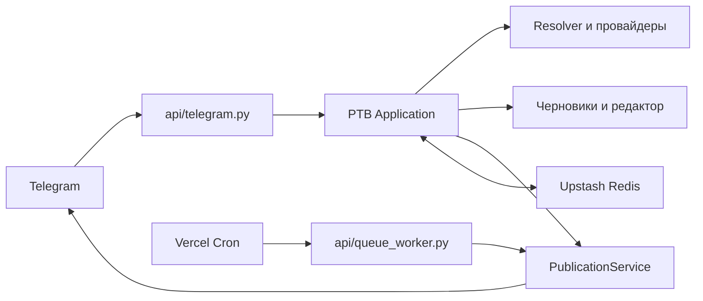

# Архитектура StonerHand Soundlinks Bot

Документ описывает текущую production-архитектуру Telegram-бота.

## Контур системы

```mermaid
flowchart LR
    TG["Telegram"] --> WH["api/telegram.py"]
    WH --> BOT["PTB Application"]
    BOT --> RESOLVE["Resolver и провайдеры"]
    BOT --> EDIT["Черновики и редактор"]
    BOT --> PUB["PublicationService"]
    PUB --> TG
    CRON["Vercel Cron"] --> WORKER["api/queue_worker.py"]
    WORKER --> PUB
    BOT <--> REDIS["Upstash Redis"]
```

Production работает на Vercel Functions. Telegram передаёт updates только через
webhook `/api/telegram`. Polling используется исключительно при локальном запуске.

## HTTP-маршруты

- `/api/telegram` — Telegram webhook;
- `/api/set_webhook` — защищённая регистрация webhook, команд, описаний и меню;
- `/api/health` — Telegram, webhook, Redis, очередь и runtime-метрики;
- `/api/queue_worker` — защищённый cron-tick очереди.

## Основные модули

- `bot.py` — orchestration команд, callback и сообщений;
- `bot_ui.py` — Telegram-тексты и inline-клавиатуры;
- `bot_lookup.py` — классификация и объединение источников;
- `provider_runtime.py` — параллельные провайдеры, timeout и partial result;
- `publication_service.py` — отправка себе и публикация в канал;
- `bot_crate.py` — пользовательская подборка до 10 материалов;
- `bot_history.py` — недавние релизы;
- `bot_runtime.py` — сессии, дедупликация, диагностика и метрики;
- `bot_storage.py` — черновики и retry state;
- `publish_queue.py` — долговечная очередь с lease и повторами;
- `kvstore.py` — Upstash Redis с безопасным fallback;
- `formatter.py` и `keyboards.py` — единое представление постов.

## Поиск и карточка

Вход классифицируется как текстовый запрос, музыкальная ссылка, YouTube, NTS,
плейлист или артист. Независимые источники обрабатываются параллельно. Успешные
частичные результаты сохраняются даже при ошибке отдельного провайдера.

Одиночный релиз превращается в редактируемый черновик. Пользователь может
изменить стиль, цитату, хэштеги и набор площадок, отправить пост себе,
опубликовать в канал или добавить релиз в подборку.

Несколько ссылок создают одну подборку. Исходные ссылки и цитата в итоговом
посте не повторяются. Порядок и удаление управляются callback-кнопками;
очистка подтверждается, последнее удаление можно отменить.

## Состояние

| Данные | Redis key | TTL / fallback |
| --- | --- | --- |
| lookup cache | типизированные cache keys | TTL по провайдеру / bounded memory |
| пользовательская сессия | `session:v1:<id>` | 30 дней / bounded memory |
| черновик | `draft:<id>` | 48 часов / bounded memory |
| подборка | `bot-crate:v1:<id>` | 14 дней / bounded memory |
| история | `hist:<id>` | 90 дней / bounded memory |
| очередь | `queue:v1` | постоянная / memory fallback |
| антидубли публикаций | `posted:<hash>` | постоянная |

Владение черновиком проверяется по положительному `chat_id`. Callback и update
имеют дедупликацию, а publish/send используют lease, поэтому повторный тап или
повтор Telegram update не создаёт второй пост.

## Публикация и очередь

`PublicationService` проверяет права, формирует HTML и клавиатуру, отправляет
сообщение или фото и записывает метрики. Для канала сохраняется компактный
шаблон оформления. Очередь использует статусы `pending` и `processing`, lease,
ограниченные повторы и уведомление владельца при окончательной ошибке.

Worker не зависит от пользовательского интерфейса: он создаёт то же приложение
бота, загружает готовый draft и вызывает общий publication pipeline.

## Надёжность

- один runtime получает updates: webhook в production, polling локально;
- webhook создаёт приложение лениво и переиспользует соединения на тёплом instance;
- update ID резервируется в Redis до обработки;
- локальная дедупликация защищена от параллельных serverless-вызовов;
- внешние запросы имеют timeout, cache и single-flight;
- ошибки одного провайдера не отменяют найденные материалы;
- webhook удаляет claim после ошибки, чтобы Telegram мог повторить update;
- health endpoint проверяет Telegram, webhook, Redis и просроченную очередь;
- production canary проверяет только реальные API бота;
- CI выполняет lint, compile, проверку `vercel.json` и полный набор тестов.
