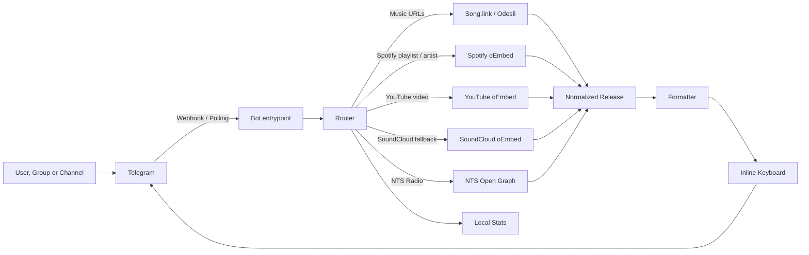

<div align="center">

# 🎧 StonerHand Soundlinks Bot

### One music link in → one perfect Telegram post out

**Drop any music URL — get an editorial-grade post: cover art, smart hashtags and buttons for every streaming platform. In DMs, groups, channels, and inline in any chat.**

[Русская версия](README.ru.md)
· [Architecture](ARCHITECTURE.ru.md)
· [Skills](#project-skills)
· [Bot](https://t.me/StonerHandBot)
· [Channel](https://t.me/stonerhand)
· [Vercel setup](#vercel-deployment)
· [Customization](#customization)


`streaming URL -> normalized release -> Telegram-ready editorial post`

</div>

---

## ✨ Highlights

| | Feature | What it feels like |
| --- | --- | --- |
| 🎛 | **Studio Mini App** | A full visual post editor inside Telegram: live preview with cover art, toggle chips, one-tap send or publish — opens from the menu button or the editor row |
| 🔎 | **Search without a link** | Type `artist - track` in DM or inline — the bot finds the release itself, no URL required |
| 🎚 | **Post editor** | Every DM post comes with toggles: hashtags on/off, quote on/off, ✅ finalize, 🗑 delete |
| 📤 | **Publish to channel** | The bot owner gets a one-tap button that posts the finished card straight to the channel |
| 🪄 | **Inline mode** | Type `@StonerHandBot <link>` (or a track name) in *any* chat — pick from up to three matches and insert a finished post without leaving the conversation |
| ⚡ | **Live loading** | An instant "⏳ собираю пост…" placeholder morphs into the final card — no dead air, no typing-indicator guessing |
| 🖼 | **Artwork previews** | Big cover art on top of every card, with release artwork as a fallback when a platform page has no preview |
| 🎛 | **Every platform, one tap** | Spotify, Apple Music, YouTube Music, SoundCloud, Deezer, Tidal, Yandex Music + a Song.link hub button |
| 🎨 | **Native button styles** | Green Spotify, red YouTube, success-highlighted active menu tab — real Telegram button colors, not just emoji |
| 📚 | **Collections** | Several links in one message become a numbered playlist-style post with a button per release |
| 🤖 | **Channel autopilot** | As an admin, the bot silently swaps raw links in channels/groups for clean editorial posts |
| 🚀 | **Serverless-fast** | Warm instances reuse connections and caches; repeated links resolve near-instantly |
| 🔁 | **Self-healing** | A daily cron re-registers the webhook and command menu — the bot never silently goes stale |
| 🧠 | **Shared Redis cache** | With Upstash/Vercel KV configured, lookups and `/stats` survive cold starts and are shared across instances |
| 🌍 | **Bilingual interface** | Menus, hints and editor controls switch to English automatically based on the user's Telegram language |

## What It Does

StonerHand Soundlinks Bot turns messy music URLs into compact Telegram posts with a consistent editorial style. Send a track, album, podcast, Spotify playlist, Spotify artist, YouTube video, NTS Radio page or several links at once, and the bot builds a clean card with title, preview, hashtags and platform buttons.

The default copy is tuned for [@stonerhand](https://t.me/stonerhand), but the architecture is intentionally reusable: swap the channel handle, phrase bank, button labels and platform priority, and it becomes a solid base for another music channel.

This is not a media downloader. It does not fetch or redistribute audio/video files. It resolves public links, fetches lightweight metadata and formats Telegram posts.

```text
input
https://open.spotify.com/track/...

output
📻 · Artist
Track

кнопки ниже, трек ждет

#stonerhand #track

[🟢 Spotify] [⚫ Tidal]
[🟦 Deezer]  [🟡 Yandex]
[🪩 All platforms]
```

## Product Surface

| Surface | Behavior |
| --- | --- |
| Private chat | Live loading placeholder morphs into the card, with an editor row: hashtags, quote, preview size, publish |
| Group chat | Can delete the original message and replace it with a clean post if admin rights allow it |
| Channel | Can replace raw links with editorial posts and stay silent on unrelated content |
| Inline (`@bot link` or a name) | Resolves on the fly, offers up to three matches with cover art, inserts a full post with buttons |
| Multi-link message | Builds a playlist-style collection post |
| User note above link | Preserves paragraphs and Telegram rich text: bold, italic, underline, strike, spoiler, code and text links |
| Command menu | Emoji tabs, an active-state marker and a 🧪 example-post tab |

## Supported Content

| Type | Example source | Output style |
| --- | --- | --- |
| Track | Spotify, Apple Music, YouTube Music, Deezer, Tidal, Yandex Music, SoundCloud | Music card with platform buttons |
| Album / EP / Single | Spotify, Apple Music, Deezer, Tidal, Yandex Music, SoundCloud sets | Release card with smart hashtags |
| Podcast episode / show | Spotify, Apple Podcasts and podcast links supported by Song.link | Podcast card or platform fallback |
| Spotify playlist | Spotify playlist URL | Playlist card with direct playlist button |
| Spotify artist | Spotify artist URL | Artist card with direct artist button |
| YouTube video | `youtube.com/watch`, `youtu.be`, `shorts`, `live`, `embed`, `m.youtube.com` | Video card with YouTube button |
| NTS Radio | `nts.live`, `www.nts.live` and NTS subdomains | Radio card with direct NTS button |
| Collection | Several links in one message | Numbered editorial playlist post |

## Tech Stack

| Layer | Choice |
| --- | --- |
| Runtime | Python 3.10+ |
| Telegram SDK | `python-telegram-bot` 21.x |
| HTTP client | `httpx` with connection limits and explicit timeouts |
| Music resolution | Song.link / Odesli API |
| Name search | iTunes Search API (public, keyless) |
| Lightweight metadata | Spotify, YouTube and SoundCloud oEmbed, NTS Open Graph |
| Shared cache & drafts | Upstash Redis / Vercel KV over REST (optional, graceful fallback) |
| Interface languages | RU/EN catalog in `i18n.py`, routed by the user's Telegram language |
| Deployment | Vercel webhook (warm instance reuse) or Railway worker |
| Configuration | Environment variables and optional `.env` |
| Testing | 189 `unittest` tests plus compile checks, no network required |

## Why It Is Public-Ready

| Area | Status |
| --- | --- |
| Secrets | No real tokens are committed; use `.env` locally and hosting environment variables in production |
| Local files | `.env`, `.venv`, stats files, caches and generated egg-info are ignored |
| Deployment | Vercel webhook and Railway worker setups are documented |
| Branding | StonerHand-specific copy lives in formatters, constants and phrase banks |
| Forkability | The core flow is separated into URL parsing, metadata clients, formatting, keyboards and transport |
| Safety | Webhook setup requires `SET_WEBHOOK_SECRET`; Telegram request signing is supported |
| Scope | No downloader APIs, no media scraping, no stored message text |

## Visual Language

The bot intentionally avoids overloaded Telegram posts. The format is short, readable on mobile, and stable on desktop.

Platform buttons use native Telegram button styles where the client supports them:

| Button family | Style | Fallback marker |
| --- | --- | --- |
| Spotify | `success` | `🟢 Spotify` |
| YouTube | `danger` | `🔴 YouTube` / `📺 Смотреть на YouTube` |
| Song.link hub | `danger` | `🪩 All platforms` / release-specific hub label |
| Playlists, artists, radio and secondary platforms | `primary` | Platform emoji labels |

Telegram clients can render styles differently, so emoji labels stay in place as a stable visual fallback.
Menu tabs use `success` for the active section and `primary` for the remaining actions.

Release keyboards are platform-first: direct streaming buttons appear before the Song.link hub button, so the most common action takes fewer taps.

### Single Release

```text
@username quote:
Альбом, который стоит включить целиком

💿 · Artist
Release

альбом собран, уходи слушать

#stonerhand #album

[🟢 Spotify] [⚫ Tidal]
[🟦 Deezer]  [🟡 Yandex]
[💿 Full release]
```

### Collection

```text
@username quote:
пять ссылок на вечер

сегодня в подборке:

1. 📻 · Youth Code - Transitions
2. 🎧 · Show Me The Body - Camp Orchestra
3. 💿 · The Soft Moon - Criminal
4. 📺 · SANSAE Live Session Vol.3 - Melon
5. 📡 · NTS Radio - Dark Energy

выбирай с чего начать

#stonerhand #collection #track #album #video #radio

[🎧 1. Youth Code] [🎧 2. Show Me The Body]
[💿 3. The Soft Moon] [📺 4. Live Session]
[📡 5. Dark Energy]
```

### Dedicated Cards

```text
🎛 · Women of Punk
платформа: Spotify

пачка собрана, вход открыт

#stonerhand #playlist

[🎛 Открыть плейлист]
```

```text
🧬 · 1.Kla$
профиль: Spotify

профиль открыт, можно копать глубже

#stonerhand #artist

[🧬 Открыть артиста]
```

```text
📡 · Dark Energy w/ Guest
станция: NTS Radio

эфир на месте, можно включать

#stonerhand #radio

[📡 Открыть на NTS]
```

## Architecture



## Code Map

```text
api/
├── telegram.py       Vercel webhook endpoint with payload and optional signature validation
└── set_webhook.py    protected Telegram webhook setup and command sync

src/music_links_bot/
├── bot.py            Telegram handlers, routing, keyboards, editor drafts, inline mode
├── songlink.py       Song.link client, country fallback, artwork, Redis-backed cache
├── search.py         iTunes Search: free text → release candidates
├── kvstore.py        Upstash/Vercel KV REST client (optional, graceful fallback)
├── i18n.py           RU/EN interface string catalog
├── formatter.py      Post layout, captions, hashtags, preview selection
├── telegram_text.py  Safe Telegram entity remapping and rich-text rendering
├── playlist.py       Spotify playlist metadata through oEmbed
├── artist.py         Spotify artist metadata through oEmbed
├── youtube.py        YouTube video metadata through oEmbed
├── soundcloud.py     SoundCloud metadata fallback through oEmbed
├── nts.py            NTS Radio metadata through Open Graph parsing
├── url_utils.py      URL detection, normalization, tracking-param cleanup
├── cache.py          In-memory TTL cache for external lookups
├── stats.py          Privacy-safe counters
├── phrases.py        Human phrase banks for CTAs and errors
├── constants.py      Platform labels, aliases and button order
└── config.py         Environment-driven settings
```

## Reliability Design

| Area | Implementation |
| --- | --- |
| Speed | Parallel link resolution, connection pooling, short external timeouts |
| Perceived speed | Private chats get an instant loading placeholder that is edited into the final post; groups/channels get a typing action |
| Inline safety | Inline lookups reuse the same clients and caches; failed lookups collapse into a "open the bot" hint instead of a broken result |
| Stability | Separate handling for not-found, service outages and malformed input |
| Recoverable errors | Private-chat errors include a compact support keyboard instead of a dead end |
| Deduplication | Tracking query params like `si`, `utm_*`, `fbclid` are ignored for cache keys |
| Telegram limits | Long notes, metadata and large link packs are trimmed before posting |
| Channel noise | Non-music posts, Instagram/TikTok/Pinterest and unrelated links are ignored in groups/channels |
| Navigation | `/start`, `/help`, `/platforms` and `/guide` share one inline menu with emoji tabs, active-state markers and a 🧪 example-post tab |
| Serverless speed | Warm Vercel instances reuse the Telegram application, HTTP pools and lookup caches across updates instead of rebuilding them per message |
| Webhook self-healing | A daily Vercel Cron re-registers the webhook and command menu, so `allowed_updates` never goes stale after code changes |
| Preview quality | Preferred platform controls preview source and button priority; release artwork backs cards with no platform preview |
| Spotify guarantee | Every music card leads with a 🟢 Spotify button — a search deep link fills in when Song.link has no direct match |
| Editor drafts | DM drafts live in memory with Redis write-through, so toggles survive instance restarts |
| SoundCloud support | Song.link links are used when available; direct SoundCloud URLs fall back to SoundCloud oEmbed |
| NTS Radio support | NTS pages are routed outside Song.link and formatted as dedicated radio cards |
| Privacy | Stats store counters and ids, not message text or source links |
| Serverless safety | Vercel validates payload size, JSON shape and optional Telegram request signature |
| Admin safety | The finished post is published before the original message is deleted |

## Project Skills

This repository also includes agent-oriented project skills in `skills/`. They are short operational playbooks for future maintenance, so contributors do not need to rediscover the project structure from scratch.

| Skill | Use it for |
| --- | --- |
| `skills/stonerhand-bot-audit` | Full code audit, refactoring, cleanup, stability checks, tests and public-release safety |
| `skills/stonerhand-bot-deploy` | Vercel, Railway, local polling, webhook setup, env variables and deployment debugging |
| `skills/stonerhand-bot-editorial-ui` | Telegram post design, copywriting, buttons, hashtags, previews and channel style |

The broader system map lives in [ARCHITECTURE.ru.md](ARCHITECTURE.ru.md).

## Commands

| Command | Description |
| --- | --- |
| `/start` | interactive menu and quick start |
| `/help` | how to use the bot |
| `/guide` | group and channel setup |
| `/platforms` | supported services and link types |
| `/channel` | open StonerHand |
| `/stats` | public stats, plus private admin stats when configured |
| `/id` | hidden utility command for `ADMIN_CHAT_ID` setup |

The public command menu is synced during local/Railway startup and through the Vercel `/api/set_webhook` endpoint. The webhook subscribes to `message`, `channel_post` and `callback_query`, so inline menu buttons work in production.

The `/start` menu uses emoji tabs (🚀 quick start, 📖 usage, 🎛 services, 📣 channels) plus a 🧪 example-post tab that renders a mock card, so new users see the output format before sending their first link.

### Studio Mini App

`/app` serves a self-contained Telegram Mini App: paste a link or type a name, get a live preview card (cover art, CTA, hashtags, platform buttons), flip the toggle chips and send the post to yourself — or, as the bot owner, publish it straight to the channel with duplicate protection. It opens from the chat menu button (synced automatically) and from the 🎛 button in the post editor. The `/api/webapp` backend validates Telegram `initData` signatures, so requests can't be forged.

### Inline Mode

Type `@StonerHandBot <link>` in any chat: the bot resolves the link, shows an article with the release artwork, and inserts the full post (text + platform buttons) when tapped. An empty or unresolvable query shows a hint button that opens the bot.

> Inline mode must be enabled once via [@BotFather](https://t.me/BotFather): `/setinline` → pick the bot → set any placeholder text. The webhook already subscribes to `inline_query`.

## Environment

Create a local `.env`:

```bash
cp .env.example .env
```

Minimal production configuration:

```env
BOT_TOKEN=your-telegram-bot-token
SONGLINK_USER_COUNTRIES=US
LOG_LEVEL=INFO
PRIMARY_PLATFORM=spotify
SET_WEBHOOK_SECRET=generate-a-long-random-value
```

Full configuration:

```env
BOT_TOKEN=your-telegram-bot-token
SONGLINK_API_KEY=
SONGLINK_USER_COUNTRIES=US
LOG_LEVEL=INFO
ADMIN_CHAT_ID=
PRIMARY_PLATFORM=spotify
BOT_UI_MODE=stonerhand
SET_WEBHOOK_SECRET=
TELEGRAM_WEBHOOK_SECRET=
WEBHOOK_BASE_URL=
STATS_PATH=
CRON_SECRET=
```

| Variable | Required | Purpose |
| --- | --- | --- |
| `BOT_TOKEN` | yes | Telegram Bot API token |
| `SONGLINK_API_KEY` | no | Optional Song.link API key |
| `SONGLINK_USER_COUNTRIES` | no | Country fallback list, `US` is a good default |
| `LOG_LEVEL` | no | `INFO`, `DEBUG`, `WARNING`, `ERROR` |
| `ADMIN_CHAT_ID` | no | Enables private admin stats and channel error notifications |
| `PRIMARY_PLATFORM` | no | Preferred preview and button priority |
| `BOT_UI_MODE` | no | Button copy and visual density: `stonerhand`, `minimal`, `editorial` |
| `SET_WEBHOOK_SECRET` | Vercel setup | Required to open `/api/set_webhook` safely |
| `TELEGRAM_WEBHOOK_SECRET` | no | Verifies `X-Telegram-Bot-Api-Secret-Token` on incoming updates |
| `WEBHOOK_BASE_URL` | no | Explicit production base URL; otherwise Vercel environment URLs are used |
| `STATS_PATH` | no | Overrides local stats file path |
| `WEBAPP_URL` | no | Explicit Studio Mini App URL; defaults to `https://<production-domain>/app` on Vercel |
| `CRON_SECRET` | recommended on Vercel | Vercel sends `Authorization: Bearer $CRON_SECRET` on scheduled Cron Job runs; setting it enables a daily automatic re-call of `/api/set_webhook` so the webhook subscription (e.g. `allowed_updates`) never goes stale after a deploy |
| `PUBLISH_CHAT_ID` | no | Target chat/channel for the 📤 publish button in the post editor (defaults to `@stonerhand`) |
| `UPSTASH_REDIS_REST_URL` / `UPSTASH_REDIS_REST_TOKEN` | recommended | Upstash Redis REST credentials (Vercel KV `KV_REST_API_URL`/`KV_REST_API_TOKEN` also work): shared lookup cache across instances, persistent editor drafts and live `/stats` counters. Without them everything still works in-memory |

Supported `PRIMARY_PLATFORM` values:

```text
spotify
appleMusic
applePodcasts
youtubeMusic
soundcloud
deezer
tidal
yandexMusic
```

Supported `BOT_UI_MODE` values:

```text
stonerhand  default branded style with emoji platform labels
minimal     cleaner labels with less visual noise
editorial   more expressive hub buttons for channel-style posts
```

## Local Development

```bash
python3 -m venv .venv
```

```bash
source .venv/bin/activate
```

```bash
pip install -r requirements.txt
```

```bash
PYTHONPATH=src python -m music_links_bot
```

On macOS, stop the local bot with `Control + C`.

## Vercel Deployment

Vercel is the recommended serverless deployment path for this bot. Telegram sends updates to `/api/telegram`, so your Mac and editor can be closed.

1. Import `StonerHand/stonerhand-soundlinks-bot` into Vercel
2. Keep `Application Preset` as `Python`
3. Keep `Root Directory` as `./`
4. Add production environment variables
5. Deploy
6. Generate and add `SET_WEBHOOK_SECRET`
7. Optionally add a different `TELEGRAM_WEBHOOK_SECRET` using only letters, digits, `_` and `-`
8. Open the protected setup endpoint once:

```text
https://your-vercel-domain.vercel.app/api/set_webhook?secret=your-secret
```

Successful response means the Telegram webhook and command menu are connected.
Open this endpoint again after changing bot commands, callback menu buttons or the production domain.
If `TELEGRAM_WEBHOOK_SECRET` is set before this step, Telegram signs every update and the receiver rejects forged requests.

### Vercel Endpoints

| Endpoint | Method | Purpose |
| --- | --- | --- |
| `/api/telegram` | `POST` | Telegram webhook receiver |
| `/api/set_webhook` | `GET` | Registers webhook and syncs bot commands |

## Railway Deployment

Railway runs the bot as a background worker through long polling.

```bash
pip install -r requirements.txt
```

```bash
PYTHONPATH=src python -m music_links_bot
```

The repository already includes `railway.toml`. If Vercel webhook mode is active, stop Railway polling to avoid duplicate processing.

## Tests

```bash
PYTHONPATH=src python -m unittest discover -s tests -v
```

Compile check:

```bash
python -m compileall -q src tests api
```

## Production Checklist

- `BOT_TOKEN` exists in hosting environment variables
- Only one runtime is active: Vercel webhook or Railway/local polling
- `SET_WEBHOOK_SECRET` is configured and the protected `/api/set_webhook` URL was opened after deploy
- `TELEGRAM_WEBHOOK_SECRET` is configured for signed Telegram updates when possible
- Bot has `Delete messages` permission in channels/groups where replacement is needed
- `ADMIN_CHAT_ID` is configured if private stats or admin notifications are needed
- `WEBHOOK_BASE_URL` is set when a custom production domain must override the Vercel URL
- Tokens are never committed to git
- Tokens are rotated if they were ever pasted into a public place

## Repository Hygiene

Useful checks before publishing or deploying:

```bash
git status --short
```

```bash
rg -n "ghp_|x-rapidapi-key|X-RapidAPI-Key|[0-9]{6,}:[A-Za-z0-9_-]{20,}" .
```

```bash
find . -path './.venv' -prune -o -path './.git' -prune -o \
  \( -name '__pycache__' -o -name '*.pyc' -o -name '.DS_Store' -o -name '*.egg-info' \) -print
```

The repository ignores local runtime artifacts such as `.env`, `.venv`, `__pycache__`, `.DS_Store`, generated egg-info and local stats files.

## Privacy

The bot processes URLs to build Telegram posts. It does not ask for passwords, payment data or personal files. Local stats are intentionally minimal: counters, chat ids, labels and last-seen timestamps. Message text and original source links are not stored in stats.

On Vercel, file-based stats are temporary unless `STATS_PATH` points to persistent storage. For serious analytics, connect a database later.

## Customization

For another channel, start with these files:

| File | What to change |
| --- | --- |
| `src/music_links_bot/constants.py` | Channel URL, platform labels, platform priority |
| `src/music_links_bot/phrases.py` | CTA and error phrase banks |
| `src/music_links_bot/formatter.py` | Post layout, hashtags, title style |
| `src/music_links_bot/bot.py` | Command copy, intro text, admin behavior |
| `.env.example` | Deployment defaults for your environment |

## Troubleshooting

| Symptom | Most likely cause | Fix |
| --- | --- | --- |
| Bot does not answer | Missing or wrong `BOT_TOKEN` | Check hosting environment variables |
| Vercel shows `404` on root page | Normal for this bot | Use `/api/telegram` and `/api/set_webhook` |
| Telegram still hits old host | Webhook was not updated | Open `/api/set_webhook` on the new domain |
| Menu buttons (Quick start, How it works, Platforms, For channels) do nothing when tapped | Webhook was registered without `callback_query` in `allowed_updates` (e.g. before this feature shipped) | Open `/api/set_webhook?secret=...` once, or set `CRON_SECRET` so Vercel Cron refreshes the subscription automatically (can also be triggered manually from the Vercel dashboard → Cron Jobs → Run) |
| Posts are duplicated | Polling and webhook are both active | Stop Railway/local polling |
| Channel links are not replaced | Missing admin rights | Grant delete-message permission |
| Some platform is missing | Song.link did not return it for the selected region | Try another source link or adjust country fallback |
| SoundCloud link only shows SoundCloud | No cross-platform match was available | Expected fallback behavior; the original SoundCloud link is still turned into a clean card |

## License

[MIT](LICENSE) — fork it, remix it, run it for your own channel.
