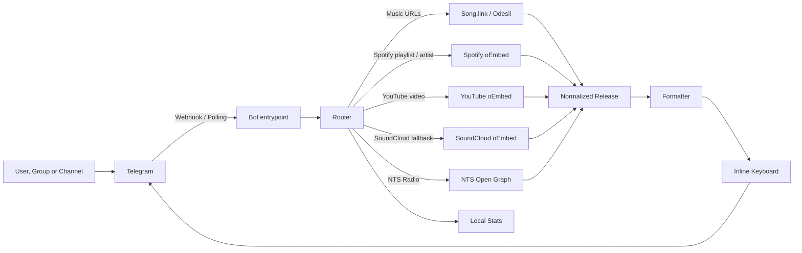

<div align="center">

# StonerHand Soundlinks Bot

**Open-source Telegram bot for turning music links into clean editorial posts**

[Русская версия](README.ru.md)
· [Architecture](ARCHITECTURE.ru.md)
· [Skills](#project-skills)
· [Bot](https://t.me/StonerHandBot)
· [Channel](https://t.me/stonerhand)
· [Vercel setup](#vercel-deployment)
· [Customization](#customization)


`streaming URL -> normalized release -> Telegram-ready editorial post`

</div>

---

## What It Does

StonerHand Soundlinks Bot turns messy music URLs into compact Telegram posts with a consistent editorial style. Send a track, album, podcast, Spotify playlist, Spotify artist, YouTube video, NTS Radio page or several links at once, and the bot builds a clean card with title, preview, hashtags and platform buttons.

The default copy is tuned for [@stonerhand](https://t.me/stonerhand), but the architecture is intentionally reusable: swap the channel handle, phrase bank, button labels and platform priority, and it becomes a solid base for another music channel.

This is not a media downloader. It does not fetch or redistribute audio/video files. It resolves public links, fetches lightweight metadata and formats Telegram posts.

```text
input
https://open.spotify.com/track/...

output
📻 · Artist
Track

кнопки ниже, трек ждет

#stonerhand #track

[🟢 Spotify] [🌊 Tidal]
[🟦 Deezer]  [🟡 Yandex]
```

## Product Surface

| Surface | Behavior |
| --- | --- |
| Private chat | Replies with a formatted card and buttons |
| Group chat | Can delete the original message and replace it with a clean post if admin rights allow it |
| Channel | Can replace raw links with editorial posts and stay silent on unrelated content |
| Multi-link message | Builds a playlist-style collection post |
| User note above link | Turns the note into a Telegram quote block |

## Supported Content

| Type | Example source | Output style |
| --- | --- | --- |
| Track | Spotify, Apple Music, YouTube Music, Deezer, Tidal, Yandex Music, SoundCloud | Music card with platform buttons |
| Album / EP / Single | Spotify, Apple Music, Deezer, Tidal, Yandex Music, SoundCloud sets | Release card with smart hashtags |
| Podcast episode / show | Spotify, Apple Podcasts and podcast links supported by Song.link | Podcast card or platform fallback |
| Spotify playlist | Spotify playlist URL | Playlist card with direct playlist button |
| Spotify artist | Spotify artist URL | Artist card with direct artist button |
| YouTube video | `youtube.com/watch`, `youtu.be`, `shorts`, `live`, `embed`, `m.youtube.com` | Video card with YouTube button |
| NTS Radio | `nts.live`, `www.nts.live` and NTS subdomains | Radio card with direct NTS button |
| Collection | Several links in one message | Numbered editorial playlist post |

## Tech Stack

| Layer | Choice |
| --- | --- |
| Runtime | Python 3.10+ |
| Telegram SDK | `python-telegram-bot` 21.x |
| HTTP client | `httpx` with connection limits and explicit timeouts |
| Music resolution | Song.link / Odesli API |
| Lightweight metadata | Spotify, YouTube and SoundCloud oEmbed, NTS Open Graph |
| Deployment | Vercel webhook or Railway worker |
| Configuration | Environment variables and optional `.env` |
| Testing | `unittest` plus compile checks |

## Why It Is Public-Ready

| Area | Status |
| --- | --- |
| Secrets | No real tokens are committed; use `.env` locally and hosting environment variables in production |
| Local files | `.env`, `.venv`, stats files, caches and generated egg-info are ignored |
| Deployment | Vercel webhook and Railway worker setups are documented |
| Branding | StonerHand-specific copy lives in formatters, constants and phrase banks |
| Forkability | The core flow is separated into URL parsing, metadata clients, formatting, keyboards and transport |
| Safety | Webhook setup can be protected with `SET_WEBHOOK_SECRET` |
| Scope | No downloader APIs, no media scraping, no stored message text |

## Visual Language

The bot intentionally avoids overloaded Telegram posts. The format is short, readable on mobile, and stable on desktop.

### Single Release

```text
@username quote:
Альбом, который стоит включить целиком

💿 · Artist
Release

альбом собран, уходи слушать

#stonerhand #album

[🟢 Spotify] [🌊 Tidal]
[🟦 Deezer]  [🟡 Yandex]
```

### Collection

```text
@username quote:
пять ссылок на вечер

сегодня в подборке:

1. 📻 · Youth Code - Transitions
2. 🎧 · Show Me The Body - Camp Orchestra
3. 💿 · The Soft Moon - Criminal
4. 📺 · SANSAE Live Session Vol.3 - Melon
5. 📡 · NTS Radio - Dark Energy

выбирай с чего начать

#stonerhand #collection #track #album #video #radio

[🎧 1. Youth Code] [🎧 2. Show Me The Body]
[💿 3. The Soft Moon] [📺 4. Live Session]
[📡 5. Dark Energy]
```

### Dedicated Cards

```text
🎛 · Women of Punk
платформа: Spotify

пачка собрана, вход открыт

#stonerhand #playlist

[🎛 Открыть плейлист]
```

```text
🧬 · 1.Kla$
профиль: Spotify

профиль открыт, можно копать глубже

#stonerhand #artist

[🧬 Открыть артиста]
```

```text
📡 · Dark Energy w/ Guest
станция: NTS Radio

эфир на месте, можно включать

#stonerhand #radio

[📡 Открыть на NTS]
```

## Architecture



## Code Map

```text
api/
├── telegram.py       Vercel webhook endpoint
└── set_webhook.py    one-click Telegram webhook setup and command sync

src/music_links_bot/
├── bot.py            Telegram handlers, routing, keyboards, replacement logic
├── songlink.py       Song.link client, country fallback, release normalization
├── formatter.py      Post layout, captions, hashtags, preview selection
├── playlist.py       Spotify playlist metadata through oEmbed
├── artist.py         Spotify artist metadata through oEmbed
├── youtube.py        YouTube video metadata through oEmbed
├── soundcloud.py     SoundCloud metadata fallback through oEmbed
├── nts.py            NTS Radio metadata through Open Graph parsing
├── url_utils.py      URL detection, normalization, tracking-param cleanup
├── cache.py          In-memory TTL cache for external lookups
├── stats.py          Privacy-safe counters
├── phrases.py        Human phrase banks for CTAs and errors
├── constants.py      Platform labels, aliases and button order
└── config.py         Environment-driven settings
```

## Reliability Design

| Area | Implementation |
| --- | --- |
| Speed | Parallel link resolution, connection pooling, short external timeouts |
| Stability | Separate handling for not-found, service outages and malformed input |
| Deduplication | Tracking query params like `si`, `utm_*`, `fbclid` are ignored for cache keys |
| Telegram limits | Long notes and large link packs are trimmed before posting |
| Channel noise | Non-music posts, Instagram/TikTok/Pinterest and unrelated links are ignored in groups/channels |
| Preview quality | Preferred platform controls preview source and button priority |
| SoundCloud support | Song.link links are used when available; direct SoundCloud URLs fall back to SoundCloud oEmbed |
| NTS Radio support | NTS pages are routed outside Song.link and formatted as dedicated radio cards |
| Privacy | Stats store counters and ids, not message text or source links |
| Serverless safety | Vercel payload size is checked before JSON parsing |
| Admin safety | Message replacement only happens when Telegram grants the required rights |

## Project Skills

This repository also includes Codex-oriented project skills in `skills/`. They are short operational playbooks for future maintenance, so contributors do not need to rediscover the project structure from scratch.

| Skill | Use it for |
| --- | --- |
| `skills/stonerhand-bot-audit` | Full code audit, refactoring, cleanup, stability checks, tests and public-release safety |
| `skills/stonerhand-bot-deploy` | Vercel, Railway, local polling, webhook setup, env variables and deployment debugging |
| `skills/stonerhand-bot-editorial-ui` | Telegram post design, copywriting, buttons, hashtags, previews and channel style |

The broader system map lives in [ARCHITECTURE.ru.md](ARCHITECTURE.ru.md).

## Commands

| Command | Description |
| --- | --- |
| `/start` | what the bot can do |
| `/help` | short usage guide |
| `/guide` | channel and group guide |
| `/platforms` | supported services |
| `/channel` | open StonerHand |
| `/stats` | public stats, plus private admin stats when configured |
| `/id` | hidden utility command for `ADMIN_CHAT_ID` setup |

The public command menu is synced during local/Railway startup and through the Vercel `/api/set_webhook` endpoint.

## Environment

Create a local `.env`:

```bash
cp .env.example .env
```

Minimal production configuration:

```env
BOT_TOKEN=your-telegram-bot-token
SONGLINK_USER_COUNTRIES=US
LOG_LEVEL=INFO
PRIMARY_PLATFORM=spotify
```

Full configuration:

```env
BOT_TOKEN=your-telegram-bot-token
SONGLINK_API_KEY=
SONGLINK_USER_COUNTRIES=US
LOG_LEVEL=INFO
ADMIN_CHAT_ID=
PRIMARY_PLATFORM=spotify
SET_WEBHOOK_SECRET=
STATS_PATH=
```

| Variable | Required | Purpose |
| --- | --- | --- |
| `BOT_TOKEN` | yes | Telegram Bot API token |
| `SONGLINK_API_KEY` | no | Optional Song.link API key |
| `SONGLINK_USER_COUNTRIES` | no | Country fallback list, `US` is a good default |
| `LOG_LEVEL` | no | `INFO`, `DEBUG`, `WARNING`, `ERROR` |
| `ADMIN_CHAT_ID` | no | Enables private admin stats and channel error notifications |
| `PRIMARY_PLATFORM` | no | Preferred preview and button priority |
| `SET_WEBHOOK_SECRET` | no | Protects `/api/set_webhook` |
| `STATS_PATH` | no | Overrides local stats file path |

Supported `PRIMARY_PLATFORM` values:

```text
spotify
appleMusic
applePodcasts
youtubeMusic
soundcloud
deezer
tidal
yandexMusic
```

## Local Development

```bash
python3 -m venv .venv
```

```bash
source .venv/bin/activate
```

```bash
pip install -r requirements.txt
```

```bash
PYTHONPATH=src python -m music_links_bot
```

On macOS, stop the local bot with `Control + C`.

## Vercel Deployment

Vercel is the recommended serverless deployment path for this bot. Telegram sends updates to `/api/telegram`, so your Mac and editor can be closed.

1. Import `StonerHand/stonerhand-soundlinks-bot` into Vercel
2. Keep `Application Preset` as `Python`
3. Keep `Root Directory` as `./`
4. Add production environment variables
5. Deploy
6. Open the setup endpoint once:

```text
https://your-vercel-domain.vercel.app/api/set_webhook
```

If `SET_WEBHOOK_SECRET` is configured, use:

```text
https://your-vercel-domain.vercel.app/api/set_webhook?secret=your-secret
```

Successful response means the Telegram webhook and command menu are connected.

### Vercel Endpoints

| Endpoint | Method | Purpose |
| --- | --- | --- |
| `/api/telegram` | `POST` | Telegram webhook receiver |
| `/api/set_webhook` | `GET` | Registers webhook and syncs bot commands |

## Railway Deployment

Railway runs the bot as a background worker through long polling.

```bash
pip install -r requirements.txt
```

```bash
PYTHONPATH=src python -m music_links_bot
```

The repository already includes `railway.toml`. If Vercel webhook mode is active, stop Railway polling to avoid duplicate processing.

## Tests

```bash
PYTHONPATH=src python -m unittest discover -s tests -v
```

Compile check:

```bash
python -m compileall -q src tests api
```

## Production Checklist

- `BOT_TOKEN` exists in hosting environment variables
- Only one runtime is active: Vercel webhook or Railway/local polling
- `/api/set_webhook` was opened after Vercel deploy
- Bot has `Delete messages` permission in channels/groups where replacement is needed
- `ADMIN_CHAT_ID` is configured if private stats or admin notifications are needed
- `SET_WEBHOOK_SECRET` is configured for a safer setup endpoint
- Tokens are never committed to git
- Tokens are rotated if they were ever pasted into a public place

## Repository Hygiene

Useful checks before publishing or deploying:

```bash
git status --short
```

```bash
rg -n "ghp_|x-rapidapi-key|X-RapidAPI-Key|[0-9]{6,}:[A-Za-z0-9_-]{20,}" .
```

```bash
find . -path './.venv' -prune -o -path './.git' -prune -o \
  \( -name '__pycache__' -o -name '*.pyc' -o -name '.DS_Store' -o -name '*.egg-info' \) -print
```

The repository ignores local runtime artifacts such as `.env`, `.venv`, `__pycache__`, `.DS_Store`, generated egg-info and local stats files.

## Privacy

The bot processes URLs to build Telegram posts. It does not ask for passwords, payment data or personal files. Local stats are intentionally minimal: counters, chat ids, labels and last-seen timestamps. Message text and original source links are not stored in stats.

On Vercel, file-based stats are temporary unless `STATS_PATH` points to persistent storage. For serious analytics, connect a database later.

## Customization

For another channel, start with these files:

| File | What to change |
| --- | --- |
| `src/music_links_bot/constants.py` | Channel URL, platform labels, platform priority |
| `src/music_links_bot/phrases.py` | CTA and error phrase banks |
| `src/music_links_bot/formatter.py` | Post layout, hashtags, title style |
| `src/music_links_bot/bot.py` | Command copy, intro text, admin behavior |
| `.env.example` | Deployment defaults for your environment |

## Troubleshooting

| Symptom | Most likely cause | Fix |
| --- | --- | --- |
| Bot does not answer | Missing or wrong `BOT_TOKEN` | Check hosting environment variables |
| Vercel shows `404` on root page | Normal for this bot | Use `/api/telegram` and `/api/set_webhook` |
| Telegram still hits old host | Webhook was not updated | Open `/api/set_webhook` on the new domain |
| Posts are duplicated | Polling and webhook are both active | Stop Railway/local polling |
| Channel links are not replaced | Missing admin rights | Grant delete-message permission |
| Some platform is missing | Song.link did not return it for the selected region | Try another source link or adjust country fallback |
| SoundCloud link only shows SoundCloud | No cross-platform match was available | Expected fallback behavior; the original SoundCloud link is still turned into a clean card |

## License

No license file is included yet. If you want people to freely fork, modify and reuse the project, add an explicit license such as MIT or Apache-2.0.
