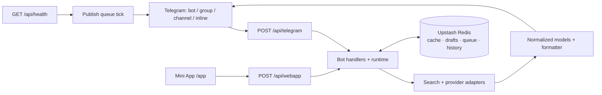

<div align="center">

# 🎧 StonerHand Soundlinks Bot


### A link or title → the exact release and a finished post

**Cover art, platforms, editing, crates and queue — in 🎛 Studio.**

[Русская версия](README.ru.md) · [Architecture (RU)](ARCHITECTURE.ru.md) · [Bot](https://t.me/StonerHandBot) · [Channel](https://t.me/stonerhand)


</div>

StonerHand turns music links and search queries into ready-to-send Telegram posts. The bot works in DMs, groups, channels and inline mode. Its Mini App, Studio, adds a visual editor, crates and scheduled publishing.

```text
Input:   https://open.spotify.com/track/…
         or “black sabbath paranoid”

Output:  artist + release + artwork + automatic hashtags
         + Spotify / Apple Music / YouTube / Deezer / Tidal / … buttons
         + a universal Song.link URL
```

## Features

### Telegram bot

- accepts tracks, albums, podcasts, Spotify playlists and artists, YouTube videos, SoundCloud, Bandcamp and NTS Radio URLs;
- searches by title in DMs and presents up to six candidates;
- uses one live progress message from search to platform lookup to finished card;
- produces a draft with artwork, CTA, hashtags and platform buttons;
- edits hashtags, quote and preview size directly under the message;
- sends a post to yourself, adds it to a crate or publishes it to the channel;
- turns multiple links into a numbered collection;
- manages `/crate`, including removal and reordering;
- supports `@StonerHandBot query` inline in any chat;
- can replace raw links in a source channel with formatted posts;
- warns about duplicate releases;
- supports RU/EN, actionable retries and double-tap protection.

Commands: `/start`, `/help`, `/guide`, `/platforms`, `/channel`, `/crate`, `/stats`, `/id`.

### 🎛 Studio Mini App

- text search, single-link lookup and batch link paste;
- exact-release picker with artwork and a 30-second audio preview;
- live preview of the Telegram post;
- CTA, hashtags, quote, preview size, photo mode, platform selection and ordering;
- up to four reusable style presets in Telegram CloudStorage;
- a 10-track crate with drag-and-drop and one-post delivery;
- recent-release history with “already published” state;
- publish to channel, send to self and undo after publication;
- a 50-job queue with schedule, reschedule and cancel actions;
- admin statistics by content type, user and chat;
- light/dark themes, fullscreen, haptics, clipboard hint and Telegram BackButton;
- mobile-first UI with accessible loading, error and empty states.

Channel publishing, scheduling, undo and stats are restricted to `ADMIN_CHAT_ID`. Every authenticated user can search, edit, build crates and send posts to themselves.

## Supported inputs

| Input | Metadata source | Result |
| --- | --- | --- |
| Spotify, Apple Music, Deezer, Tidal, Yandex Music, Bandcamp and other music URLs | Song.link / Odesli | normalized release and platform links |
| Release title | iTunes Search → Song.link | candidate list and selected release |
| YouTube / YouTube Music | Song.link or YouTube oEmbed | music card or video post |
| SoundCloud | Song.link, then SoundCloud oEmbed fallback | music card |
| Spotify playlist / artist | Spotify oEmbed | playlist or artist post |
| NTS Radio | NTS page Open Graph metadata | radio post |

A Song.link API key is optional; the public endpoint is used by default.

## Quick start on Vercel

1. Create a bot with [@BotFather](https://t.me/BotFather) and enable `/setinline`.
2. Import this repository into Vercel with `./` as the root.
3. Add the minimum environment variables:

```dotenv
BOT_TOKEN=123456:telegram-token
SET_WEBHOOK_SECRET=long-random-secret
CRON_SECRET=another-long-random-secret
```

For production, also configure Upstash Redis and the owner/channel:

```dotenv
ADMIN_CHAT_ID=123456789
PUBLISH_CHAT_ID=@your_channel
UPSTASH_REDIS_REST_URL=https://…
UPSTASH_REDIS_REST_TOKEN=…
```

4. Deploy and register Telegram:

```text
https://<production-domain>/api/set_webhook?secret=<SET_WEBHOOK_SECRET>
```

5. Verify the live service:

```text
https://<production-domain>/api/health
```

A healthy endpoint returns HTTP 200 and `"ok": true`. Point an external monitor at `/api/health` every five minutes: health requests also tick the scheduled-publication queue. The daily Vercel Cron at `03:00 UTC` restores the webhook, commands, RU/EN profile copy and Studio menu button.

## Environment variables

| Variable | Requirement | Purpose |
| --- | --- | --- |
| `BOT_TOKEN` | required | Telegram bot token |
| `SET_WEBHOOK_SECRET` | production | protects manual `/api/set_webhook` calls |
| `CRON_SECRET` | recommended | authorizes Vercel Cron with a Bearer token |
| `ADMIN_CHAT_ID` | admin features | owner allowed to publish, schedule, undo, inspect stats and receive alerts |
| `PUBLISH_CHAT_ID` | optional | destination channel; defaults to `@stonerhand` |
| `WEBAPP_URL` | optional | explicit Studio URL; otherwise derived from Vercel production URL |
| `WEBHOOK_BASE_URL` | optional | explicit webhook base URL |
| `UPSTASH_REDIS_REST_URL` / `TOKEN` | recommended | shared cache, deduplication, drafts, history, queue and stats |
| `KV_REST_API_URL` / `TOKEN` | alternative | Vercel KV-compatible aliases |
| `SONGLINK_API_KEY` | optional | Song.link/Odesli API key |
| `SONGLINK_USER_COUNTRIES` | optional | comma-separated lookup regions; defaults to `US` |
| `PRIMARY_PLATFORM` | optional | first platform button; defaults to `spotify` |
| `BOT_UI_MODE` | optional | `stonerhand`, `minimal` or `editorial` |
| `EPHEMERAL_GROUP_REPLIES` | optional | attempt user-specific replies in groups |
| `BRAND_PHOTO_FRAME` | optional | set to `1` for branded photo mode |
| `BRAND_LOGO_URL` / `BRAND_LABEL` | optional | frame logo and label |
| `TELEGRAM_WEBHOOK_SECRET` | optional | explicit webhook signature; safely derived from `BOT_TOKEN` otherwise |
| `STATS_PATH` | optional | local stats JSON path outside Vercel |
| `LOG_LEVEL` | optional | logging level; defaults to `INFO` |

See [.env.example](.env.example) for the complete template. The bot works without Redis, but serverless instances do not share memory; durable scheduling, history, cross-instance deduplication and complete stats require Redis.

## Local development

```bash
python3 -m venv .venv
source .venv/bin/activate
pip install -r requirements.txt pyflakes
cp .env.example .env
PYTHONPATH=src python -m music_links_bot
```

Local execution uses polling. Do not run polling and the production webhook against the same bot token at the same time.

Validation:

```bash
python -m pyflakes src api tests
PYTHONPATH=src python -m unittest discover -s tests -v
node --check webapp/app.js
node --check webapp/api-client.js
node --check webapp/cloud-storage.js
python tests/e2e/smoke.py
```

The E2E smoke needs Playwright and Chromium (`pip install playwright && playwright install chromium`). CI runs Python lint/tests, JavaScript syntax checks and the separate headless Studio smoke.

## Architecture at a glance



- `api/` contains serverless transport: Telegram webhook, Studio API, health and webhook setup;
- `src/music_links_bot/bot.py` composes the application and Telegram handlers;
- `bot_lookup.py`, `songlink.py`, `search.py` and provider modules normalize metadata;
- `bot_runtime.py` and `request_guard.py` provide sessions, callback v2, leases, rate limits and idempotency;
- `formatter.py`, `keyboards.py`, `bot_ui.py` and `i18n.py` form the Telegram presentation layer;
- `studio_models.py`, `studio_storage.py` and `publish_queue.py` own Studio/publication state;
- `webapp/` is a build-free Mini App made of HTML, CSS and ES modules.

See [ARCHITECTURE.ru.md](ARCHITECTURE.ru.md) for the full implementation map.

## Reliability and security

- Telegram webhook secret-token validation;
- HMAC-SHA256 Telegram Mini App `initData` validation with a 24-hour age limit;
- 1 MiB Telegram update and 64 KiB Studio request limits;
- explicit timeouts, parallel lookups and provider fallbacks;
- deduplication for Telegram updates, callbacks and Studio mutations;
- distributed queue lock, per-job lease, three attempts and retry backoff;
- CSP, restricted browser permissions, escaped HTML and checked external URLs;
- memory fallback for unavailable Redis and owner DMs for critical failures.

## Use your own channel

1. Set `PUBLISH_CHAT_ID` and `ADMIN_CHAT_ID`.
2. Change channel branding in `constants.py`, `keyboards.py` and `phrases.py`.
3. Configure `PRIMARY_PLATFORM`, `BOT_UI_MODE` and photo framing if needed.
4. Update `BOT_DESCRIPTIONS` and `BOT_SHORT_DESCRIPTIONS`.
5. Call `/api/set_webhook` to synchronize Telegram.

## Troubleshooting

| Symptom | Check |
| --- | --- |
| Bot is silent | `/api/health`, `BOT_TOKEN`, webhook URL and Telegram delivery error |
| Menu or profile copy is stale | `/api/set_webhook?secret=…` |
| Inline mode does not work | BotFather `/setinline`, then re-register the webhook |
| Publishing is denied | `ADMIN_CHAT_ID`, `PUBLISH_CHAT_ID` and channel permissions |
| Scheduled posts are late | Redis and an external `/api/health` ping every five minutes |
| Stats reset | connect Upstash Redis |
| Duplicate replies | ensure polling and webhook are not both active |
| `/` returns 404 | expected; public routes are `/app` and `/api/*` |

## License

[MIT](LICENSE)
