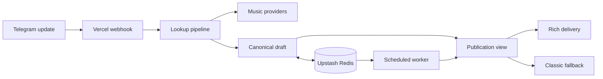

<div align="center">

# StonerHand Soundlinks Bot

**Music discovery in. Publish-ready Telegram post out.**

[Open the bot](https://t.me/StonerHandBot) · [See the channel](https://t.me/stonerhand) · [Русская версия](README.ru.md)


[](https://github.com/StonerHand/stonerhand-soundlinks-bot/actions/workflows/ci.yml)

</div>

StonerHand is a Telegram-native music publishing editor. Send one release,
an `artist — track` query, an audio file or several links. The bot resolves the
music, builds a clean card and keeps every publishing control inside Telegram.

## One simple flow

| Send | Get | Adjust | Publish |
| --- | --- | --- | --- |
| Music link | Exact release and artwork | Intro, style, tags, cover, platforms | Yourself, another chat, queue or channel |
| `artist — track` | Search and result picker | Live preview | A post with working buttons |
| Several links | Ordered collection without duplicates | Title and order | One compact collection |
| Song + video | One mixed publication | Music and clip actions | A clickable combined post |

Your own text above a link becomes the post intro. Automatic hashtags contain
the release type and only a provider-verified genre; uncertain genre metadata
is omitted instead of guessed.

## Product highlights

- Resolves tracks, albums, podcasts, playlists, artists, YouTube videos and NTS
  Radio pages.
- Builds large-artwork cards with the original service, a canonical
  **All platforms** Songlink/Odesli action and compact secondary controls.
- Combines matching links from different services into one release rather than
  publishing duplicate cards.
- Imports public Spotify and Apple Music playlists into editable collections.
- Preserves bold, italic and linked text in author intros and calculates the
  exact Telegram UTF-16 budget for each delivery format.
- Keeps one clear primary action per editor screen, supports undo, reusable
  templates, custom artwork, history and named collections.
- Publishes immediately or through a durable scheduled queue with duplicate
  protection, access checks and failure notifications.
- Works inline with `@StonerHandBot artist — track` in any conversation.
- Uses Bot API 10.3 Rich Messages when supported and falls back to a complete
  classic card without losing artwork, text or platform links.
- Exposes `/privacy` for transparent data controls and confirmed user-data
  deletion.

## Supported sources

| Source | Links | Metadata | Collection import |
| --- | :---: | :---: | :---: |
| Spotify | ✓ | ✓ | ✓ |
| Apple Music | ✓ | ✓ | ✓ |
| YouTube / YouTube Music | ✓ | ✓ | — |
| SoundCloud | ✓ | ✓ | — |
| Deezer | ✓ | via Songlink | — |
| Tidal | ✓ | via Songlink | — |
| Yandex Music | ✓ | via Songlink | — |
| NTS Radio | ✓ | ✓ | — |

## Telegram UX

The home screen starts with **Create post** and explains every accepted input.
An active card is recoverable by release name; collections and history stay on
the second row. Less frequent tools live under one predictable **More** action.

The editor is progressive rather than crowded:

1. preview the finished card;
2. change only what matters;
3. run a final preflight check;
4. send or publish with one explicit action.

Collection keyboards adapt to their content: a shared artist is not repeated,
technical remaster suffixes do not consume button space, short titles share a
row and long labels receive the full width. The preview keeps the exact release
count without repeating type icons, a shared artist or technical remaster text.
A classic 2–4-release card uses a collage of distinct available covers and
falls back to the reliable single-cover preview if collage delivery fails.
Incomplete collections deliberately keep a single cover so they cannot look
finished before every source resolves.

Semantic button styles, disabled progress states, ephemeral notices and Rich
content are capability-gated. Older Telegram clients always receive the full
classic experience.

## Architecture


```mermaid
flowchart LR
    U[Telegram update] --> W[Vercel webhook]
    W --> P[Lookup pipeline]
    P --> S[Music providers]
    P --> D[Canonical draft]
    D --> V[Publication view]
    V --> R[Rich delivery]
    V --> C[Classic fallback]
    D <--> K[(Upstash Redis)]
    K --> Q[Scheduled worker]
    Q --> V
```

One immutable publication plan is shared by preview, direct send, channel
publishing and the queue. It freezes text, hashtags, keyboard, artwork, link
preview and delivery mode before Telegram is called. Durable drafts are
normalized before queue storage and delivery. Redis stores sessions, history,
templates, deduplication claims and queue state; bounded memory remains a
development and degraded-mode fallback.

See [Architecture](ARCHITECTURE.ru.md) for the complete data and failure model.

## Run locally

```bash
python -m venv .venv
source .venv/bin/activate
python -m pip install -e ".[dev]"
cp .env.example .env
python -m music_links_bot
```

Only `BOT_TOKEN` is required for local polling. Add Songlink and Redis values to
exercise universal links and durable state.

<details>
<summary><strong>Production configuration</strong></summary>

The repository is configured for Vercel Functions:

- `/api/telegram` — authenticated Telegram webhook;
- `/api/set_webhook` — protected webhook maintenance;
- `/api/queue_worker` — protected scheduled publishing worker;
- `/api/collage` — signed, compressed and cached classic collection artwork;
- `/api/health` — Telegram, webhook, Redis, queue and release canary.

Required production values:

| Variable | Purpose |
| --- | --- |
| `BOT_TOKEN` | Telegram bot token |
| `TELEGRAM_WEBHOOK_SECRET` | verifies every incoming update |
| `SET_WEBHOOK_SECRET` | protects webhook maintenance |
| `WEBHOOK_BASE_URL` | public Vercel origin |
| `UPSTASH_REDIS_REST_URL` | durable Redis endpoint |
| `UPSTASH_REDIS_REST_TOKEN` | durable Redis credential |
| `CRON_SECRET` | protects the queue worker |

`ADMIN_CHAT_ID`, `PUBLISH_CHAT_ID`, `SONGLINK_API_KEY` and presentation flags
are optional and documented in [.env.example](.env.example).

`COLLECTION_COLLAGE_ENABLED=0` disables only generated collages without a new
deploy; `BOT_SAFE_MODE=1` disables every capability-gated enhancement and keeps
the complete Classic fallback available.

</details>

<details>
<summary><strong>Release quality gate</strong></summary>

```bash
python -m pyflakes src api tests
python -m ruff check src api tests
python -m ruff format --check src api tests
python -m bandit -q -r src api -x tests
python -m pip_audit -r requirements.txt --progress-spinner off
python -m pytest -q
```

CI also checks dependency pins, secrets, generated files, compilation and the
Vercel route/build/cron contract. A production canary verifies the exact commit,
the collection-artwork service and the production dependencies before it allows
the guarded automatic rollback decision.

</details>

## Repository

```text
api/                    Vercel webhook, health, collage and queue endpoints
src/music_links_bot/    application, providers, editor and publishing pipeline
tests/                  unit, contract, snapshot and production-canary tests
.github/                CI, dependency updates and guarded release checks
```

Public documentation is intentionally limited to the product, architecture,
release history and operations checklist. Generated state, credentials, local
environments and tool caches are excluded from Git.

## Documentation

- [Russian README](README.ru.md)
- [Architecture and state model](ARCHITECTURE.ru.md)
- [Release checklist](RELEASE_CHECKLIST.ru.md)
- [Changelog](CHANGELOG.md)
- [MIT License](LICENSE)

---

Built for music posts that should look finished before they are published.
