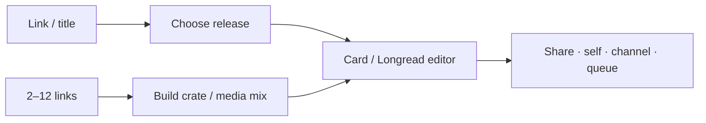

<div align="center">

# 🎧 StonerHand Soundlinks Bot

### A link, title or several releases → a card, longread or collection

Artwork, polished copy, every platform, collections and publishing — in 🎛 Studio.

[Open the bot](https://t.me/StonerHandBot) · [Channel](https://t.me/stonerhand) · [Русская версия](README.ru.md) · [Architecture (RU)](ARCHITECTURE.ru.md)


</div>

## What it does

| Telegram bot | Studio Mini App |
| --- | --- |
| Link or title → exact release picker → finished card | Search, candidates, live preview and optional 30-second audio |
| 2–12 links → one complete numbered collection | Multi-link import and a crate of up to 10 releases |
| Song + YouTube video → a two-tile native mix preview | Paired song/video artwork, media labels and drag ordering |
| Artwork, CTA, hashtags and compact platform buttons | Card / Longread mode with an exact Telegram preview |
| Native Telegram Rich Messages with safe HTML fallback | Block editor: headings, text, quotes, lists, sections and dividers |
| Inline search with `@StonerHandBot` in any chat | Draft recovery, presets and a delivery preflight |
| Automatic link replacement in groups and channels | Reordering, sections, notes and collection styling |
| RU/EN workspace, actionable errors and retry | History, queue, reschedule, undo and owner analytics |

```text
Spotify / Apple Music / YouTube / SoundCloud / Bandcamp / Deezer / Tidal
Yandex Music / Spotify playlists & artists / podcasts / NTS Radio
```

Metadata and universal links come from Song.link/Odesli, iTunes Search and oEmbed. Longreads use Telegram Rich Messages (up to 32K, artwork and structured blocks); if Rich Messages are unavailable in a target client or chat, the bot sends a bounded HTML version with the same platform keyboard. Use Studio's Share action to send the full post and buttons as one prepared Telegram message. Telegram's ordinary forward action removes inline keyboards.

For a one-song/one-video mix, Telegram receives the song cover and YouTube
thumbnail as one native two-tile media preview. A compact action row opens the
universal music page or the original YouTube video; the bot does not download or
re-upload copyrighted video.

## Flow


```mermaid
flowchart LR
    A["Link / title"] --> B["Choose release"]
    A2["2–12 links"] --> C["Build crate / media mix"]
    B --> D["Card / Longread editor"]
    C --> D
    D --> E["Share · self · channel · queue"]
```

Every user can search, edit, build crates and send finished posts to themselves or another chat. Channel publishing, scheduling, undo and stats are restricted to `ADMIN_CHAT_ID`. Keyboards are channel-safe: unsupported inline actions are removed while music-platform URL buttons remain.

## Quick start on Vercel

1. Create a bot with [@BotFather](https://t.me/BotFather) and enable `/setinline`.
2. Import the repository into Vercel with `./` as the root.
3. Add the minimum environment:

```dotenv
BOT_TOKEN=123456:telegram-token
SET_WEBHOOK_SECRET=long-random-secret
CRON_SECRET=another-long-random-secret
```

4. Register Telegram after deployment:

```text
https://<production-domain>/api/set_webhook?secret=<SET_WEBHOOK_SECRET>
```

5. Check `https://<production-domain>/api/health`; healthy production returns HTTP 200 and `"ok": true`.

Set `ADMIN_CHAT_ID` and `PUBLISH_CHAT_ID` for channel publishing. Add Upstash Redis for durable scheduling, history, full stats and cross-instance deduplication. See [.env.example](.env.example) for every option.

<details>
<summary><b>Local development</b></summary>

```bash
python3 -m venv .venv
source .venv/bin/activate
pip install -r requirements.txt pyflakes playwright
python -m playwright install chromium
cp .env.example .env
PYTHONPATH=src python -m music_links_bot
```

Do not run polling and the production webhook against the same token.

```bash
python -m pyflakes src api tests
PYTHONPATH=src python -m unittest discover -s tests -v
python tests/e2e/smoke.py
```

</details>

<details>
<summary><b>Production and reliability</b></summary>

- `POST /api/telegram`: signed Telegram webhook with update deduplication;
- `POST /api/webapp`: Studio API with HMAC `initData`, rate limiting and idempotency;
- `GET /api/health`: Telegram, webhook, Redis, queue state and due-job delivery;
- a Redis outage falls back to bounded in-memory deduplication instead of dropping updates;
- a draft is durably written to Redis before the request completes, so it survives cold starts and opens from another serverless instance;
- multi-link input is deduplicated and added to the crate with one batch write instead of one persistence round trip per track;
- transient caches and active user tasks are bounded and deterministically cleaned up;
- the queue uses a distributed lock, per-job lease, three attempts and backoff;
- Vercel Cron restores the webhook without dropping pending updates, plus commands, profile and the Studio button;
- critical failures are sent to the owner with hourly alert deduplication.

Ping `/api/health` every five minutes for timely scheduled posts.

</details>

## Code map

```text
api/                    Vercel webhook, Studio API, health and setup
src/music_links_bot/    bot UI, lookup, Rich Messages, delivery, queue and storage
webapp/                 build-free Mini App: block editor, preview, design system
tests/                  offline unit/integration suite + adaptive Playwright smoke
```

CI verifies Python modules, deployment JSON, JavaScript, the complete offline suite and the mobile Studio flow in Chromium at multiple widths and in both themes. For request flows, API actions, Redis keys, security and extension rules, see [ARCHITECTURE.ru.md](ARCHITECTURE.ru.md).

## License

[MIT](LICENSE)
