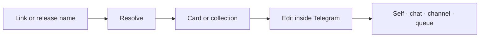

<div align="center">

# 🎧 StonerHand Soundlinks Bot

### Music link → ready-to-publish Telegram post

[Open bot](https://t.me/StonerHandBot) · [Channel](https://t.me/stonerhand) · [Русский](README.ru.md) · [Architecture](ARCHITECTURE.ru.md)


</div>

## Features

- accepts a music URL or an `artist — track` query;
- resolves release metadata, artwork and platform links;
- builds a clean Telegram card with compact buttons;
- combines several links into one numbered collection;
- pairs a song and YouTube clip in one media post;
- includes a native card builder with separate style, intro, hashtag and platform screens;
- offers a clean final preview and returns to the active card by release name;
- remembers card preferences and keeps timestamped recent posts;
- names, previews, reorders and deduplicates collections;
- sends to the user, another chat or a configured channel;
- shows a compact final check before channel publication;
- supports a durable scheduled-publishing queue;
- works inline: `@StonerHandBot artist — track`.

Supported sources include Spotify, Apple Music, YouTube, SoundCloud, Bandcamp,
Deezer, Tidal, Yandex Music, podcasts, Spotify and Apple Music playlists,
Spotify artists and NTS Radio.

## Flow


```mermaid
flowchart LR
    A["Link or release name"] --> B["Resolve"]
    B --> C["Card or collection"]
    C --> D["Edit inside Telegram"]
    D --> E["Self · chat · channel · queue"]
```

Cards keep only useful information: artwork, artist, title, hashtags selected
by the user, chosen services and the complete release hub. Secondary actions
appear only in context. Multi-link inputs are not quoted back into the result.
Style, intro, hashtags, platforms, preview and delivery have explicit screens;
free-form intro and tags are entered through native Telegram replies.

The primary **Create post** action opens a native input guide for all three
input shapes: a release or artist link, an `artist — title` query, or several
links for a collection. Restoring an unfinished card is a separate named
secondary action and never replaces the main flow.

Lookup uses visible `1/3 → 3/3` progress. When one source fails, resolved items
are still delivered and retry targets only the failed links.
All output is checked against Telegram message and caption limits before
delivery, with a safe fallback for oversized formatted text.

## Local setup

```bash
python3 -m venv .venv
source .venv/bin/activate
pip install -e ".[dev]"
cp .env.example .env
PYTHONPATH=src python -m music_links_bot
```

Minimum environment:

```env
BOT_TOKEN=...
SONGLINK_USER_COUNTRIES=US
LOG_LEVEL=INFO
PRIMARY_PLATFORM=spotify
```

Production also uses webhook secrets, a cron secret and Upstash Redis.

## Validation

```bash
PYTHONPATH=src python -m unittest discover -s tests -v
python -m compileall -q src api tests
python -m pyflakes src api tests
python -m ruff check src api tests --select F,B,ASYNC,PERF
python -m bandit -q -r src api -x tests
python tests/check_dependency_pins.py
python -m json.tool vercel.json >/dev/null
```

## Layout

```text
api/                    webhook, health, webhook setup and queue worker
src/music_links_bot/    bot logic, providers, editor and persistence
tests/                  unit and integration tests
vercel.json             production routes and cron jobs
```

Production runs on Vercel using a Telegram webhook. Redis stores caches,
sessions, drafts, collections, history, the publishing queue and deduplication
claims. Stored state is versioned and automatically migrates legacy records.
Non-critical flows have a bounded in-memory fallback.

License: [MIT](LICENSE).
