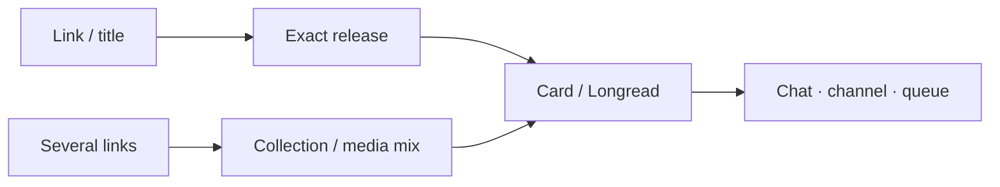

<div align="center">

# 🎧 StonerHand Soundlinks Bot

### A music link → a finished Telegram publication

[Open the bot](https://t.me/StonerHandBot) · [Channel](https://t.me/stonerhand) · [Русская версия](README.ru.md) · [Architecture (RU)](ARCHITECTURE.ru.md)


</div>

## Features

| Telegram bot | Studio Mini App |
| --- | --- |
| Link or title → exact release | Search, candidates and audio preview |
| Clean title, artwork, hashtags and compact buttons | Card or block-based Rich longread |
| Several links → one collection | Up to 10 releases with ordering and notes |
| Song + YouTube clip → two-tile media preview | Song artwork and video thumbnail |
| Inline search in any conversation | History, queue, undo and owner analytics |
| Automatic link replacement in chats and channels | Native sharing that preserves buttons |

Spotify, Apple Music, YouTube, SoundCloud, Bandcamp, Deezer, Tidal,
Yandex Music, podcasts, Spotify playlists and artists, and NTS Radio are
supported.

Cards contain release data and actions without generated promotional filler or
hidden heading links. The default keyboard shows two preferred services plus a
universal hub. Use Studio's Share action when the complete keyboard must travel
with the post.

Longreads use Telegram Rich Messages with a safe HTML fallback. A song and a
YouTube clip become a native two-tile media album; the bot never downloads or
re-uploads the copyrighted video.

## Flow


```mermaid
flowchart LR
    A["Link / title"] --> B["Exact release"]
    A2["Several links"] --> C["Collection / media mix"]
    B --> D["Card / Longread"]
    C --> D
    D --> E["Chat · channel · queue"]
```

The bot exposes two clear modes: **Quick** for a finished chat card and
**Studio** for longreads, crates, scheduling and publishing. A chat draft keeps
only Studio and Add to crate actions. Provider clients are lazy, independent
lookups run in parallel, and successful bundles are cached in memory and Redis.
A slow optional provider no longer discards already resolved content.

## Vercel setup

```dotenv
BOT_TOKEN=123456:telegram-token
SET_WEBHOOK_SECRET=long-random-secret
CRON_SECRET=another-long-random-secret
ADMIN_CHAT_ID=123456789
PUBLISH_CHAT_ID=@channel
```

1. Create a bot with [@BotFather](https://t.me/BotFather) and enable `/setinline`.
2. Import the repository into Vercel with `./` as the project root.
3. Connect Upstash Redis from Vercel Marketplace for drafts, queue, history,
   analytics and cross-instance deduplication.
4. Open `https://<domain>/api/set_webhook?secret=<SET_WEBHOOK_SECRET>`.
5. Verify `https://<domain>/api/health` returns HTTP 200 and `"ok": true`.

See [.env.example](.env.example) for every setting.

<details>
<summary><b>Local development and verification</b></summary>

```bash
python3 -m venv .venv
source .venv/bin/activate
pip install -r requirements.txt pyflakes playwright
python -m playwright install chromium
cp .env.example .env

python -m pyflakes src api tests
PYTHONPATH=src python -m unittest discover -s tests
python tests/e2e/smoke.py
```

Do not run polling and the production webhook against the same token.

</details>

## Code map

```text
api/                    webhook, Studio API, health and queue worker
src/music_links_bot/    providers, bot UI, delivery, queue and Redis
webapp/                 build-free modular Telegram Mini App
tests/                  unit/integration, mobile smoke and production canary
```

See [ARCHITECTURE.ru.md](ARCHITECTURE.ru.md) for request flows, API actions,
Redis keyspace, security and extension rules.

[MIT](LICENSE)
