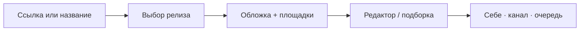

<div align="center">

# 🎧 StonerHand Soundlinks Bot

### Ссылка или название → точный релиз и готовый Telegram-пост

Обложка, автохэштеги, кнопки площадок, редактор, подборки и очередь — в 🎛 Студии.

[Открыть бота](https://t.me/StonerHandBot) · [Канал](https://t.me/stonerhand) · [English](README.md) · [Архитектура](ARCHITECTURE.ru.md)


</div>

## Что умеет

| Telegram-бот | Mini App «Студия» |
| --- | --- |
| Поиск по ссылке или названию с выбором точного релиза | Live-preview поста и 30-секундная прослушка |
| Готовая карточка с обложкой, CTA, тегами и площадками | CTA, теги, цитата, обложка и порядок кнопок |
| Персональное `/start`-меню, inline и быстрый редактор | Пресеты оформления, светлая и тёмная темы |
| Несколько ссылок → один пост-подборка | Crate до 10 треков с drag-and-drop |
| Антидубль, retry и защита от двойных нажатий | Публикация, undo и очередь до 50 постов |
| Работа в личке, группах и каналах, RU/EN | История и admin-статистика |

```text
Spotify / Apple Music / YouTube / SoundCloud / Bandcamp / Deezer / Tidal
Яндекс Музыка / Spotify playlists & artists / podcasts / NTS Radio
```

Метаданные и универсальные ссылки собираются через Song.link/Odesli, iTunes Search и oEmbed. В inline-режиме достаточно набрать `@StonerHandBot запрос` в любом чате.

## Как это работает



Обычный пользователь может искать, редактировать, собирать подборки и отправлять посты себе. Публикация в канал, очередь, undo и статистика доступны владельцу из `ADMIN_CHAT_ID`.

## Быстрый запуск на Vercel

1. Создай бота у [@BotFather](https://t.me/BotFather) и включи `/setinline`.
2. Импортируй репозиторий в Vercel с корнем `./`.
3. Добавь минимальное окружение:

```dotenv
BOT_TOKEN=123456:telegram-token
SET_WEBHOOK_SECRET=long-random-secret
CRON_SECRET=another-long-random-secret
```

4. После deploy зарегистрируй Telegram:

```text
https://<production-domain>/api/set_webhook?secret=<SET_WEBHOOK_SECRET>
```

5. Проверь `https://<production-domain>/api/health` — здоровый production отвечает HTTP 200 и `"ok": true`.

Для публикации укажи `ADMIN_CHAT_ID` и `PUBLISH_CHAT_ID`. Для долговечной очереди, истории, статистики и межинстансового дедупа подключи Upstash Redis. Все настройки перечислены в [.env.example](.env.example).

<details>
<summary><b>Локальная разработка</b></summary>

```bash
python3 -m venv .venv
source .venv/bin/activate
pip install -r requirements.txt pyflakes
cp .env.example .env
PYTHONPATH=src python -m music_links_bot
```

Не запускай polling одновременно с production webhook на том же токене.

```bash
python -m pyflakes src api tests
PYTHONPATH=src python -m unittest discover -s tests -v
python tests/e2e/smoke.py
```

</details>

<details>
<summary><b>Production и надёжность</b></summary>

- `POST /api/telegram` — подписанный Telegram webhook с дедупликацией updates;
- `POST /api/webapp` — Studio API с HMAC-проверкой `initData`, rate limit и idempotency;
- `GET /api/health` — Telegram, webhook, Redis, очередь и доставка созревших jobs;
- очередь использует distributed lock, job lease, три попытки и backoff;
- Vercel Cron ежедневно восстанавливает webhook, команды, профиль и кнопку Студии;
- критические ошибки приходят владельцу в Telegram с часовым дедупом.

Для точности отложенных публикаций поставь внешний монитор на `/api/health` каждые пять минут.

</details>

## Код

```text
api/                    Vercel webhook, Studio API, health, setup
src/music_links_bot/    handlers, lookup, formatter, runtime, queue, storage
webapp/                 Mini App без build-step: HTML, CSS, ES modules
tests/                  299 offline tests + Playwright smoke
```

Подробные потоки, API actions, Redis keyspace, безопасность и правила расширения: [ARCHITECTURE.ru.md](ARCHITECTURE.ru.md).

## Лицензия

[MIT](LICENSE)
