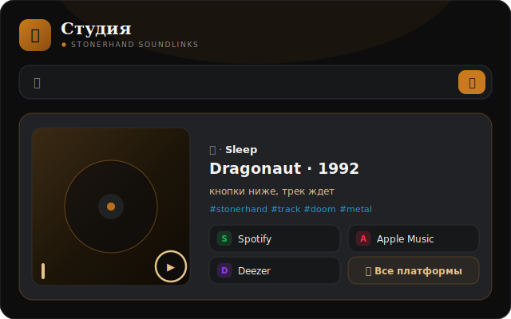

<div align="center">

# 🎧 StonerHand Soundlinks Bot

### Кидаешь ссылку — получаешь идеальный пост

**Трек, альбом, плейлист, подкаст, YouTube или NTS Radio → карточка с обложкой,
автохэштегами и кнопками всех стриминговых площадок. В один тап.**

[English](README.md) · [Архитектура](ARCHITECTURE.ru.md) · [Бот](https://t.me/StonerHandBot) · [Канал](https://t.me/stonerhand)




</div>

```text
вход   →  https://open.spotify.com/track/...   (или просто «black sabbath paranoid»)

выход  →  📻 · Black Sabbath
          Paranoid

          кнопки ниже, трек ждет

          #stonerhand #track #heavymetal

          [🟢 Spotify] [⚪ Apple] [🟦 Deezer] [⚫ Tidal]
          [🪩 Все платформы]
```

## 🎛 Студия — Mini App внутри Telegram

Визуальный редактор постов: открывается кнопкой меню или кнопкой 🎛 под любым постом.

- **Поиск** — текстом с выбором из нескольких релизов, ссылкой или прямо из буфера
  (Студия сама предложит вставить скопированную ссылку). Кинь несколько ссылок
  сразу → Студия соберёт из них подборку автоматически
- **▶ Прослушка** — 30 секунд трека прямо на обложке, с кольцом прогресса и эквалайзером
- **Оформление** — один шит с тумблерами в стиле лампового усилителя: хэштеги, цитата,
  📸 фото-режим (с опц. брендированной рамкой — лого + подпись канала), размер превью +
  свой текст, свои теги и набор/порядок кнопок платформ
- **Док действий** — публикация всегда закреплена внизу; рядом отложка, подборка и шаринг
- **Undo** — после публикации 5 секунд на «Отменить»: пост удаляется из канала
- **🧺 Конструктор подборок** — накидай треков с любых карточек → один пост-плейлист
- **🕒 Отложенный постинг** — «через час / вечером / своя дата», очередь видна и отменяема
- **🕘 История** — недавние релизы с пометкой «уже в канале» + подсказки при вводе
- **📊 Дашборд** — статистика с графиками (для админа)
- **🎨 Живой акцент** — карточка подкрашивается доминирующим цветом обложки
- **☀️🌙 Светлая и тёмная темы** — следует за Telegram, с переключателем в шапке
- **📱 Нижний таб-бар** — Главная / Подборка / Очередь / Стата; шрифты Unbounded + Golos Text + JetBrains Mono

## Что умеет сам бот

- 🔎 **Поиск без ссылки** — напиши `артист - трек` и выбери точный релиз из найденных вариантов
- 🪄 **Inline** — `@StonerHandBot запрос` в любом чате → до шести релизов + быстрый вход в Студию
- 🎚 **Редактор в чате** — понятные настройки, отправка себе, подборка, Студия и 📤 «В канал»
- 🧭 **Новый `/start`** — короткий онбординг для первого запуска и рабочие действия для постоянных пользователей
- 📦 **`/crate`** — сохранённая подборка с удалением и перестановкой треков прямо в чате
- 🛡 **Антидубль** — предупредит, если релиз уже публиковался в канале
- 🏷 **Жанры сами** — `#doom`, `#hiphop` из метаданных iTunes
- 📚 **Подборки** — несколько ссылок → нумерованный пост-плейлист
- 🤖 **Автопилот каналов** — бот-админ молча заменяет сырые ссылки на посты
- 🫥 **Невидимые ответы в группах** — карточку видит только тот, кто кинул ссылку (опц., `EPHEMERAL_GROUP_REPLIES`)
- ⚡ **Живая загрузка** — одно сообщение проходит этапы поиска, сбора площадок и карточки; ошибку можно повторить кнопкой
- 🌍 **RU/EN** — интерфейс подстраивается под язык пользователя

**Источники:** Spotify, Apple Music, YouTube, Deezer, Tidal, Яндекс.Музыка,
SoundCloud, Bandcamp и NTS Radio — резолвятся через Song.link/Odesli.

Пересланный пост не теряет смысла: CTA-фраза — живая ссылка на song.link со всеми площадками
(кнопки при пересылке съедает сам Telegram, у всех ботов).

## 🩺 Неубиваемость

- **CI** — GitHub Actions гоняет 295+ тестов, линтер, проверку JS и хедлесс-смоук Студии на каждый пуш
- **`/api/health`** — пульс бота: Telegram API, регистрация webhook, Redis и бэклог
  очереди; заодно доставляет созревшие отложенные посты
- **Посты не теряются** — упавшая отложенная публикация ретраится с backoff (а не
  дропается); каждый запрос ограничен по времени, зависший вызов не вешает инстанс
- **Без дублей** — повторные доставки апдейтов Telegram отсекаются по `update_id`
- **Алерты владельцу** — упавший health, застрявшая очередь, потерянный отложенный пост
  или крашащийся webhook — бот пишет тебе в личку (не чаще раза в час на проблему)
- **Самовосстановление** — ежедневный cron заново регистрирует webhook, меню и описания
- **Авторизация по умолчанию** — секрет webhook выводится из токена автоматически,
  подделать апдейт нельзя даже без настройки

**Рекомендация:** заведи бесплатный монитор [UptimeRobot](https://uptimerobot.com) на
`https://<домен>/api/health` каждые 5 минут — это сразу: детект падений, алерты,
точность отложки до минуты и тёплые инстансы.

## Быстрый старт (Vercel, ~10 минут)

1. Форкни репозиторий → импортируй в [Vercel](https://vercel.com) (пресет Python, корень `./`)
2. Добавь env: `BOT_TOKEN`, `SET_WEBHOOK_SECRET` (любая длинная строка), `CRON_SECRET`
3. Deploy → открой `https://<домен>/api/set_webhook?secret=<твой секрет>`
4. В [@BotFather](https://t.me/BotFather): `/setinline` → включи inline-режим
5. Готово. Кидай боту ссылку

<details>
<summary><b>⚙️ Все переменные окружения</b></summary>

| Переменная | Зачем |
| --- | --- |
| `BOT_TOKEN` ⭐ | токен из BotFather |
| `SET_WEBHOOK_SECRET` ⭐ | защита `/api/set_webhook` |
| `CRON_SECRET` | ежедневное самовосстановление webhook через Vercel Cron |
| `UPSTASH_REDIS_REST_URL/TOKEN` | Redis: общий кеш, живой `/stats`, вечные черновики, антидубль, история/очередь Студии, дедуп алертов (подборка хранится на стороне Mini App, поэтому работает и без Redis) |
| `ADMIN_CHAT_ID` | твой chat id (команда `/id`): приватная статистика, право 📤 и алерты |
| `PUBLISH_CHAT_ID` | куда постит 📤 (по умолчанию `@stonerhand`) |
| `PRIMARY_PLATFORM` | какая площадка первая: `spotify`, `appleMusic`, `tidal`… |
| `SONGLINK_USER_COUNTRIES` | регионы Song.link через запятую, например `US,DE` |
| `BOT_UI_MODE` | стиль кнопок: `stonerhand` / `minimal` / `editorial` |
| `BRAND_PHOTO_FRAME` | `1` — в 📸 фото-режиме накладывает брендированную рамку на обложку (нижняя подпись + опц. лого). По умолчанию выкл |
| `BRAND_LOGO_URL` | лого для угла фото-рамки |
| `BRAND_LABEL` | подпись на фото-рамке (по умолчанию `@`+канал) |
| `EPHEMERAL_GROUP_REPLIES` | `1` — в группах бот отвечает «невидимо» (карточку видит только тот, кто кинул ссылку). Опционально; при отсутствии поддержки со стороны Telegram молча откатывается к обычному ответу |
| `TELEGRAM_WEBHOOK_SECRET` | подпись входящих updates (не задан — выводится из токена автоматически) |
| `WEBAPP_URL`, `WEBHOOK_BASE_URL`, `STATS_PATH`, `LOG_LEVEL` | тонкая настройка |

Алиасы Vercel KV (`KV_REST_API_URL/TOKEN`) тоже работают. Без Redis всё живёт в памяти инстанса.
</details>

<details>
<summary><b>🚂 Railway / локально (polling)</b></summary>

```bash
pip install -r requirements.txt
PYTHONPATH=src python -m music_links_bot
```

`railway.toml` уже в репозитории. Не запускай polling одновременно с Vercel-webhook — будут дубли.
</details>

## Под капотом

**Python 3.10+ · python-telegram-bot 21 · httpx · Song.link/Odesli · iTunes Search · Pillow · Upstash Redis · Vercel**

```text
api/telegram.py      webhook: тёплый reuse, тик очереди, алерт при краше
api/webapp.py        API Студии (подпись initData, черновики, очередь, подборки)
api/health.py        пульс: Telegram/webhook/Redis + алерты + тик очереди
api/set_webhook.py   самовосстановление: webhook, команды, описания, кнопка меню
webapp/              Mini App «Студия» — раздельные HTML, CSS и vanilla JS
src/music_links_bot/
  bot.py             роутинг, редактор, inline, черновики
  bot_runtime.py     сессии, callback v2, идемпотентность и диагностика
  bot_crate.py       подборка в чате: дедуп, порядок, Redis/memory
  bot_ui.py          Telegram-экраны и клавиатуры
  keyboards.py       Telegram-клавиатуры и кнопки платформ
  studio_models.py   модели и валидация Mini App
  studio_storage.py  история и зеркало подборки
  publish_queue.py   очередь отложенных публикаций
  songlink.py        кроссплатформенные ссылки + обложки + Redis-кеш
  search.py          поиск, жанры и аудио-превью (iTunes)
  branding.py        опц. брендированная рамка обложки (Pillow)
  alerts.py          DM владельцу о проблемах (дедуп через Redis)
  kvstore.py         Redis по REST, мягкая деградация
  i18n.py            RU/EN интерфейс
  formatter.py       макет постов, хэштеги, CTA
  …и ещё дюжина маленьких модулей с одной задачей у каждого
```

Полная карта — в [ARCHITECTURE.ru.md](ARCHITECTURE.ru.md).

```bash
PYTHONPATH=src python -m unittest discover -s tests   # 270+ тестов, без сети
```

## Свой канал вместо StonerHand

`constants.py` (канал, площадки) → `phrases.py` (голос) → `formatter.py` (макет) →
`.env` (`PUBLISH_CHAT_ID`, `PRIMARY_PLATFORM`). Всё брендовое собрано в этих файлах.

<details>
<summary><b>🚑 Если что-то не работает</b></summary>

| Симптом | Лечение |
| --- | --- |
| Бот молчит | Открой `/api/health` — он скажет, что сломано |
| Кнопки меню не реагируют | Открой `/api/set_webhook?secret=…` (или дождись ночного cron) |
| Посты дублируются | Работают и polling, и webhook — выключи один |
| В канале не заменяет ссылку | Дай боту право удалять сообщения |
| `/stats` по нулям | Подключи Redis (Upstash, бесплатно) |
| Inline не работает | `/setinline` в BotFather + один вызов `/api/set_webhook` |
| Отложенный пост опаздывает | Пингуй `/api/health` каждые 5 мин (UptimeRobot) — очередь тикает с каждым пингом |
| Не приходят алерты | Проверь `ADMIN_CHAT_ID` (команда `/id`) |
| Корень сайта отдаёт 404 | Так и задумано: живые пути — `/app`, `/api/health` и `/api/*` |

</details>

## Лицензия

[MIT](LICENSE) — форкай, переделывай, запускай для своего канала. 🤘
