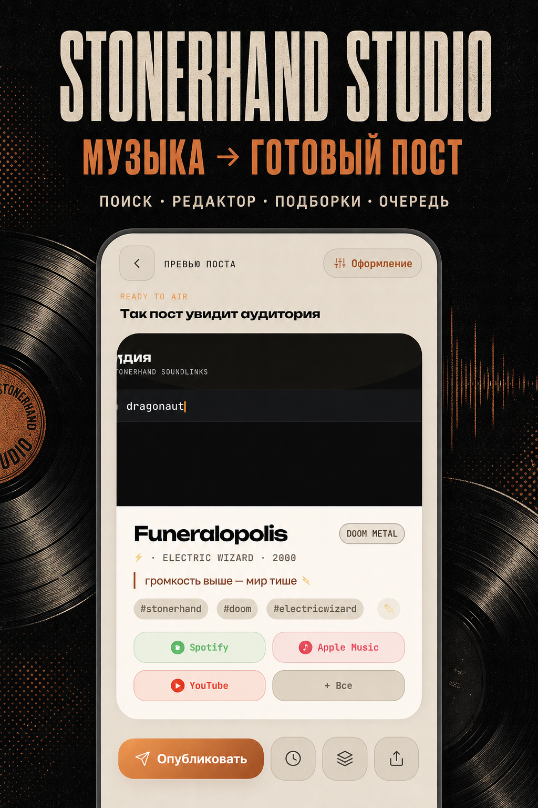
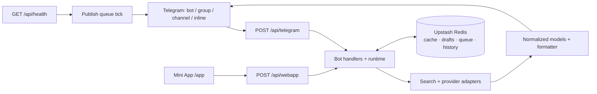

<div align="center">

# 🎧 StonerHand Soundlinks Bot



### Ссылка или название → точный релиз и готовый пост

**Обложка, площадки, редактор, подборки и очередь — в 🎛 Студии.**

[English](README.md) · [Архитектура](ARCHITECTURE.ru.md) · [Бот](https://t.me/StonerHandBot) · [Канал](https://t.me/stonerhand)


</div>

StonerHand превращает музыкальные ссылки и поисковые запросы в готовые Telegram-посты. Бот работает в личке, группах, каналах и inline-режиме, а Mini App «Студия» даёт визуальный редактор, подборки и отложенную публикацию.

```text
Вход:   https://open.spotify.com/track/…
        или «black sabbath paranoid»

Выход:  артист + релиз + обложка + автохэштеги
        + кнопки Spotify / Apple Music / YouTube / Deezer / Tidal / …
        + общая ссылка Song.link
```

## Возможности

### Бот в Telegram

- принимает ссылку на трек, альбом, подкаст, Spotify-плейлист или артиста, YouTube-видео, SoundCloud, Bandcamp и NTS Radio;
- ищет музыку по названию в личном чате и предлагает до шести релизов вместо случайного первого совпадения;
- показывает один обновляемый progress-экран: поиск → площадки → готовая карточка;
- создаёт черновик с обложкой, CTA, хэштегами и кнопками площадок;
- позволяет менять хэштеги, цитату и размер превью прямо под сообщением;
- отправляет пост себе, добавляет трек в подборку или публикует в канал;
- собирает несколько ссылок в один нумерованный пост;
- хранит `/crate`: добавление, удаление и перестановка треков;
- работает inline: `@StonerHandBot запрос` в любом чате;
- в канале-источнике может заменить сырую ссылку аккуратным постом;
- предупреждает о повторной публикации релиза;
- поддерживает RU/EN, повтор действия после ошибки и защиту от двойных нажатий.

Команды: `/start`, `/help`, `/guide`, `/platforms`, `/channel`, `/crate`, `/stats`, `/id`.

### 🎛 Mini App «Студия»

- поиск по тексту, одной ссылке или пакетная вставка нескольких ссылок;
- выбор точного релиза с обложкой и 30-секундной аудиопрослушкой;
- live-preview будущего Telegram-поста;
- настройка CTA, хэштегов, цитаты, размера превью, фото-режима, состава и порядка площадок;
- до четырёх пользовательских пресетов оформления в Telegram CloudStorage;
- подборка до 10 треков с drag-and-drop и отправкой одним постом;
- история последних релизов и отметка «уже опубликован»;
- публикация в канал, отправка себе и undo после публикации;
- очередь до 50 постов: отложить, перенести или отменить;
- admin-статистика по типам контента, пользователям и чатам;
- светлая/тёмная тема, fullscreen, хэптика, clipboard-подсказка и системная кнопка «Назад»;
- адаптивный mobile-first UI с доступными состояниями загрузки, ошибок и пустых экранов.

Публикация в канал, очередь, undo и статистика доступны владельцу из `ADMIN_CHAT_ID`. Обычный пользователь может искать, редактировать, собирать подборки и отправлять готовые посты себе.

## Поддерживаемые источники

| Вход | Получение метаданных | Результат |
| --- | --- | --- |
| Spotify, Apple Music, Deezer, Tidal, Яндекс Музыка, Bandcamp и другие музыкальные URL | Song.link / Odesli | единая карточка и ссылки площадок |
| Название релиза | iTunes Search → Song.link | список кандидатов и карточка выбранного релиза |
| YouTube / YouTube Music | Song.link или YouTube oEmbed | музыкальная карточка либо видео-пост |
| SoundCloud | Song.link, затем SoundCloud oEmbed fallback | музыкальная карточка |
| Spotify playlist / artist | Spotify oEmbed | плейлист или артист |
| NTS Radio | Open Graph страницы NTS | радио-пост |

Song.link API key необязателен. Без него используется публичный endpoint.

## Быстрый запуск на Vercel

### 1. Создай бота

1. Получи токен у [@BotFather](https://t.me/BotFather).
2. Включи inline-режим командой `/setinline`.
3. Импортируй репозиторий в Vercel с корневой директорией `./`.

### 2. Настрой окружение

Минимум:

```dotenv
BOT_TOKEN=123456:telegram-token
SET_WEBHOOK_SECRET=long-random-secret
CRON_SECRET=another-long-random-secret
```

Для production рекомендуется также подключить Upstash Redis и указать владельца/канал:

```dotenv
ADMIN_CHAT_ID=123456789
PUBLISH_CHAT_ID=@your_channel
UPSTASH_REDIS_REST_URL=https://…
UPSTASH_REDIS_REST_TOKEN=…
```

Полный шаблон находится в [.env.example](.env.example).

### 3. Зарегистрируй webhook

После первого deploy открой:

```text
https://<production-domain>/api/set_webhook?secret=<SET_WEBHOOK_SECRET>
```

Endpoint зарегистрирует `/api/telegram`, команды, RU/EN-описания профиля и кнопку меню Студии. Vercel Cron повторяет синхронизацию ежедневно в `03:00 UTC`.

### 4. Проверь production

```text
https://<production-domain>/api/health
```

Здоровый ответ имеет HTTP 200 и `"ok": true`. Для своевременной доставки отложенных постов поставь внешний монитор на `/api/health` с интервалом 5 минут: каждый health-check также запускает обработку очереди.

## Переменные окружения

| Переменная | Обязательность | Назначение |
| --- | --- | --- |
| `BOT_TOKEN` | обязательно | токен Telegram-бота |
| `SET_WEBHOOK_SECRET` | production | защита ручного вызова `/api/set_webhook` |
| `CRON_SECRET` | рекомендуется | авторизация Vercel Cron через Bearer token |
| `ADMIN_CHAT_ID` | для админ-функций | владелец: публикация, очередь, undo, статистика и алерты |
| `PUBLISH_CHAT_ID` | опционально | канал назначения; по умолчанию `@stonerhand` |
| `WEBAPP_URL` | опционально | явный URL Студии; иначе берётся production URL Vercel |
| `WEBHOOK_BASE_URL` | опционально | явный базовый URL webhook |
| `UPSTASH_REDIS_REST_URL` / `TOKEN` | рекомендуется | общий кеш, дедупликация, черновики, история, очередь и статистика |
| `KV_REST_API_URL` / `TOKEN` | альтернатива | совместимые алиасы Vercel KV |
| `SONGLINK_API_KEY` | опционально | ключ Song.link/Odesli |
| `SONGLINK_USER_COUNTRIES` | опционально | регионы Song.link через запятую; по умолчанию `US` |
| `PRIMARY_PLATFORM` | опционально | первая кнопка площадки; по умолчанию `spotify` |
| `BOT_UI_MODE` | опционально | `stonerhand`, `minimal` или `editorial` |
| `EPHEMERAL_GROUP_REPLIES` | опционально | пробовать отправлять персональные ответы в группах |
| `BRAND_PHOTO_FRAME` | опционально | `1` включает брендированную рамку в фото-режиме |
| `BRAND_LOGO_URL` / `BRAND_LABEL` | опционально | логотип и подпись рамки |
| `TELEGRAM_WEBHOOK_SECRET` | опционально | явная подпись webhook; иначе безопасно выводится из `BOT_TOKEN` |
| `STATS_PATH` | опционально | локальный JSON-файл статистики вне Vercel |
| `LOG_LEVEL` | опционально | уровень логирования; по умолчанию `INFO` |

Без Redis бот остаётся работоспособным, но serverless-инстансы не разделяют память: долговечная очередь, история, межинстансовый дедуп и полная статистика требуют Redis.

## Локальная разработка

```bash
python3 -m venv .venv
source .venv/bin/activate
pip install -r requirements.txt pyflakes
cp .env.example .env
PYTHONPATH=src python -m music_links_bot
```

Локальный режим использует polling. Не запускай его одновременно с production webhook на том же токене — Telegram начнёт конфликтовать между двумя способами получения updates.

Проверки:

```bash
python -m pyflakes src api tests
PYTHONPATH=src python -m unittest discover -s tests -v
node --check webapp/app.js
node --check webapp/api-client.js
node --check webapp/cloud-storage.js
python tests/e2e/smoke.py
```

E2E smoke требует Playwright и Chromium (`pip install playwright && playwright install chromium`). CI выполняет lint, unit/integration tests, проверку JavaScript и отдельный headless smoke Mini App.

## Архитектура в одном экране



Основные границы:

- `api/` — serverless transport: Telegram webhook, Studio API, health и настройка webhook;
- `src/music_links_bot/bot.py` — композиция приложения и Telegram handlers;
- `bot_lookup.py`, `songlink.py`, `search.py` и provider-модули — получение и нормализация метаданных;
- `bot_runtime.py`, `request_guard.py` — сессии, callback v2, leases, rate limit и идемпотентность;
- `formatter.py`, `keyboards.py`, `bot_ui.py`, `i18n.py` — представление Telegram;
- `studio_models.py`, `studio_storage.py`, `publish_queue.py` — состояние Студии и публикаций;
- `webapp/` — Mini App без build-step: HTML, CSS и ES modules.

Подробно: [ARCHITECTURE.ru.md](ARCHITECTURE.ru.md).

## Надёжность и безопасность

- Telegram webhook проверяется через `X-Telegram-Bot-Api-Secret-Token`;
- Mini App `initData` проверяется HMAC-SHA256 и считается просроченным через 24 часа;
- входной update ограничен 1 MiB, Studio request — 64 KiB;
- внешние вызовы ограничены таймаутами, lookup выполняется параллельно;
- повторные Telegram updates, callback и Studio mutations дедуплицируются;
- очередь использует межинстансовый lock, job lease, три попытки и backoff;
- CSP, запрет опасных browser permissions, экранирование HTML и проверка внешних URL;
- ошибки Redis приводят к мягкому memory fallback, а критические сбои — к DM владельцу.

## Адаптация под свой канал

1. Задай `PUBLISH_CHAT_ID` и `ADMIN_CHAT_ID`.
2. Измени канал/бренд в `constants.py`, `keyboards.py` и `phrases.py`.
3. При необходимости настрой `PRIMARY_PLATFORM`, `BOT_UI_MODE` и фото-рамку.
4. Обнови тексты профиля в `BOT_DESCRIPTIONS` и `BOT_SHORT_DESCRIPTIONS`.
5. Вызови `/api/set_webhook`, чтобы синхронизировать Telegram.

## Диагностика

| Симптом | Что проверить |
| --- | --- |
| Бот молчит | `/api/health`, `BOT_TOKEN`, webhook URL и последние ошибки Telegram |
| Меню или описание устарели | `/api/set_webhook?secret=…` |
| Inline не работает | `/setinline` у BotFather и повторная регистрация webhook |
| Нельзя публиковать | `ADMIN_CHAT_ID`, `PUBLISH_CHAT_ID` и права бота в канале |
| Очередь опаздывает | Redis и внешний ping `/api/health` каждые 5 минут |
| Статистика сбрасывается | подключение Upstash Redis |
| Дубли | не запущены ли polling и webhook одновременно |
| `/` возвращает 404 | это нормально; публичные пути — `/app` и `/api/*` |

## Лицензия

[MIT](LICENSE)
