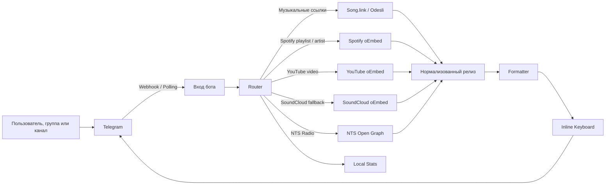

<div align="center">

# StonerHand Soundlinks Bot

**Открытый Telegram-бот, который превращает музыкальные ссылки в аккуратные посты**

[English version](README.md)
· [Архитектура](ARCHITECTURE.ru.md)
· [Скиллы](#проектные-скиллы)
· [Бот](https://t.me/StonerHandBot)
· [Канал](https://t.me/stonerhand)
· [Vercel setup](#деплой-на-vercel)
· [Кастомизация](#кастомизация)


`стриминговая ссылка -> релиз -> готовый редакторский Telegram-пост`

</div>

---

## Обзор

StonerHand Soundlinks Bot собирает музыкальные ссылки в чистые Telegram-посты. Можно отправить трек, альбом, подкаст, Spotify-плейлист, Spotify-артиста, YouTube-видео, NTS Radio или несколько ссылок сразу, а бот вернет короткую карточку с названием, preview, хэштегами и кнопками платформ.

Дефолтный стиль сделан под голос канала [@stonerhand](https://t.me/stonerhand), но архитектура специально оставлена переиспользуемой: можно заменить канал, фразы, подписи кнопок и приоритет платформ, чтобы собрать свою версию.

Это не downloader. Бот не скачивает и не раздает аудио/видео файлы. Он распознает публичные ссылки, забирает легкие метаданные и оформляет Telegram-посты.

```text
вход
https://open.spotify.com/track/...

выход
📻 · Artist
Track

кнопки ниже, трек ждет

#stonerhand #track

[🟢 Spotify] [⚫ Tidal]
[🟦 Deezer]  [🟡 Yandex]
[🪩 Все платформы]
```

## Пользовательские Сценарии

| Поверхность | Поведение |
| --- | --- |
| Личный чат | Отвечает карточкой с кнопками |
| Группа | Может удалить исходную ссылку и заменить ее красивым постом, если есть права админа |
| Канал | Может превращать сырые ссылки в посты и молчать на обычный контент |
| Несколько ссылок | Собирает пост-подборку |
| Текст над ссылкой | Превращает текст в Telegram-цитату, сохраняя абзацы, пустые строки и отступы |
| Меню команд | Inline-навигация для старта, инструкции, сервисов и настройки групп/каналов |

## Поддерживаемый Контент

| Тип | Источники | Как оформляется |
| --- | --- | --- |
| Трек | Spotify, Apple Music, YouTube Music, Deezer, Tidal, Yandex Music, SoundCloud | Музыкальная карточка с кнопками платформ |
| Альбом / EP / Single | Spotify, Apple Music, Deezer, Tidal, Yandex Music, SoundCloud sets | Карточка релиза с автохэштегами |
| Подкаст / выпуск / шоу | Spotify, Apple Podcasts и podcast-ссылки, которые понимает Song.link | Podcast-карточка или fallback на одну платформу |
| Spotify playlist | Spotify playlist URL | Отдельная карточка плейлиста |
| Spotify artist | Spotify artist URL | Отдельная карточка артиста |
| YouTube-видео | `youtube.com/watch`, `youtu.be`, `shorts`, `live`, `embed`, `m.youtube.com` | Видео-карточка с кнопкой YouTube |
| NTS Radio | `nts.live`, `www.nts.live` и поддомены NTS | Радио-карточка с кнопкой NTS |
| Подборка | Несколько ссылок в одном сообщении | Нумерованный пост-плейлист |

## Технический Стек

| Слой | Решение |
| --- | --- |
| Runtime | Python 3.10+ |
| Telegram SDK | `python-telegram-bot` 21.x |
| HTTP client | `httpx` с connection limits и явными таймаутами |
| Музыкальный поиск | Song.link / Odesli API |
| Легкие метаданные | Spotify, YouTube и SoundCloud oEmbed, NTS Open Graph |
| Деплой | Vercel webhook или Railway worker |
| Конфигурация | Environment variables и опциональный `.env` |
| Тестирование | `unittest` и compile checks |

## Почему Можно Открывать Публично

| Зона | Статус |
| --- | --- |
| Секреты | Реальные токены не коммитятся; локально используется `.env`, в проде - env variables хостинга |
| Локальные файлы | `.env`, `.venv`, stats-файлы, кеши и generated egg-info игнорируются |
| Деплой | Описаны Vercel webhook и Railway worker |
| Брендинг | StonerHand-специфика лежит в formatter/constants/phrase bank |
| Форки | Поток разделен на URL parsing, metadata clients, formatting, keyboards и transport |
| Безопасность | Setup endpoint можно закрыть через `SET_WEBHOOK_SECRET` |
| Границы | Нет downloader API, media scraping и хранения текста сообщений |

## Визуальный Стиль

Главная идея: меньше шума, больше пользы. Пост должен нормально читаться на телефоне, не ломаться на desktop и не превращаться в простыню.

Кнопки платформ используют нативные стили Telegram там, где клиент их поддерживает:

| Семейство кнопок | Style | Fallback-маркер |
| --- | --- | --- |
| Spotify | `success` | `🟢 Spotify` |
| YouTube | `danger` | `🔴 YouTube` / `📺 Смотреть на YouTube` |
| Song.link hub, плейлисты, артисты, радио и остальные платформы | `primary` | Эмодзи в названии платформы |

Разные клиенты Telegram могут рисовать стили по-разному, поэтому эмодзи остаются стабильным fallback.

Клавиатуры релизов идут platform-first: прямые кнопки стримингов стоят выше Song.link hub, чтобы самый частый сценарий занимал меньше тапов.

### Одиночный Релиз

```text
цитата от @username:
Альбом, который стоит включить целиком

💿 · Artist
Release

альбом собран, уходи слушать

#stonerhand #album

[🟢 Spotify] [⚫ Tidal]
[🟦 Deezer]  [🟡 Yandex]
[💿 Весь релиз]
```

### Подборка

```text
цитата от @username:
пять ссылок на вечер

сегодня в подборке:

1. 📻 · Youth Code - Transitions
2. 🎧 · Show Me The Body - Camp Orchestra
3. 💿 · The Soft Moon - Criminal
4. 📺 · SANSAE Live Session Vol.3 - Melon
5. 📡 · NTS Radio - Dark Energy

выбирай с чего начать

#stonerhand #collection #track #album #video #radio

[🎧 1. Youth Code] [🎧 2. Show Me The Body]
[💿 3. The Soft Moon] [📺 4. Live Session]
[📡 5. Dark Energy]
```

### Отдельные Карточки

```text
🎛 · Women of Punk
платформа: Spotify

пачка собрана, вход открыт

#stonerhand #playlist

[🎛 Открыть плейлист]
```

```text
🧬 · 1.Kla$
профиль: Spotify

профиль открыт, можно копать глубже

#stonerhand #artist

[🧬 Открыть артиста]
```

```text
📡 · Dark Energy w/ Guest
станция: NTS Radio

эфир на месте, можно включать

#stonerhand #radio

[📡 Открыть на NTS]
```

## Архитектура



## Карта Кода

```text
api/
├── telegram.py       Vercel webhook endpoint с fail-fast проверкой payload
└── set_webhook.py    установка webhook, callback updates и синхронизация команд

src/music_links_bot/
├── bot.py            Telegram handlers, routing, keyboards, замена сообщений
├── songlink.py       Song.link client, fallback по регионам, нормализация релиза
├── formatter.py      макет поста, подписи, хэштеги, выбор preview
├── playlist.py       Spotify playlist metadata через oEmbed
├── artist.py         Spotify artist metadata через oEmbed
├── youtube.py        YouTube video metadata через oEmbed
├── soundcloud.py     SoundCloud metadata fallback через oEmbed
├── nts.py            NTS Radio metadata через Open Graph parsing
├── url_utils.py      поиск URL, нормализация, чистка tracking-параметров
├── cache.py          in-memory TTL-кеш внешних запросов
├── stats.py          privacy-safe счетчики
├── phrases.py        живые фразы для CTA и ошибок
├── constants.py      платформы, алиасы и порядок кнопок
└── config.py         настройки из переменных окружения
```

## Надежность И Скорость

| Зона | Как решено |
| --- | --- |
| Скорость | Параллельная обработка ссылок, connection pooling, короткие таймауты внешних API |
| Ощущение скорости | Перед внешними lookup-запросами бот отправляет Telegram typing action |
| Стабильность | Раздельная обработка not found, service unavailable и неправильного ввода |
| Исправимые ошибки | В личке ошибки получают компактную клавиатуру поддержки, а не тупик |
| Дедупликация | `si`, `utm_*`, `fbclid` и похожие параметры не участвуют в cache key |
| Лимиты Telegram | Длинные подводки и большие пачки ссылок обрезаются до безопасного размера |
| Чистота каналов | Обычные посты, Instagram/TikTok/Pinterest и нерелевантные ссылки игнорируются в группах и каналах |
| Навигация | `/start`, `/help`, `/platforms` и `/guide` используют одно inline-меню с активным состоянием |
| Preview | Приоритетная платформа управляет preview и порядком кнопок |
| SoundCloud | Если Song.link не нашел кроссплатформенные ссылки, прямая SoundCloud-ссылка оформляется через SoundCloud oEmbed |
| NTS Radio | NTS-ссылки не гоняются через Song.link, а оформляются отдельными радио-карточками |
| Приватность | Статистика хранит счетчики и ids, но не тексты сообщений и не исходные ссылки |
| Serverless | Vercel webhook проверяет размер и форму JSON до запуска бота |
| Безопасность админки | Замена сообщений происходит только если Telegram реально дал нужные права |

## Проектные Скиллы

В репозитории есть Codex-скиллы в `skills/`. Это короткие операционные инструкции для будущей поддержки, чтобы не перечитывать весь код каждый раз заново.

| Скилл | Для чего |
| --- | --- |
| `skills/stonerhand-bot-audit` | Полный аудит кода, рефакторинг, чистка, стабильность, тесты и проверка перед публичным релизом |
| `skills/stonerhand-bot-deploy` | Vercel, Railway, локальный polling, webhook, env variables и диагностика деплоя |
| `skills/stonerhand-bot-editorial-ui` | Дизайн Telegram-постов, тексты, кнопки, хэштеги, preview и стиль канала |

Большая карта системы лежит в [ARCHITECTURE.ru.md](ARCHITECTURE.ru.md).

## Команды

| Команда | Что делает |
| --- | --- |
| `/start` | меню и быстрый старт |
| `/help` | как пользоваться |
| `/guide` | настройка групп и каналов |
| `/platforms` | сервисы и типы ссылок |
| `/channel` | открыть StonerHand |
| `/stats` | публичная статистика и приватная статистика для админа |
| `/id` | скрытая команда для получения `ADMIN_CHAT_ID` |

Публичное меню команд синхронизируется при локальном/Railway запуске и через Vercel endpoint `/api/set_webhook`. Webhook подписан на `message`, `channel_post` и `callback_query`, поэтому inline-кнопки меню работают в проде.

## Переменные Окружения

Создай локальный `.env`:

```bash
cp .env.example .env
```

Минимальная production-настройка:

```env
BOT_TOKEN=your-telegram-bot-token
SONGLINK_USER_COUNTRIES=US
LOG_LEVEL=INFO
PRIMARY_PLATFORM=spotify
```

Полная настройка:

```env
BOT_TOKEN=your-telegram-bot-token
SONGLINK_API_KEY=
SONGLINK_USER_COUNTRIES=US
LOG_LEVEL=INFO
ADMIN_CHAT_ID=
PRIMARY_PLATFORM=spotify
BOT_UI_MODE=stonerhand
SET_WEBHOOK_SECRET=
STATS_PATH=
```

| Переменная | Обязательна | Зачем нужна |
| --- | --- | --- |
| `BOT_TOKEN` | да | Telegram Bot API token |
| `SONGLINK_API_KEY` | нет | Опциональный ключ Song.link |
| `SONGLINK_USER_COUNTRIES` | нет | Список регионов для fallback, `US` хороший дефолт |
| `LOG_LEVEL` | нет | `INFO`, `DEBUG`, `WARNING`, `ERROR` |
| `ADMIN_CHAT_ID` | нет | Приватная статистика и админ-уведомления |
| `PRIMARY_PLATFORM` | нет | Приоритет preview и порядка кнопок |
| `BOT_UI_MODE` | нет | Текст и плотность кнопок: `stonerhand`, `minimal`, `editorial` |
| `SET_WEBHOOK_SECRET` | нет | Защита `/api/set_webhook` |
| `STATS_PATH` | нет | Путь к локальному файлу статистики |

Поддерживаемые значения `PRIMARY_PLATFORM`:

```text
spotify
appleMusic
applePodcasts
youtubeMusic
soundcloud
deezer
tidal
yandexMusic
```

Поддерживаемые значения `BOT_UI_MODE`:

```text
stonerhand  фирменный стиль по умолчанию с эмодзи на кнопках
minimal     более чистые кнопки без лишнего визуального шума
editorial   более живые hub-кнопки для канального оформления
```

## Локальный Запуск

```bash
python3 -m venv .venv
```

```bash
source .venv/bin/activate
```

```bash
pip install -r requirements.txt
```

```bash
PYTHONPATH=src python -m music_links_bot
```

На Mac остановить локального бота можно через `Control + C`.

## Деплой На Vercel

Vercel - основной serverless-вариант. Telegram отправляет updates на `/api/telegram`, поэтому Mac и Zed можно закрывать.

1. Импортируй `StonerHand/stonerhand-soundlinks-bot` в Vercel
2. `Application Preset` оставь `Python`
3. `Root Directory` оставь `./`
4. Добавь production-переменные окружения
5. Нажми `Deploy`
6. После деплоя один раз открой endpoint настройки:

```text
https://your-vercel-domain.vercel.app/api/set_webhook
```

Если задан `SET_WEBHOOK_SECRET`, открывай так:

```text
https://your-vercel-domain.vercel.app/api/set_webhook?secret=your-secret
```

Если Telegram вернул `"ok": true`, webhook и меню команд подключены.
Открой этот endpoint заново после изменения команд, callback-меню или production-домена.

### Vercel Endpoint'ы

| Endpoint | Method | Зачем |
| --- | --- | --- |
| `/api/telegram` | `POST` | Telegram webhook receiver |
| `/api/set_webhook` | `GET` | Установка webhook и синхронизация команд |

## Деплой На Railway

Railway запускает бота как background worker через long polling.

```bash
pip install -r requirements.txt
```

```bash
PYTHONPATH=src python -m music_links_bot
```

В репозитории уже есть `railway.toml`. Если включен Vercel webhook, Railway/local polling лучше остановить, чтобы не было дублей.

## Тесты

```bash
PYTHONPATH=src python -m unittest discover -s tests -v
```

Проверка компиляции:

```bash
python -m compileall -q src tests api
```

## Production Checklist

- `BOT_TOKEN` добавлен в переменные окружения хостинга
- Активен только один режим: Vercel webhook или Railway/local polling
- После деплоя открыт `/api/set_webhook`
- У бота есть право `Delete messages` там, где нужна автозамена постов
- `ADMIN_CHAT_ID` настроен, если нужны приватная статистика и админ-уведомления
- `SET_WEBHOOK_SECRET` задан для более безопасного setup endpoint
- Токены не попадают в git
- Токены перевыпущены, если они когда-либо попадали в публичное место

## Чистота Репозитория

Полезные проверки перед публикацией или деплоем:

```bash
git status --short
```

```bash
rg -n "ghp_|x-rapidapi-key|X-RapidAPI-Key|[0-9]{6,}:[A-Za-z0-9_-]{20,}" .
```

```bash
find . -path './.venv' -prune -o -path './.git' -prune -o \
  \( -name '__pycache__' -o -name '*.pyc' -o -name '.DS_Store' -o -name '*.egg-info' \) -print
```

Репозиторий игнорирует локальные артефакты: `.env`, `.venv`, `__pycache__`, `.DS_Store`, generated egg-info и локальные stats-файлы.

## Приватность

Бот обрабатывает ссылки, чтобы собрать музыкальный пост. Он не запрашивает пароли, платежные данные или личные файлы. Статистика минимальная: счетчики, chat ids, labels и last-seen timestamp. Тексты сообщений и исходные ссылки в статистике не хранятся.

На Vercel файловая статистика временная, если `STATS_PATH` не ведет в постоянное хранилище. Для серьезной аналитики позже лучше подключить базу данных.

## Кастомизация

Если кто-то хочет адаптировать бота под свой канал, начинать лучше отсюда:

| Файл | Что менять |
| --- | --- |
| `src/music_links_bot/constants.py` | Ссылка на канал, названия платформ, приоритет платформ |
| `src/music_links_bot/phrases.py` | Фразы CTA и ошибок |
| `src/music_links_bot/formatter.py` | Макет поста, хэштеги, стиль заголовков |
| `src/music_links_bot/bot.py` | Тексты команд, intro, поведение админа |
| `.env.example` | Дефолтные переменные для своего деплоя |

## Troubleshooting

| Симптом | Вероятная причина | Что сделать |
| --- | --- | --- |
| Бот не отвечает | Нет или неверный `BOT_TOKEN` | Проверить env variables на хостинге |
| На корневой странице Vercel `404` | Это нормально для webhook-бота | Использовать `/api/telegram` и `/api/set_webhook` |
| Telegram ходит на старый хост | Webhook не обновлен | Открыть `/api/set_webhook` на новом домене |
| Посты дублируются | Одновременно активны polling и webhook | Остановить Railway/local polling |
| В канале ссылка не заменяется | Нет прав админа | Выдать право удалять сообщения |
| Не хватает платформы | Song.link не вернул ее для региона | Попробовать другую исходную ссылку или поменять регион fallback |
| SoundCloud показывает только SoundCloud | Song.link не нашел совпадения на других платформах | Это нормальный fallback: ссылка все равно превращается в чистую карточку |

## Лицензия

Файл лицензии пока не добавлен. Если хочешь, чтобы люди свободно форкали, меняли и переиспользовали проект, лучше явно добавить MIT или Apache-2.0.
