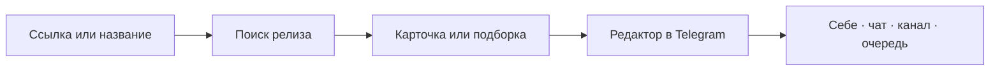

<div align="center">

# 🎧 StonerHand Soundlinks Bot

### Музыкальная ссылка → готовая публикация в Telegram

[Открыть бота](https://t.me/StonerHandBot) · [Канал](https://t.me/stonerhand) · [English](README.md) · [Архитектура](ARCHITECTURE.ru.md)


</div>

StonerHand — нативный музыкальный редактор внутри Telegram. Он превращает
ссылку на релиз, запрос `артист — название` или несколько ссылок в готовый пост
без перехода в отдельный веб-интерфейс.

## Что умеет бот

- принимает ссылку, запрос `артист — трек` или загруженный аудиофайл;
- находит релиз, обложку и ссылки на музыкальные площадки;
- собирает чистую Telegram-карточку с компактными кнопками;
- использует Telegram Rich Messages для структурированных карточек, нативных
  медиагрупп и кнопок внутри поста с автоматическим fallback на прежний формат;
- объединяет несколько ссылок в одну нумерованную подборку;
- объединяет ссылки разных площадок на один релиз, не создавая дубли карточек;
- импортирует найденные треки из публичных плейлистов Spotify и Apple Music;
- собирает песню и YouTube-клип в единый кликабельный Rich-медиапост;
- использует нативный конструктор с экранами стиля, подводки, хэштегов, площадок и формата Telegram;
- сохраняет именованные шаблоны оформления и позволяет поставить свою обложку;
- оставляет на экране одно главное действие и обновляет активное сообщение на месте;
- сохраняет жирный, курсив, ссылки и другое Telegram-форматирование подводки;
- рассчитывает доступную длину подводки отдельно для карточки и подписи к фото;
- восстанавливает сохранённое оформление и отменяет до пяти изменений;
- показывает чистое итоговое превью и возвращает к активной карточке по названию релиза;
- запоминает настройки карточки и показывает время в истории;
- позволяет назвать, проверить, переставить и очистить подборку без дублей;
- отправляет публикацию себе, в другой чат или канал;
- показывает компактную проверку перед публикацией в канал;
- поддерживает очередь отложенных публикаций с постраничным экраном управления;
- учитывает явный часовой пояс для готовых и произвольных дат публикации;
- позволяет отменить любой ожидаемый ввод командой `/cancel`;
- работает inline: `@StonerHandBot артист — трек`;
- объясняет сбой каждой ссылки и позволяет заменить проблемную позицию по номеру;
- опционально показывает ответ в группе только запросившему его пользователю
  через ephemeral messages Bot API 10.3.

Одно сообщение принимает до 10 уникальных источников — это тот же явный лимит,
что и у редактируемой подборки. Дубли и tracking-варианты удаляются до поиска.

Поддерживаются Spotify, Apple Music, YouTube, SoundCloud, Bandcamp, Deezer,
Tidal, Яндекс Музыка, подкасты, плейлисты Spotify и Apple Music,
Spotify-артисты и NTS Radio.

## Основной сценарий


```mermaid
flowchart LR
    A["Ссылка или название"] --> B["Поиск релиза"]
    B --> C["Карточка или подборка"]
    C --> D["Редактор в Telegram"]
    D --> E["Себе · чат · канал · очередь"]
```

Бот оставляет в карточке только полезное: обложку, исполнителя, название,
выбранные хэштеги, нужные площадки и кнопку полного релиза. Стиль, подводка,
хэштеги, площадки, формат Telegram, превью и отправка разнесены по понятным
экранам. Перед отправкой preflight-проверка не пропускает карточку без названия,
ссылки или выбранной площадки. Свой текст, обложка и хэштеги вводятся обычным
ответом в Telegram. Несколько ссылок не цитируются
повторно и не засоряют итоговый пост, а удаление можно отменить.
Форматирование подводки сохраняется, а её лимит считается по реальному формату
Telegram-публикации, поэтому текст не вытесняет название релиза и хэштеги.
Предыдущее или именованное оформление можно применить к новой карточке одним
нажатием. Режим **Авто** использует Rich Message с безопасным fallback, а
**Классика** всегда отправляет обычную Telegram-карточку.

Главная кнопка **«Создать пост»** открывает нативную подсказку с тремя входами:
ссылка на релиз или артиста, запрос `артист — название` и несколько ссылок для
подборки. Возврат к незавершённой карточке показывается отдельно с названием
релиза и никогда не заменяет основной сценарий.

Поиск показывает понятные этапы `1/3 → 3/3`. Для каждой принятой ссылки бот
сохраняет отдельный результат в исходном порядке: один зависший запрос не
отменяет уже найденные релизы и не блокирует следующие ссылки. Неполная
подборка остаётся явно отмеченной как `3 из 4`, не выдаётся за готовую и не
получает кнопку отправки; повторная проверка пересобирает всю исходную подборку
в том же порядке.
Для каждой проблемной позиции доступна кнопка **«Заменить №N»**: ошибочную или
закрытую ссылку можно исправить, не собирая остальные релизы заново.
Перед отправкой текст и подписи проверяются по реальному UTF-16-лимиту
Telegram, включая эмодзи; для слишком длинного или повреждённого HTML
используется безопасный резервный вариант.
При временном сбое Song.link Spotify-ссылки обрабатываются через резервные
метаданные Spotify; региональный промах проверяется в ограниченном наборе
дополнительных регионов и по публичным метаданным страницы релиза. Короткий
fallback-кеш автоматически сменяется полным набором площадок после
восстановления сервиса. Неполные обычные и inline-подборки не кэшируются и не
выдаются за готовые: их кнопка заново проверяет все исходные ссылки. Бот также
распознаёт ссылки, спрятанные за текстом Telegram, а tracking-варианты удаляет
до поиска и повторной отправки.

## Запуск локально

```bash
python3 -m venv .venv
source .venv/bin/activate
pip install -e ".[dev]"
cp .env.example .env
PYTHONPATH=src python -m music_links_bot
```

Минимальные переменные окружения:

```env
BOT_TOKEN=...
SONGLINK_USER_COUNTRIES=US
LOG_LEVEL=INFO
PRIMARY_PLATFORM=spotify
```

Для production также используются `SET_WEBHOOK_SECRET`,
`TELEGRAM_WEBHOOK_SECRET` и Upstash Redis. `CRON_SECRET` рекомендуется для
прямого Vercel Cron; при пустом значении внутренний вызов worker защищается
отдельным ключом, производным от `BOT_TOKEN`. Фиксированное время
публикации берётся из `BOT_TIMEZONE` (по умолчанию `Europe/Moscow`), а свою дату
можно выбрать в пределах 90 дней.

`RICH_MESSAGES_ENABLED=1` включает оформление Bot API 10.3. Флаг безопасно
оставлять включённым: при неподдерживаемом методе, старом узле Telegram или
ошибке загрузки медиа бот автоматически отправит прежнюю HTML/photo-карточку.
`RICH_DRAFTS_ENABLED=0` оставляет экспериментальный streaming-черновик
выключенным. `EPHEMERAL_GROUP_REPLIES=1` включает персональные ответы в группах.

## Проверка

```bash
PYTHONPATH=src python -m unittest discover -s tests -v
python -m compileall -q src api tests
python -m pyflakes src api tests
python -m ruff check src api tests --select F,B,ASYNC,PERF
python -m bandit -q -r src api -x tests
python -m pip_audit -r requirements.txt --progress-spinner off
python tests/check_dependency_pins.py
python -m json.tool vercel.json >/dev/null
```

История выпусков: [CHANGELOG.md](CHANGELOG.md).

## Структура

```text
api/                    webhook, health, настройка webhook и worker очереди
src/music_links_bot/    orchestration, типизированный lookup, редактор и хранение
tests/                  unit и интеграционные тесты
vercel.json             production-маршруты и cron
```

Проект работает на Vercel через Telegram webhook. Webhook обрабатывает только
Telegram updates, а запланированные публикации забирает защищённый worker.
Redis хранит кеш, повторно используемые Telegram `file_id` обложек,
пользовательские сессии, черновики, подборки, историю, очередь и защиту от
повторной обработки. Состояние версионируется и автоматически читает данные
предыдущей схемы. При недоступности Redis некритичные сценарии используют
ограниченный memory fallback.

`/api/health` показывает состояние Telegram, webhook, Redis, worker и очереди,
runtime-метрики и точную версию/commit развёрнутого кода. Production canary
обнаруживает устаревший deploy, недоступный worker и зависшую очередь.
Диагностика провайдеров показывает число запросов, процент успеха, среднюю
задержку, fallback, timeout и ограничения частоты запросов. Runtime-метрики
отдельно показывают попытки Rich Messages, ошибки и автоматические fallback.

Лицензия: [MIT](LICENSE).
