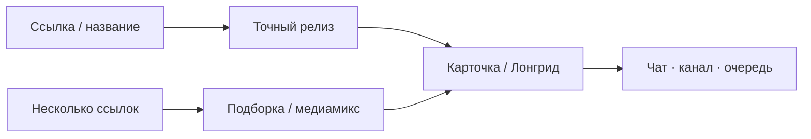

<div align="center">

# 🎧 StonerHand Soundlinks Bot

### Музыкальная ссылка → готовая Telegram-публикация

[Открыть бота](https://t.me/StonerHandBot) · [Канал](https://t.me/stonerhand) · [English](README.md) · [Архитектура](ARCHITECTURE.ru.md)




</div>

## Возможности

| Telegram-бот | Mini App «Студия» |
| --- | --- |
| Ссылка или название → точный релиз | Поиск, кандидаты и аудиопревью |
| Чистый заголовок, обложка, хэштеги и компактные кнопки | Карточка или блочный Rich-лонгрид |
| Несколько ссылок → одна подборка со статусом каждой ссылки | Подборка до 10 релизов, сортировка и повтор только ошибок |
| Песня + YouTube-клип → двухкадровое медиапревью | Обложка песни и превью клипа |
| Inline-поиск с помеченной историей, кешем и страницами | История, очередь, отмена и аналитика |
| Автозамена ссылок в группах и каналах | Нативная отправка поста с кнопками |

Поддерживаются Spotify, Apple Music, YouTube, SoundCloud, Bandcamp, Deezer,
Tidal, Яндекс Музыка, подкасты, плейлисты Spotify и Apple Music,
Spotify-артисты, NTS Radio.

В карточках нет рекламных подписей и скрытых ссылок в заголовке. Быстрый слой
всегда одинаков: основная площадка + «Все платформы», затем «Изменить» +
«В подборку». Редактор остаётся в том же Telegram-сообщении и показывает только
стиль, текст, хэштеги и площадки; отправка, публикация, пересылка и удаление
убраны в дополнительное меню. Изменения сохраняются сразу, `/start` продолжает
активный черновик, а раздел «Недавние» хранит пять последних карточек.
Автохэштегов не больше трёх. Очистка и удаление требуют подтверждения и имеют
15 секунд на отмену.

Лонгрид отправляется как Telegram Rich Message со структурированными блоками.
Если формат недоступен, бот автоматически создаёт безопасную HTML-версию.
Песня и YouTube-клип публикуются как нативный двухкадровый альбом; видео не
скачивается и открывается в оригинале.

## Сценарий


```mermaid
flowchart LR
    A["Ссылка / название"] --> B["Точный релиз"]
    A2["Несколько ссылок"] --> C["Подборка / медиамикс"]
    B --> D["Карточка / Лонгрид"]
    C --> D
    D --> E["Чат · канал · очередь"]
```

Главное меню содержит четыре понятных действия: **Создать**, **Подборка**,
**Недавние** и **Студия**. Короткий тур показывается только при первом запуске.
Настройки, лонгрид, очередь и публикация находятся в
Mini App; чат остаётся быстрым сценарием. Бот и Студия используют один резолвер.
Сетевые клиенты создаются лениво, независимые провайдеры работают параллельно,
а успешные результаты кешируются в памяти и Redis. Одинаковые параллельные
поиски и наборы ссылок используют один внешний запрос; случайные повторы
сообщений и `/start` подавляются между прогретыми инстансами. У всего запроса есть общий
дедлайн, а нестабильный провайдер временно отключается после серии ошибок.
Если одна ссылка не обработана, найденная часть сохраняется, а повтор запускается
только для неудачных ссылок.

Канал запоминает последнее успешное оформление — карточка или лонгрид, режим
обложки, хэштеги и выбранные площадки — и применяет его к следующему черновику
владельца. Rich Messages, нативная отправка с кнопками и безопасный HTML fallback
работают через один publication pipeline.

Перед публикацией бот проверяет право писать в канал. Антидубль хранит ссылку
на прежний пост и предлагает открыть его, опубликовать ещё раз либо заменить.
Статус «Запланировано» возвращается только после подтверждённой записи в Redis.
Очередь запускается только через защищённый `CRON_SECRET` worker: задания
захватываются по одному, а один запуск обрабатывает ограниченный пакет. Кеши
тёплого инстанса имеют предел, владение черновиком закрыто по умолчанию, а данные
Студии нормализуются до записи в хранилище.
Владельцу доступна скрытая команда `/status`: Telegram, Redis, очередь, права,
скорость, кеш и состояние провайдеров.

## Запуск на Vercel

```dotenv
BOT_TOKEN=123456:telegram-token
SET_WEBHOOK_SECRET=long-random-secret
CRON_SECRET=another-long-random-secret
ADMIN_CHAT_ID=123456789
PUBLISH_CHAT_ID=@channel
```

1. Создай бота у [@BotFather](https://t.me/BotFather) и включи `/setinline`.
2. Импортируй репозиторий в Vercel с корнем `./`.
3. Подключи Upstash Redis из Vercel Marketplace для черновиков, очереди,
   истории, статистики и межинстансовой дедупликации.
4. Открой `https://<domain>/api/set_webhook?secret=<SET_WEBHOOK_SECRET>`.
5. Проверь `https://<domain>/api/health`: ожидаются HTTP 200 и `"ok": true`.

Все переменные перечислены в [.env.example](.env.example).

<details>
<summary><b>Локальная разработка и проверки</b></summary>

```bash
python3 -m venv .venv
source .venv/bin/activate
pip install -e '.[dev]'
python -m playwright install chromium
cp .env.example .env

python -m pyflakes src api tests
python -m pytest -q
python tests/e2e/smoke.py
```

Не запускай polling одновременно с production webhook на том же токене.

</details>

## Структура

```text
api/                    webhook, Studio API, health и queue worker
src/music_links_bot/    handlers, provider registry, публикация, очередь, Redis
webapp/                 Mini App из небольших ES-модулей без build-step
tests/                  unit/integration, мобильный smoke и production canary
```

Подробные потоки, API, Redis keyspace и правила расширения описаны в
[ARCHITECTURE.ru.md](ARCHITECTURE.ru.md).

[MIT](LICENSE)
