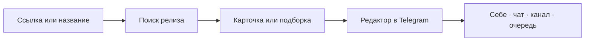

<div align="center">

# 🎧 StonerHand Soundlinks Bot

### Музыкальная ссылка → готовая публикация в Telegram

[Открыть бота](https://t.me/StonerHandBot) · [Канал](https://t.me/stonerhand) · [English](README.md) · [Архитектура](ARCHITECTURE.ru.md)


</div>

StonerHand — нативный музыкальный редактор внутри Telegram. Он превращает
ссылку на релиз, запрос `артист — название` или несколько ссылок в готовый пост
без перехода в отдельный веб-интерфейс.

## Что умеет бот

- принимает ссылку или запрос `артист — трек`;
- находит релиз, обложку и ссылки на музыкальные площадки;
- собирает чистую Telegram-карточку с компактными кнопками;
- объединяет несколько ссылок в одну нумерованную подборку;
- собирает песню и YouTube-клип в единый медиапост;
- использует нативный конструктор с отдельными экранами стиля, подводки, хэштегов и площадок;
- показывает чистое итоговое превью и возвращает к активной карточке по названию релиза;
- запоминает настройки карточки и показывает время в истории;
- позволяет назвать, проверить, переставить и очистить подборку без дублей;
- отправляет публикацию себе, в другой чат или канал;
- показывает компактную проверку перед публикацией в канал;
- поддерживает очередь отложенных публикаций;
- учитывает явный часовой пояс для готовых и произвольных дат публикации;
- позволяет отменить любой ожидаемый ввод командой `/cancel`;
- работает inline: `@StonerHandBot артист — трек`.

Поддерживаются Spotify, Apple Music, YouTube, SoundCloud, Bandcamp, Deezer,
Tidal, Яндекс Музыка, подкасты, плейлисты Spotify и Apple Music,
Spotify-артисты и NTS Radio.

## Основной сценарий


```mermaid
flowchart LR
    A["Ссылка или название"] --> B["Поиск релиза"]
    B --> C["Карточка или подборка"]
    C --> D["Редактор в Telegram"]
    D --> E["Себе · чат · канал · очередь"]
```

Бот оставляет в карточке только полезное: обложку, исполнителя, название,
выбранные хэштеги, нужные площадки и кнопку полного релиза. Стиль, подводка,
хэштеги, площадки, превью и отправка разнесены по понятным экранам. Свой текст
и хэштеги вводятся обычным ответом в Telegram. Несколько ссылок не цитируются
повторно и не засоряют итоговый пост, а удаление можно отменить.

Главная кнопка **«Создать пост»** открывает нативную подсказку с тремя входами:
ссылка на релиз или артиста, запрос `артист — название` и несколько ссылок для
подборки. Возврат к незавершённой карточке показывается отдельно с названием
релиза и никогда не заменяет основной сценарий.

Поиск показывает понятные этапы `1/3 → 3/3`. Если один из источников временно
не ответил, готовые релизы всё равно отправляются, а повтор запускается только
для ошибочных ссылок.
Перед отправкой текст и подписи проверяются по лимитам Telegram; для слишком
длинного форматирования используется безопасный резервный вариант.

## Запуск локально

```bash
python3 -m venv .venv
source .venv/bin/activate
pip install -e ".[dev]"
cp .env.example .env
PYTHONPATH=src python -m music_links_bot
```

Минимальные переменные окружения:

```env
BOT_TOKEN=...
SONGLINK_USER_COUNTRIES=US
LOG_LEVEL=INFO
PRIMARY_PLATFORM=spotify
```

Для production также используются `SET_WEBHOOK_SECRET`,
`TELEGRAM_WEBHOOK_SECRET`, `CRON_SECRET` и Upstash Redis. Фиксированное время
публикации берётся из `BOT_TIMEZONE` (по умолчанию `Europe/Moscow`).

## Проверка

```bash
PYTHONPATH=src python -m unittest discover -s tests -v
python -m compileall -q src api tests
python -m pyflakes src api tests
python -m ruff check src api tests --select F,B,ASYNC,PERF
python -m bandit -q -r src api -x tests
python tests/check_dependency_pins.py
python -m json.tool vercel.json >/dev/null
```

История выпусков: [CHANGELOG.md](CHANGELOG.md).

## Структура

```text
api/                    webhook, health, настройка webhook и worker очереди
src/music_links_bot/    orchestration, меню, редактор, провайдеры и хранение
tests/                  unit и интеграционные тесты
vercel.json             production-маршруты и cron
```

Проект работает на Vercel через Telegram webhook. Redis хранит кеш,
пользовательские сессии, черновики, подборки, историю, очередь и защиту от
повторной обработки. Состояние версионируется и автоматически читает данные
предыдущей схемы. При недоступности Redis некритичные сценарии используют
ограниченный memory fallback.

Лицензия: [MIT](LICENSE).
