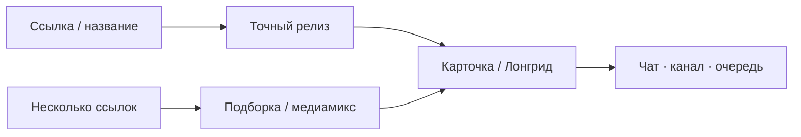

<div align="center">

# 🎧 StonerHand Soundlinks Bot

### Музыкальная ссылка → готовая Telegram-публикация

[Открыть бота](https://t.me/StonerHandBot) · [Канал](https://t.me/stonerhand) · [English](README.md) · [Архитектура](ARCHITECTURE.ru.md)


</div>

## Возможности

| Telegram-бот | Mini App «Студия» |
| --- | --- |
| Ссылка или название → точный релиз | Поиск, кандидаты и аудиопревью |
| Кликабельный заголовок, обложка и компактные кнопки | Карточка или блочный Rich-лонгрид |
| Несколько ссылок → одна подборка | Подборка до 10 релизов, сортировка и заметки |
| Песня + YouTube-клип → двухкадровое медиапревью | Обложка песни и превью клипа |
| Inline-поиск в любом чате | История, очередь, отмена и аналитика |
| Автозамена ссылок в группах и каналах | Нативная отправка поста с кнопками |

Поддерживаются Spotify, Apple Music, YouTube, SoundCloud, Bandcamp, Deezer,
Tidal, Яндекс Музыка, подкасты, Spotify-плейлисты и артисты, NTS Radio.

В карточках нет случайных рекламных подписей: только данные релиза, теги и
действия. По умолчанию видны две приоритетные площадки и универсальная ссылка
«Все платформы». Поэтому пост остаётся компактным, а после обычной пересылки
кликабельный заголовок всё равно открывает релиз. Для отправки вместе с кнопками
используется действие «Поделиться» в Студии.

Лонгрид отправляется как Telegram Rich Message со структурированными блоками.
Если формат недоступен, бот автоматически создаёт безопасную HTML-версию.
Песня и YouTube-клип публикуются как нативный двухкадровый альбом; видео не
скачивается и открывается в оригинале.

## Сценарий


```mermaid
flowchart LR
    A["Ссылка / название"] --> B["Точный релиз"]
    A2["Несколько ссылок"] --> C["Подборка / медиамикс"]
    B --> D["Карточка / Лонгрид"]
    C --> D
    D --> E["Чат · канал · очередь"]
```

В меню бота оставлены только основные действия: Студия, поиск, подборка и
помощь. Публикация, расписание, статистика и расширенное оформление находятся
в Студии. Сетевые клиенты провайдеров создаются лениво — только когда реально
нужны конкретному запросу.

## Запуск на Vercel

```dotenv
BOT_TOKEN=123456:telegram-token
SET_WEBHOOK_SECRET=long-random-secret
CRON_SECRET=another-long-random-secret
ADMIN_CHAT_ID=123456789
PUBLISH_CHAT_ID=@channel
```

1. Создай бота у [@BotFather](https://t.me/BotFather) и включи `/setinline`.
2. Импортируй репозиторий в Vercel с корнем `./`.
3. Подключи Upstash Redis из Vercel Marketplace для черновиков, очереди,
   истории, статистики и межинстансовой дедупликации.
4. Открой `https://<domain>/api/set_webhook?secret=<SET_WEBHOOK_SECRET>`.
5. Проверь `https://<domain>/api/health`: ожидаются HTTP 200 и `"ok": true`.

Все переменные перечислены в [.env.example](.env.example).

<details>
<summary><b>Локальная разработка и проверки</b></summary>

```bash
python3 -m venv .venv
source .venv/bin/activate
pip install -r requirements.txt pyflakes playwright
python -m playwright install chromium
cp .env.example .env

python -m pyflakes src api tests
PYTHONPATH=src python -m unittest discover -s tests
python tests/e2e/smoke.py
```

Не запускай polling одновременно с production webhook на том же токене.

</details>

## Структура

```text
api/                    Vercel webhook, Studio API, health, cron
src/music_links_bot/    поиск, форматирование, доставка, очередь, Redis
webapp/                 Mini App без build-step
tests/                  unit/integration + адаптивный Playwright smoke
```

Подробные потоки, API, Redis keyspace и правила расширения описаны в
[ARCHITECTURE.ru.md](ARCHITECTURE.ru.md).

[MIT](LICENSE)
