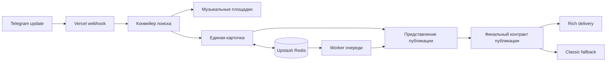

<div align="center">

# StonerHand Soundlinks Bot

**Музыка на входе. Готовый Telegram-пост на выходе.**

[Открыть бота](https://t.me/StonerHandBot) · [Посмотреть канал](https://t.me/stonerhand) · [English](README.md)


[](https://github.com/StonerHand/stonerhand-soundlinks-bot/actions/workflows/ci.yml)

</div>

StonerHand — музыкальный редактор, который полностью работает внутри Telegram.
Пришлите один релиз, запрос `артист — трек`, аудиофайл или несколько ссылок.
Бот найдёт музыку, соберёт аккуратную карточку и даст опубликовать её без
лишних переходов.

## Один понятный сценарий

| Отправляете | Получаете | Настраиваете | Публикуете |
| --- | --- | --- | --- |
| Ссылку на музыку | Точный релиз и обложку | Подводку, стиль, теги, обложку, площадки | Себе, в чат, очередь или канал |
| `артист — трек` | Поиск с выбором результата | Живое превью | Пост с рабочими кнопками |
| Несколько ссылок | Подборку без дублей | Название и порядок | Один компактный пост |
| Песню + видео | Общую музыкальную публикацию | Кнопки песни и клипа | Кликабельный мультипост |

Свой текст над ссылкой становится подводкой. Автоматические хэштеги содержат
тип релиза и только подтверждённый площадкой жанр: сомнительные данные бот
пропускает, а не угадывает.

## Что умеет продукт

- Обрабатывает треки, альбомы, подкасты, плейлисты, артистов, YouTube-видео и
  страницы NTS Radio.
- Собирает карточку с крупной обложкой, исходным сервисом, отдельной кнопкой
  **Все платформы** на Songlink/Odesli и компактными вторичными действиями.
- Показывает кнопку площадки только для прямой ссылки на релиз, которую вернул
  resolver: поисковая подсказка больше не выглядит подтверждённым совпадением.
- Объединяет ссылки разных площадок на один релиз вместо карточек-дубликатов.
- Импортирует доступные треки из публичных плейлистов Spotify и Apple Music.
- Сохраняет жирный текст, курсив и внешние ссылки в авторской подводке, убирает
  дубли музыкальных источников и точно считает Telegram-лимит UTF-16 для
  выбранного формата.
- Даёт менять оформление, платформы, теги и обложку, отменять изменения,
  сохранять шаблоны, историю и именованные подборки.
- Публикует сразу или через долговечную очередь с защитой от дублей, проверкой
  прав и уведомлением об ошибке.
- Работает inline: `@StonerHandBot артист — трек` в любой переписке.
- Использует Rich Messages из Bot API 10.3 там, где они доступны, и без потери
  обложки, текста или ссылок возвращается к полной классической карточке.
- Проверяет каждый готовый Classic, Rich, inline, channel, photo и audio пост
  единым релизным контрактом до обращения к Telegram.
- Даёт посмотреть и удалить личные данные через `/privacy` с подтверждением.

## Поддерживаемые источники

| Источник | Ссылки | Метаданные | Импорт подборки |
| --- | :---: | :---: | :---: |
| Spotify | ✓ | ✓ | ✓ |
| Apple Music | ✓ | ✓ | ✓ |
| YouTube / YouTube Music | ✓ | ✓ | — |
| SoundCloud | ✓ | ✓ | — |
| Deezer | ✓ | через Songlink | — |
| Tidal | ✓ | через Songlink | — |
| Yandex Music | ✓ | через Songlink | — |
| NTS Radio | ✓ | ✓ | — |

## UI и UX в Telegram

Главный экран начинается с кнопки **Создать пост** и сразу объясняет допустимые
варианты ввода. Незавершённую карточку можно вернуть по названию релиза;
подборка и история остаются во втором ряду. Редкие функции собраны под одной
предсказуемой кнопкой **Ещё**.

Конструктор раскрывается постепенно и не перегружает экран:

1. показывает готовую карточку;
2. предлагает изменить только нужные параметры;
3. выполняет финальную проверку;
4. отправляет или публикует одним явным действием.

Нативные ответы, callback-действия редактора и поиск разделены с отображением.
UI-тексты хранятся в отдельном RU/EN-каталоге: формулировки меняются без правки
исполняемого сценария, а полнота переводов и плейсхолдеры проверяются тестами.

В подборках кнопки подстраиваются под содержание: общий исполнитель не
повторяется, служебный remaster-хвост не занимает место, короткие названия стоят
попарно, а длинные получают отдельную строку. Превью сохраняет точный счётчик
релизов, но не повторяет иконки, исполнителя и служебный remaster-хвост. Обычная
карточка из 2–4 релизов получает коллаж из разных доступных обложек; при любой
ошибке остаётся надёжное превью с одной обложкой. Неполная подборка намеренно
сохраняет одну обложку, чтобы не выглядеть законченной до обработки всех ссылок.

Семантические цвета кнопок, заблокированный прогресс, временные уведомления и
Rich-контент включаются по возможностям клиента. Старые версии Telegram всегда
получают полноценную классическую карточку.

## Архитектура


```mermaid
flowchart LR
    U[Telegram update] --> W[Vercel webhook]
    W --> P[Конвейер поиска]
    P --> S[Музыкальные площадки]
    P --> D[Единая карточка]
    D --> V[Представление публикации]
    V --> G[Финальный контракт публикации]
    G --> R[Rich delivery]
    G --> C[Classic fallback]
    D <--> K[(Upstash Redis)]
    K --> Q[Worker очереди]
    Q --> V
```

Предпросмотр, отправка себе, публикация в канал и очередь используют один
неизменяемый план публикации. Затем независимый от транспорта финальный
контракт проверяет текст, счётчики, адреса кнопок, обложку и Telegram-лимиты до
любого Classic, Rich или inline вызова. Durable-черновики проходят
нормализацию перед записью в очередь и отправкой. Redis хранит сессии, историю,
шаблоны, антидубли и очередь; ограниченная память остаётся локальным и аварийным
fallback.

Подробности — в [описании архитектуры](ARCHITECTURE.ru.md).

## Локальный запуск

```bash
python -m venv .venv
source .venv/bin/activate
python -m pip install -e ".[dev]"
cp .env.example .env
python -m music_links_bot
```

Для локального polling достаточно `BOT_TOKEN`. Songlink и Redis нужны для
полных универсальных ссылок и долговечного состояния.

<details>
<summary><strong>Production-конфигурация</strong></summary>

Репозиторий настроен для Vercel Functions:

- `/api/telegram` — защищённый Telegram webhook;
- `/api/set_webhook` — обслуживание webhook;
- `/api/queue_worker` — worker отложенных публикаций;
- `/api/collage` — подписанные, сжатые и кэшируемые коллажи классических подборок;
- `/api/health` — Telegram, webhook, Redis, очередь и версия релиза;
- `/api/smoke` — детерминированная матрица Classic/Rich/inline/channel.

Обязательные production-переменные:

| Переменная | Назначение |
| --- | --- |
| `BOT_TOKEN` | токен Telegram-бота |
| `TELEGRAM_WEBHOOK_SECRET` | проверка каждого входящего update |
| `SET_WEBHOOK_SECRET` | защита обслуживания webhook |
| `WEBHOOK_BASE_URL` | публичный адрес Vercel |
| `UPSTASH_REDIS_REST_URL` | адрес долговечного Redis |
| `UPSTASH_REDIS_REST_TOKEN` | доступ к Redis |
| `CRON_SECRET` | защита worker очереди |

`ADMIN_CHAT_ID`, `PUBLISH_CHAT_ID`, `SONGLINK_API_KEY` и параметры оформления
необязательны и описаны в [.env.example](.env.example).

`COLLECTION_COLLAGE_ENABLED=0` отключает только коллажи без нового деплоя;
`BOT_SAFE_MODE=1` отключает все дополнительные capability-gated пути, сохраняя
полноценный Classic fallback.

</details>

<details>
<summary><strong>Релизный контроль качества</strong></summary>

```bash
python -m pyflakes src api tests
python -m ruff check src api tests
python -m ruff format --check src api tests
python -m bandit -q -r src api -x tests
python -m pip_audit -r requirements.txt --progress-spinner off
python -m pytest -q
```

CI дополнительно проверяет зависимости, секреты, сгенерированные файлы,
компиляцию и согласованность Vercel routes/builds/crons. Production canary
подтверждает точный commit, сервис коллажей и полную матрицу публикации до
решения о защищённом автоматическом rollback.

</details>

## Структура репозитория

```text
api/                    Vercel webhook, health, smoke, collage и queue endpoints
src/music_links_bot/    приложение, площадки, редактор и публикация
tests/                  unit, contract, snapshot и production-canary тесты
.github/                CI, обновление зависимостей и релизные проверки
```

В публичном репозитории остаются только продукт, архитектура, история релизов и
операционный checklist. Состояние, секреты, локальное окружение и кэши в Git не
попадают.

## Документация

- [English README](README.md)
- [Архитектура и модель состояния](ARCHITECTURE.ru.md)
- [Релизный checklist](RELEASE_CHECKLIST.ru.md)
- [История изменений](CHANGELOG.md)
- [MIT License](LICENSE)

---

Для музыкальных постов, которые выглядят законченными ещё до публикации.
